# APP Factory Flow

FastAPI 애플리케이션 팩토리의 전체 프로세스를 시각화한 플로우차트입니다.

📊 **[MySingle 패키지 활용가이드](./MYSINGLE_PACK_USAGE_GUIDE.md)**
📊 **[APP Factory 활용가이드](./APP_FACTORY_USAGE_GUIDE.md)**

## Main Flow

```mermaid
flowchart TD
    Start(["`**create_fastapi_app() 호출**`"]):::mainNode --> ConfigCheck{"`**ServiceConfig 검증**`"}:::decisionNode

    ConfigCheck -->|Valid| CreateApp["`**FastAPI 인스턴스 생성**
    - title/description 설정
    - version 설정
    - unique_id_function 설정`"]:::processNode

    ConfigCheck -->|Invalid| Error1(["`❌ **설정 오류**`"]):::errorNode

    CreateApp --> EnvCheck{"`**Environment 확인**`"}:::decisionNode
    EnvCheck -->|development/local| EnableDocs["`**개발 모드 설정**
    - /docs 활성화
    - /redoc 활성화
    - /openapi.json 활성화`"]:::processNode
    EnvCheck -->|production/staging| DisableDocs["`**프로덕션 모드 설정**
    - API Docs 비활성화`"]:::processNode

    EnableDocs --> CreateLifespan
    DisableDocs --> CreateLifespan

    CreateLifespan["`**Lifespan 생성**
    create_lifespan() 호출`"]:::processNode
    CreateLifespan --> AddCORS

    AddCORS["`**CORS 미들웨어 추가**
    - allow_origins 설정
    - allow_credentials=True
    - allow_methods=['*']
    - allow_headers=['*']`"]:::processNode
    AddCORS --> CheckAuth

    CheckAuth{"`**enable_auth?**`"}:::decisionNode
    CheckAuth -->|Yes| AddAuthMiddleware["`**인증 미들웨어 추가**
    AuthMiddleware 등록`"]:::processNode
    CheckAuth -->|No| CheckMetrics

    AddAuthMiddleware --> AuthSuccess{"`**미들웨어 로드 성공?**`"}:::decisionNode
    AuthSuccess -->|Yes| LogAuthEnabled["`✅ **인증 활성화 로깅**`"]:::logNode
    AuthSuccess -->|No-Dev| LogAuthFallback["`⚠️ **폴백 인증 경고**`"]:::warnNode
    AuthSuccess -->|No-Prod| Error2(["`❌ **인증 실패로 종료**`"]):::errorNode

    LogAuthEnabled --> CheckMetrics
    LogAuthFallback --> CheckMetrics

    CheckMetrics{"`**enable_metrics?**`"}:::decisionNode
    CheckMetrics -->|Yes| CreateMetricsConfig["`**메트릭 설정 생성**
    - max_duration_samples=1000
    - enable_percentiles=True
    - retention_period=3600s`"]:::processNode
    CheckMetrics -->|No| CheckHealth

    CreateMetricsConfig --> InitMetrics["`**메트릭 컬렉터 초기화**
    create_metrics_middleware() 호출`"]:::processNode
    InitMetrics --> AddMetricsMiddleware["`**메트릭 미들웨어 추가**
    - exclude_paths 설정
    - response_headers 설정`"]:::processNode
    AddMetricsMiddleware --> AddMetricsRouter["`**메트릭 라우터 추가**
    /metrics 엔드포인트`"]:::processNode
    AddMetricsRouter --> CheckHealth

    CheckHealth{"`**enable_health_check?**`"}:::decisionNode
    CheckHealth -->|Yes| AddHealthRouter["`**헬스체크 라우터 추가**
    - /health
    - /ready`"]:::processNode
    CheckHealth -->|No| CheckAudit

    AddHealthRouter --> CheckAudit

    CheckAudit{"`**enable_audit_logging?**`"}:::decisionNode
    CheckAudit -->|Yes| AddAuditMiddleware["`**감사 로그 미들웨어 추가**
    AuditLoggingMiddleware 등록`"]:::processNode
    CheckAudit -->|No| CheckAuthRouters

    AddAuditMiddleware --> CheckAuthRouters

    CheckAuthRouters{"`**enable_auth?**`"}:::decisionNode
    CheckAuthRouters -->|Yes| AddAuthRouters["`**인증 라우터 추가**
    - /api/v1/auth (auth_router)
    - /api/v1/users (user_router)`"]:::processNode
    CheckAuthRouters -->|No| Complete

    AddAuthRouters --> RegisterHandlers["`**Exception Handlers 등록**
    register_auth_exception_handlers()`"]:::processNode
    RegisterHandlers --> CheckOAuth

    CheckOAuth{"`**enable_oauth?**`"}:::decisionNode
    CheckOAuth -->|Yes| AddOAuthRouter["`**OAuth2 라우터 추가**
    - /api/v1/oauth2`"]:::processNode
    CheckOAuth -->|No| Complete

    AddOAuthRouter --> Complete

    Complete(["`✅ **FastAPI 앱 반환**`"]):::successNode

    classDef mainNode fill:#4A90E2,stroke:#2E5C8A,stroke-width:3px,color:#fff
    classDef decisionNode fill:#F5A623,stroke:#D68910,stroke-width:2px,color:#000
    classDef processNode fill:#7ED321,stroke:#5FA319,stroke-width:2px,color:#000
    classDef logNode fill:#50E3C2,stroke:#3AB09E,stroke-width:2px,color:#000
    classDef warnNode fill:#F8E71C,stroke:#D4C01A,stroke-width:2px,color:#000
    classDef errorNode fill:#D0021B,stroke:#9B0114,stroke-width:2px,color:#fff
    classDef successNode fill:#417505,stroke:#2D5203,stroke-width:3px,color:#fff
```

## Lifespan Process

```mermaid
flowchart TD
    LifespanStart(["`**Lifespan Context Manager**`"]):::mainNode --> StartupPhase["`**🚀 Startup Phase**`"]:::phaseNode

    StartupPhase --> InitTasks["`**startup_tasks 리스트 초기화**`"]:::processNode
    InitTasks --> CheckDB{"`**enable_database?**`"}:::decisionNode

    CheckDB -->|Yes| PrepareModels["`**Document Models 준비**
    - document_models 복사
    - enable_audit_logging → AuditLog 추가
    - enable_auth → User, OAuthAccount 추가`"]:::processNode
    CheckDB -->|No| CheckCustomLifespan

    PrepareModels --> ConnectMongo["`**MongoDB 연결**
    init_mongo() 호출`"]:::processNode

    ConnectMongo --> MongoSuccess{"`**연결 성공?**`"}:::decisionNode
    MongoSuccess -->|Yes| LogMongoSuccess["`✅ **MongoDB 연결 성공**`"]:::logNode
    MongoSuccess -->|No-Mock| LogMockDB["`⚠️ **Mock DB로 실행**`"]:::warnNode
    MongoSuccess -->|No-Prod| ErrorMongo(["`❌ **MongoDB 연결 실패**`"]):::errorNode

    LogMongoSuccess --> AddToTasks["`**startup_tasks에 추가**
    ('mongodb_client', client)`"]:::processNode
    AddToTasks --> CheckIAM

    CheckIAM{"`**IAM_SERVICE?**`"}:::decisionNode
    CheckIAM -->|Yes| CreateSuperAdmin["`**🔐 슈퍼 관리자 생성**
    create_first_super_admin()`"]:::processNode
    CheckIAM -->|No| LogSkipUser["`⏭️ **유저 생성 스킵**`"]:::logNode

    CreateSuperAdmin --> CreateTestUsers["`**테스트 유저 생성**
    create_test_users() (dev/local만)`"]:::processNode
    CreateTestUsers --> CheckCustomLifespan
    LogSkipUser --> CheckCustomLifespan
    LogMockDB --> CheckCustomLifespan

    CheckCustomLifespan{"`**custom lifespan?**`"}:::decisionNode
    CheckCustomLifespan -->|Yes| RunCustom["`**Custom Lifespan 실행**`"]:::processNode
    CheckCustomLifespan -->|No| YieldControl

    RunCustom --> YieldControl["`**⏸️ Yield Control**
    앱 실행 대기`"]:::yieldNode

    YieldControl --> ShutdownPhase["`**🛑 Shutdown Phase**`"]:::phaseNode

    ShutdownPhase --> LogShutdown["`**종료 시작 로깅**`"]:::logNode
    LogShutdown --> CloseHTTP["`**HTTP 클라이언트 정리**
    ServiceHttpClientManager.close_all()`"]:::processNode

    CloseHTTP --> HTTPSuccess{"`**정리 성공?**`"}:::decisionNode
    HTTPSuccess -->|Yes| LogHTTPSuccess["`✅ **HTTP 클라이언트 종료**`"]:::logNode
    HTTPSuccess -->|No| LogHTTPError["`⚠️ **HTTP 정리 오류**`"]:::warnNode

    LogHTTPSuccess --> CloseMongo
    LogHTTPError --> CloseMongo

    CloseMongo["`**MongoDB 연결 종료**
    startup_tasks 순회`"]:::processNode
    CloseMongo --> MongoCloseSuccess{"`**종료 성공?**`"}:::decisionNode

    MongoCloseSuccess -->|Yes| LogMongoClose["`✅ **MongoDB 연결 해제**`"]:::logNode
    MongoCloseSuccess -->|No| LogMongoCloseError["`⚠️ **MongoDB 종료 오류**`"]:::warnNode

    LogMongoClose --> Complete(["`👋 **종료 완료**`"]):::successNode
    LogMongoCloseError --> Complete

    classDef mainNode fill:#4A90E2,stroke:#2E5C8A,stroke-width:3px,color:#fff
    classDef phaseNode fill:#9013FE,stroke:#6610B8,stroke-width:3px,color:#fff
    classDef decisionNode fill:#F5A623,stroke:#D68910,stroke-width:2px,color:#000
    classDef processNode fill:#7ED321,stroke:#5FA319,stroke-width:2px,color:#000
    classDef logNode fill:#50E3C2,stroke:#3AB09E,stroke-width:2px,color:#000
    classDef warnNode fill:#F8E71C,stroke:#D4C01A,stroke-width:2px,color:#000
    classDef errorNode fill:#D0021B,stroke:#9B0114,stroke-width:2px,color:#fff
    classDef successNode fill:#417505,stroke:#2D5203,stroke-width:3px,color:#fff
    classDef yieldNode fill:#BD10E0,stroke:#8B0AA8,stroke-width:2px,color:#fff
```

## Middleware Stack Order

```mermaid
flowchart LR
    Request(["`**HTTP Request**`"]):::requestNode -->
    CORS["`**1. CORS Middleware**
    - Origin 검증
    - Credentials 처리`"]:::middlewareNode

    CORS --> Auth["`**2. Auth Middleware**
    (enable_auth=True)
    - JWT 검증
    - User Context 설정`"]:::middlewareNode

    Auth --> Metrics["`**3. Metrics Middleware**
    (enable_metrics=True)
    - 요청 카운팅
    - 레이턴시 측정`"]:::middlewareNode

    Metrics --> Audit["`**4. Audit Middleware**
    (enable_audit_logging=True)
    - 감사 로그 기록`"]:::middlewareNode

    Audit --> Handler["`**5. Route Handler**
    비즈니스 로직 처리`"]:::handlerNode

    Handler --> Response(["`**HTTP Response**`"]):::responseNode

    classDef requestNode fill:#4A90E2,stroke:#2E5C8A,stroke-width:3px,color:#fff
    classDef middlewareNode fill:#7ED321,stroke:#5FA319,stroke-width:2px,color:#000
    classDef handlerNode fill:#F5A623,stroke:#D68910,stroke-width:2px,color:#000
    classDef responseNode fill:#417505,stroke:#2D5203,stroke-width:3px,color:#fff
```

## Service Configuration Options

```mermaid
flowchart TD
    Config(["`**ServiceConfig**`"]):::configNode --> Type["`**service_type**
    ServiceType enum`"]:::optionNode
    Config --> Name["`**service_name**
    서비스 식별자`"]:::optionNode
    Config --> Version["`**service_version**
    버전 정보`"]:::optionNode
    Config --> Desc["`**description**
    서비스 설명`"]:::optionNode

    Config --> Features["`**기능 토글**`"]:::featureNode

    Features --> EnableDB["`**enable_database**
    MongoDB 연결`"]:::toggleNode
    Features --> EnableAuth["`**enable_auth**
    인증/인가 시스템`"]:::toggleNode
    Features --> EnableOAuth["`**enable_oauth**
    OAuth2 통합`"]:::toggleNode
    Features --> EnableMetrics["`**enable_metrics**
    메트릭 수집`"]:::toggleNode
    Features --> EnableHealth["`**enable_health_check**
    헬스체크 엔드포인트`"]:::toggleNode
    Features --> EnableAudit["`**enable_audit_logging**
    감사 로그`"]:::toggleNode

    Config --> Advanced["`**고급 설정**`"]:::advancedNode

    Advanced --> CORS["`**cors_origins**
    허용된 Origin 목록`"]:::optionNode
    Advanced --> CustomLifespan["`**lifespan**
    커스텀 Lifespan 함수`"]:::optionNode

    classDef configNode fill:#4A90E2,stroke:#2E5C8A,stroke-width:3px,color:#fff
    classDef featureNode fill:#9013FE,stroke:#6610B8,stroke-width:2px,color:#fff
    classDef advancedNode fill:#F5A623,stroke:#D68910,stroke-width:2px,color:#fff
    classDef optionNode fill:#7ED321,stroke:#5FA319,stroke-width:2px,color:#000
    classDef toggleNode fill:#50E3C2,stroke:#3AB09E,stroke-width:2px,color:#000
```

## 주요 특징

### 🎯 설계 원칙
- **단일 진입점**: `create_fastapi_app()` 함수로 모든 서비스 생성
- **선언적 설정**: `ServiceConfig`로 기능 토글 제어
- **환경별 분기**: development vs production 모드 자동 처리
- **그레이스풀 실패**: 옵셔널 기능 로드 실패 시 경고만 출력 (개발 환경)

### 🔄 Lifespan 관리
- **Startup**: DB 연결, 초기 데이터 생성, HTTP 클라이언트 풀 초기화
- **Shutdown**: 리소스 정리 (HTTP 클라이언트, DB 연결)
- **Custom Lifespan**: 서비스별 추가 로직 주입 가능

### 🛡️ 보안 레이어
- **CORS**: Origin 기반 접근 제어
- **Authentication**: JWT 기반 인증 (옵셔널)
- **OAuth2**: 소셜 로그인 통합 (옵셔널)
- **Audit Logging**: 모든 API 호출 감사 추적 (옵셔널)

### 📊 관측성
- **Metrics**: Prometheus 스타일 메트릭 (/metrics)
- **Health Checks**: Kubernetes 호환 헬스체크 (/health, /ready)
- **Structured Logging**: JSON 구조화 로그

### 🔧 미들웨어 실행 순서
1. **CORS** - 가장 먼저 Origin 검증
2. **Auth** - 인증/인가 처리
3. **Metrics** - 메트릭 수집 시작
4. **Audit** - 감사 로그 기록
5. **Route Handler** - 비즈니스 로직
