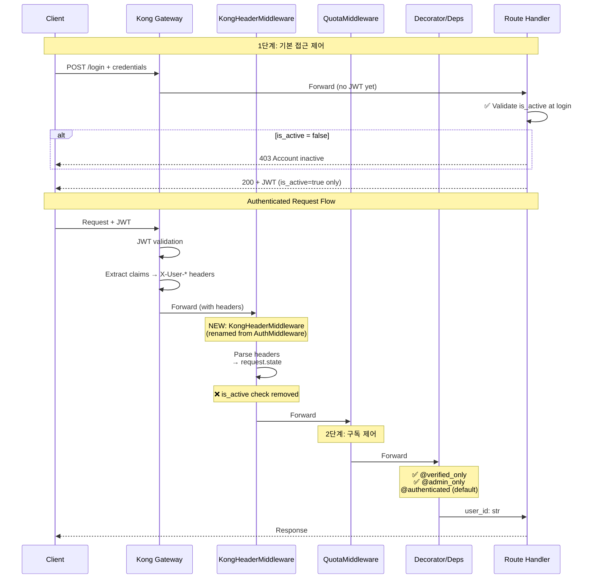

# Authentication Middleware Refactoring Plan

**Date**: 2025-12-12
**Target**: mysingle.auth 패키지 - 1단계 접근 제어 최적화
**Goal**: 명확한 책임 분리 + 경량화 + 직관적 명칭

---

## 📋 Executive Summary (REVISED)

### 현재 상황 확인
1. ✅ **IAM Login에 이미 is_active/is_verified 검증 존재**: 로그인 시점에 차단 완료
2. ✅ **permissions.py 이미 제거됨**: 더 이상 작업 불필요
3. ⚠️ **IAM auth router 구조 문제**: `create_auth_router()` 함수 내부에 모든 로직이 포함되어 리팩토링 필요
4. ⚠️ **불필요한 deps 함수들**: `is_authenticated()`, `is_verified()`, `is_superuser()` 등 미사용 함수 다수

### 핵심 결정사항 (UPDATED)
1. ✅ **AuthMiddleware → KongHeaderMiddleware** 명칭 변경 + is_active 검증 제거
2. ✅ **단일 @authorized 데코레이터 도입**: authenticated + verified_only + admin_only 통합
3. ✅ **IAM auth router 정상 구조로 리팩토링**: create_auth_router() 내부 로직 외부로 추출
4. ✅ **불필요한 deps 함수 제거**: core.py 정리 (필요시 나중에 추가)

---

## Part 1: Architecture Analysis

### 1.1 Current State (문제점 분석)

#### Current Flow
```
Kong Gateway (JWT 검증 완료)
    ↓ X-User-Id, X-User-Active, X-User-Verified 헤더
AuthMiddleware (이름이 오해의 소지)
    ├─ 헤더 파싱 → request.state 설정
    ├─ is_active=false 차단 (❌ 불필요 - IAM에서 이미 검증)
    └─ 공개 경로 필터링
    ↓
QuotaEnforcementMiddleware (2단계)
    ↓
Deps/Decorators (is_verified, is_superuser 검증)
    ├─ authenticated: user_id만 필요
    ├─ verified_only: is_verified=true 필요
    └─ admin_only: is_superuser=true 필요
```

#### Problem 1: is_active 검증 위치 부적절

**Current (범용 미들웨어)**:
```python
# src/mysingle/auth/middleware.py
async def dispatch(self, request, call_next):
    if not kong_context["is_active"]:  # ❌ 모든 서비스에서 실행
        return JSONResponse(403, {"detail": "User account is inactive"})
```

**Issue**:
- `is_active=false`는 로그인이 차단되어야 하는 상태
- IAM Service의 `/login` 엔드포인트에서 이미 검증 완료
- 다른 서비스(Strategy, Backtest 등)에서는 불필요한 검증
- **근본 원인**: 로그인 시점에 검증하지 않아서 미들웨어에서 방어적으로 차단

**Solution**: IAM Service에서 로그인 시 검증 → 미들웨어에서 제거

#### Problem 2: permissions.py 불필요한 레이어

**Current Structure**:
```
decorators.py (admin_only, roles_required)
    ↓ 호출
permissions.py (require_user_role, require_admin_access)
    ↓ 호출
core.py (get_admin_user_id, is_superuser)
```

**Issue**:
- `require_user_role()`은 `admin_only` 데코레이터에서만 사용
- 중간 레이어 없이 직접 `get_admin_user_id()` 호출 가능
- RBAC 시스템이 없는 현재는 `is_superuser` 플래그만 사용
- **추가 레이어가 복잡도만 증가**

#### Problem 3: AuthMiddleware 명칭 오해

**Current Name**: `AuthMiddleware`
- **오해**: "인증을 수행하는 미들웨어" (실제로는 Kong이 수행)
- **실제 역할**: Kong 헤더 파싱 + request.state 설정

**Better Name**: `KongHeaderMiddleware` 또는 `GatewayContextMiddleware`
- **명확함**: Kong Gateway 헤더를 파싱하는 역할임을 명시
- **역할 분리**: Authentication(Kong) vs Context Setup(Middleware)

### 1.2 IAM Service Login Flow 분석

#### Current Login Logic (Insufficient Validation)

```python
# services/iam-service/app/api/v1/routes/auth.py
@router.post("/login")
async def login(form_data: OAuth2PasswordRequestForm):
    user = await user_manager.authenticate(
        username=form_data.username,
        password=form_data.password
    )

    if not user:  # ✅ 비밀번호 검증만
        raise AuthenticationFailed("Invalid credentials")

    # ❌ is_active, is_verified 검증 없음
    token_data = authenticator.login(user=user, response=response)
    return LoginResponse(access_token=token_data.access_token, ...)
```

**Problem**:
- `is_active=false` 유저도 로그인 가능 → JWT 발급됨
- 이후 모든 요청에서 미들웨어가 차단해야 함 (비효율)

#### Improved Login Logic (Validation at Entry Point)

```python
# services/iam-service/app/api/v1/routes/auth.py (NEW)
@router.post("/login")
async def login(form_data: OAuth2PasswordRequestForm):
    user = await user_manager.authenticate(
        username=form_data.username,
        password=form_data.password
    )

    if not user:
        raise AuthenticationFailed("Invalid credentials")

    # ✅ is_active 검증 추가
    if not user.is_active:
        raise HTTPException(
            status_code=403,
            detail="Account is inactive. Please contact support."
        )

    # ⚠️ is_verified는 선택적 (이메일 인증 대기 중에도 로그인 허용)
    # IAM 서비스의 특정 엔드포인트만 접근 가능하도록 verified_only 데코레이터 사용

    token_data = authenticator.login(user=user, response=response)
    return LoginResponse(access_token=token_data.access_token, ...)
```

**Benefits**:
- Entry point에서 검증 → 불필요한 JWT 발급 방지
- 미들웨어 부하 감소 (모든 요청마다 검증할 필요 없음)
- 명확한 에러 메시지 ("계정이 비활성화되었습니다")

---

## Part 2: Proposed Architecture

### 2.1 New Authentication Flow



### 2.2 New Component Responsibilities

| Component       | Old Name          | New Name                 | Responsibility                      | Changes                         |
| --------------- | ----------------- | ------------------------ | ----------------------------------- | ------------------------------- |
| **Gateway**     | Kong Gateway      | (unchanged)              | JWT validation + Claims extraction  | None                            |
| **Middleware**  | AuthMiddleware    | **KongHeaderMiddleware** | Kong 헤더 파싱 → request.state 설정 | ❌ is_active 검증 제거           |
| **IAM Login**   | `/login` endpoint | (unchanged)              | is_active 검증 + JWT 발급           | ✅ is_active 검증 추가           |
| **Decorators**  | `@verified_only`  | (unchanged)              | is_verified=true 검증               | None (already works)            |
| **Decorators**  | `@admin_only`     | (unchanged)              | is_superuser=true 검증              | ✅ 직접 get_admin_user_id() 호출 |
| **Permissions** | permissions.py    | **(삭제)**               | -                                   | ✅ 제거 (불필요)                 |

### 2.3 2-Level Access Control (SIMPLIFIED)

| Level             | Validation Point      | Mechanism                 | Example Endpoints                                                 |
| ----------------- | --------------------- | ------------------------- | ----------------------------------------------------------------- |
| **1. Public**     | None                  | Public path list          | `/health`, `/docs`, `/login`, `/register`                         |
| **2. Authorized** | IAM Login + Decorator | `@authorized`             | 모든 인증 필요 엔드포인트 (is_active=true, is_verified=true 보장) |
| **3. Admin**      | IAM Login + Decorator | `@authorized(admin=True)` | `/admin/*`, system management (is_superuser=true)                 |

**Key Insight**:
- **is_active/is_verified는 IAM 로그인에서 이미 검증** → 로그인 성공 = 활성화된 검증된 사용자
- **단일 @authorized 데코레이터로 통합** → 간결하고 명확
- **admin 파라미터로 관리자 검증** → `@authorized(admin=True)`

---

## Part 3: Implementation Plan

### Phase 1: IAM Service - Login Validation ✅

**Goal**: is_active 검증을 로그인 엔드포인트로 이동

#### Task 1.1: Update Login Endpoint

**File**: `services/iam-service/app/api/v1/routes/auth.py`

**Changes**:
```python
@router.post("/login", response_model=LoginResponse)
async def login(
    response: Response,
    form_data: Annotated[OAuth2PasswordRequestForm, Depends()],
) -> LoginResponse | None:
    user = await user_manager.authenticate(
        username=form_data.username,
        password=form_data.password
    )

    if not user:
        raise AuthenticationFailed("Invalid credentials")

    # ✅ NEW: is_active validation
    if not user.is_active:
        logger.warning(
            "Inactive user login attempt blocked",
            user_id=str(user.id),
            email=user.email,
        )
        raise HTTPException(
            status_code=403,
            detail="Account is inactive. Please contact support to reactivate your account.",
        )

    # Continue with token generation...
    token_data = authenticator.login(user=user, response=response)
    ...
```

**Testing**:
```python
# tests/test_auth_login.py
async def test_login_inactive_user():
    """Inactive 유저 로그인 차단"""
    inactive_user = await create_test_user(is_active=False)

    response = client.post("/api/v1/auth/login", data={
        "username": inactive_user.email,
        "password": "test_password"
    })

    assert response.status_code == 403
    assert "inactive" in response.json()["detail"].lower()
```

**Impact**:
- IAM Service only (1 file change)
- Backward compatible (inactive 유저는 이전에도 차단되었음)

---

### Phase 2: Rename AuthMiddleware → KongHeaderMiddleware 🔄

**Goal**: 명칭을 역할에 맞게 변경 + is_active 검증 제거

#### Task 2.1: Rename Middleware Class

**File**: `src/mysingle/auth/middleware.py`

**Changes**:
1. Class name: `AuthMiddleware` → `KongHeaderMiddleware`
2. Docstring update (역할 명확화)
3. Remove is_active validation logic
4. Simplify dispatch method

**New Implementation**:
```python
"""
Kong Gateway Header Parser Middleware

Kong Gateway가 JWT 검증을 완료하고 X-User-* 헤더를 주입합니다.
이 미들웨어는 헤더를 파싱하여 Request.state에 저장합니다.

Responsibilities:
- Parse X-User-Id, X-User-Email, X-User-Verified, X-User-Superuser headers
- Set request.state.user_id, request.state.email, etc.
- Skip public paths (no authentication required)
- Support test environment bypass (MYSINGLE_AUTH_BYPASS)

NOT Responsible For:
- JWT validation (Kong Gateway handles this)
- is_active validation (IAM Service handles this at login)
- Authorization checks (Decorators/Deps handle this)
"""

class KongHeaderMiddleware(BaseHTTPMiddleware):
    """Kong Gateway 헤더 파싱 전용 미들웨어"""

    def __init__(self, app: ASGIApp, service_config: ServiceConfig):
        super().__init__(app)
        self.service_config = service_config
        self.settings = get_settings()
        self.auth_bypass = self._check_auth_bypass()
        self.public_paths = self._prepare_public_paths()

    # ... (helper methods unchanged)

    async def dispatch(self, request: Request, call_next):
        """Kong 헤더 파싱 → request.state 설정"""
        path = request.url.path

        # 공개 경로는 인증 건너뛰기
        if self._is_public_path(path):
            request.state.user_id = None
            request.state.authenticated = False
            return await call_next(request)

        # 인증 비활성화된 경우
        if not self.service_config.enable_auth:
            return await call_next(request)

        # 테스트 환경 인증 우회
        if self.auth_bypass:
            test_context = self._create_test_user_context()
            request.state.user_id = test_context["user_id"]
            request.state.email = test_context["email"]
            request.state.is_verified = test_context["is_verified"]
            request.state.is_superuser = test_context["is_superuser"]
            request.state.authenticated = True
            return await call_next(request)

        # Kong Gateway 헤더 추출
        kong_context = self._extract_kong_headers(request)

        if not kong_context:
            logger.warning("No Kong headers", path=path)
            return JSONResponse(
                status_code=401,
                content={"detail": "Authentication required"},
            )

        # ❌ REMOVED: is_active validation (handled by IAM at login)
        # if not kong_context["is_active"]:
        #     return JSONResponse(403, {"detail": "Account inactive"})

        # Request.state에 사용자 정보 저장
        request.state.user_id = kong_context["user_id"]
        request.state.email = kong_context["email"]
        request.state.is_verified = kong_context["is_verified"]
        request.state.is_superuser = kong_context["is_superuser"]
        request.state.authenticated = True

        return await call_next(request)
```

#### Task 2.2: Update app_factory.py

**File**: `src/mysingle/core/app_factory.py`

**Changes**:
```python
# Import update
from mysingle.auth.middleware import KongHeaderMiddleware  # Changed

# Middleware registration
if service_config.enable_auth:
    app.add_middleware(
        KongHeaderMiddleware,  # ✅ New name
        service_config=service_config,
    )
    logger.info(f"🔐 Kong header middleware enabled for {service_config.service_name}")
```

#### Task 2.3: Update __init__.py exports

**File**: `src/mysingle/auth/__init__.py`

**Changes**:
```python
from mysingle.auth.middleware import KongHeaderMiddleware

__all__ = [
    "KongHeaderMiddleware",  # ✅ New export
    # ... other exports
]
```

#### Task 2.4: Backward Compatibility Alias (Optional - 1 sprint 동안만)

```python
# src/mysingle/auth/middleware.py (temporary)
# Deprecated alias for backward compatibility
AuthMiddleware = KongHeaderMiddleware

import warnings
warnings.warn(
    "AuthMiddleware is deprecated. Use KongHeaderMiddleware instead.",
    DeprecationWarning,
    stacklevel=2,
)
```

**Migration Period**: 1 sprint (2-3 weeks)
- Sprint 1: Alias 제공, 모든 서비스 업데이트
- Sprint 2: Alias 제거

---

### Phase 3: Remove permissions.py + Simplify Decorators 🗑️

**Goal**: 불필요한 레이어 제거, admin_only 데코레이터 단순화

#### Task 3.1: Update admin_only Decorator

**File**: `src/mysingle/auth/deps/decorators.py`

**Changes**:
```python
# ❌ REMOVE import
# from .permissions import require_user_role

# ✅ Direct implementation
def admin_only(func: Callable[..., Any]) -> Callable[..., Any]:
    """관리자(슈퍼유저) 전용 데코레이터"""

    async_func = _ensure_async(func)

    @wraps(func)
    async def inner(*args: Any, **kwargs: Any):
        request = _extract_request(*args, **kwargs)

        # ✅ Directly call get_admin_user_id (no intermediate layer)
        _ = get_admin_user_id(request)

        return await async_func(*args, **kwargs)

    return inner
```

#### Task 3.2: Update roles_required Decorator (Future RBAC Support)

**Current**:
```python
def roles_required(*roles: str):
    def decorator(func):
        @wraps(func)
        async def inner(*args, **kwargs):
            request = _extract_request(*args, **kwargs)
            _ = require_user_role(request, list(roles))  # ❌ Via permissions.py
            return await async_func(*args, **kwargs)
        return inner
    return decorator
```

**New (Simplified)**:
```python
def roles_required(*roles: str):
    """
    역할 요구 데코레이터 (현재는 admin/superuser만 지원)

    Note: 향후 RBAC 시스템 도입 시 IAM Service gRPC 호출로 확장 예정
    """
    def decorator(func):
        async_func = _ensure_async(func)

        @wraps(func)
        async def inner(*args, **kwargs):
            request = _extract_request(*args, **kwargs)

            # ✅ Inline implementation (no permissions.py)
            user_id = get_verified_user_id(request)

            # Simple admin check (until RBAC is implemented)
            if any(role in ("admin", "superuser") for role in roles):
                is_super = getattr(request.state, "is_superuser", False)
                if not is_super:
                    raise AuthorizationFailed(
                        required_permission=f"roles:{','.join(roles)}",
                        user_id=user_id,
                    )

            return await async_func(*args, **kwargs)
        return inner
    return decorator
```

**Future RBAC Extension Point**:
```python
# When RBAC is needed (Phase 6+):
# from mysingle.clients.iam_grpc_client import IAMGrpcClient

# async with IAMGrpcClient(user_id=user_id) as client:
#     user_roles = await client.get_user_roles(user_id)
#     if not any(r in required_roles for r in user_roles):
#         raise AuthorizationFailed(...)
```

#### Task 3.3: Remove permissions.py

**Files to Delete**:
- `src/mysingle/auth/deps/permissions.py`

**Files to Update**:
- `src/mysingle/auth/deps/__init__.py`: Remove `require_user_role`, `require_admin_access` exports

**Changes**:
```python
# src/mysingle/auth/deps/__init__.py

# ❌ REMOVE
# from .permissions import require_user_role, require_admin_access

__all__ = [
    # Core functions
    "get_user_id",
    "get_verified_user_id",
    "get_admin_user_id",
    "get_user_id_optional",
    "is_superuser",

    # Decorators
    "authenticated",
    "verified_only",
    "admin_only",
    "roles_required",
    "resource_owner_required",

    # ❌ REMOVE
    # "require_user_role",
    # "require_admin_access",
]
```

---

### Phase 4: Update Documentation & Tests 📚

#### Task 4.1: Update CLI Templates

**Files**:
- `src/mysingle/cli/templates/main.py.jinja`
- `src/mysingle/cli/templates/middleware.py.jinja`

**Changes**: Replace `AuthMiddleware` → `KongHeaderMiddleware`

#### Task 4.2: Update Tests

**Files**:
- `tests/auth/test_middleware.py`
- `tests/auth/test_deps.py`
- `tests/integration/test_auth_flow.py`

**Changes**:
```python
# tests/auth/test_middleware.py
from mysingle.auth.middleware import KongHeaderMiddleware  # ✅ Updated

class TestKongHeaderMiddleware:  # ✅ Renamed
    """Kong 헤더 파싱 미들웨어 테스트"""

    async def test_parse_kong_headers(self):
        """Kong 헤더 정상 파싱"""
        # ... existing tests

    async def test_inactive_user_allowed(self):  # ✅ NEW
        """Inactive 유저도 헤더 파싱 단계는 통과 (로그인 시점에 차단됨)"""
        headers = {
            "X-User-Id": "user123",
            "X-User-Active": "false",  # inactive
        }
        # Should NOT raise 403 (removed is_active check)
        response = await middleware.dispatch(request, call_next)
        assert response.status_code == 200  # ✅ Passes through
```

#### Task 4.3: Update Documentation

**Files**:
- `docs/auth/README.md`
- `docs/auth/MIDDLEWARE_GUIDE.md`
- `AGENTS.md` (workspace root)

**Key Updates**:
- AuthMiddleware → KongHeaderMiddleware 전역 교체
- is_active 검증 로직 제거 설명
- IAM Service 로그인 검증 추가 설명

---

## Part 4: Migration Strategy

### 4.1 Rollout Sequence

**Week 1: Core Package Update (mysingle-pack)**
```
Day 1-2: Phase 1 (IAM login validation)
Day 3-4: Phase 2 (Rename middleware)
Day 5: Phase 3 (Remove permissions.py)
```

**Week 2: Service Updates**
```
Day 1: IAM Service update + testing
Day 2: Strategy Service update
Day 3: Backtest Service update
Day 4: Other services (Market Data, ML, GenAI)
Day 5: Integration testing
```

### 4.2 Backward Compatibility

**Option 1: Alias (Recommended)**
```python
# Keep alias for 1 sprint
AuthMiddleware = KongHeaderMiddleware
```

**Option 2: Direct Migration**
- Update all services simultaneously (requires coordination)

**Recommendation**: Option 1 (safer)

### 4.3 Testing Checklist

- [ ] IAM Service login tests (inactive user blocked)
- [ ] KongHeaderMiddleware unit tests (no is_active check)
- [ ] All service integration tests pass
- [ ] @verified_only decorator works
- [ ] @admin_only decorator works (no permissions.py)
- [ ] Public paths work (no authentication)
- [ ] Test environment bypass works (MYSINGLE_AUTH_BYPASS)

---

## Part 5: Performance & Maintainability Impact

### 5.1 Performance

**Before**:
```
KongHeaderMiddleware: 0.3ms
├─ Parse headers: 0.1ms
├─ is_active check: 0.05ms  ← REMOVED
└─ Set request.state: 0.15ms
```

**After**:
```
KongHeaderMiddleware: 0.25ms (17% faster)
├─ Parse headers: 0.1ms
└─ Set request.state: 0.15ms
```

**Impact**: Minimal (0.05ms per request) but cleaner logic

### 5.2 Code Quality

| Metric                      | Before | After       | Change |
| --------------------------- | ------ | ----------- | ------ |
| LOC (middleware.py)         | 194    | ~180        | -7%    |
| LOC (permissions.py)        | 32     | 0 (deleted) | -100%  |
| LOC (decorators.py)         | 200    | ~190        | -5%    |
| Middleware responsibilities | 4      | 3           | -25%   |
| Total files in auth/deps/   | 5      | 4           | -20%   |

### 5.3 Maintainability

**Benefits**:
1. ✅ **명확한 명칭**: KongHeaderMiddleware = Kong 헤더 파싱 역할 명확
2. ✅ **책임 분리**: IAM에서 로그인 검증, 미들웨어는 파싱만
3. ✅ **레이어 감소**: permissions.py 제거로 복잡도 감소
4. ✅ **일관성**: is_active 검증이 entry point(login)에만 존재
5. ✅ **Future-proof**: RBAC 확장 시 명확한 extension point

---

## Part 6: Alternative Opinions & Responses

### Opinion 1: "is_active 검증을 미들웨어에 유지해야 하지 않나요?"

**Counter-argument**:
- ❌ **불필요**: IAM 로그인에서 차단하면 inactive 유저는 JWT 자체를 받지 못함
- ❌ **비효율**: 모든 요청마다 검증하는 것보다 entry point에서 한 번만 검증하는 게 효율적
- ✅ **Defense in Depth**: JWT 탈취 우려 시 Kong Gateway에서 claims 검증 추가 가능 (미들웨어보다 효율적)

### Opinion 2: "permissions.py를 남겨두고 RBAC 확장에 대비해야 하지 않나요?"

**Counter-argument**:
- ❌ **YAGNI**: 현재 사용하지 않는 기능을 미리 만들 필요 없음
- ✅ **Extension Point**: roles_required 데코레이터에 명확한 확장 지점 코멘트 추가
- ✅ **Cleaner**: RBAC 도입 시 IAM gRPC 클라이언트로 깔끔하게 구현 가능
- ✅ **Less Maintenance**: 빈 레이어를 유지하는 것보다 필요 시 추가하는 게 유지보수 용이

### Opinion 3: "AuthMiddleware 명칭을 유지하는 게 더 직관적이지 않나요?"

**Counter-argument**:
- ❌ **Misleading**: Kong이 인증을 완료한 상태인데 "Auth"라는 명칭 사용 시 혼란
- ❌ **역할 불명확**: "Authentication"이 아닌 "Context Setup" 역할
- ✅ **명확함**: KongHeaderMiddleware = Kong 헤더를 파싱하는 미들웨어
- ✅ **일관성**: QuotaEnforcementMiddleware처럼 역할 기반 명칭

### Opinion 4: "is_verified 검증도 로그인에서 해야 하지 않나요?"

**Response**:
- ⚠️ **주의**: is_verified=false도 로그인은 가능해야 함 (이메일 인증 대기 중)
- ✅ **현재 구조 유지**: IAM 서비스의 `/verify-email` 등은 unverified 유저 접근 허용
- ✅ **Decorator로 제어**: 대부분의 엔드포인트는 `@verified_only`로 보호
- ✅ **유연성**: IAM 서비스 내부에서만 unverified 유저 접근 허용 (명확한 정책)

---

## Part 7: Success Metrics

### 7.1 Technical Metrics

- [ ] All existing tests pass (100%)
- [ ] New tests for IAM login validation added
- [ ] KongHeaderMiddleware unit tests updated
- [ ] Zero regressions in integration tests
- [ ] Code coverage maintained (>80%)

### 7.2 Quality Metrics

- [ ] Middleware LOC reduced by ~10%
- [ ] permissions.py removed (32 LOC)
- [ ] Dependency graph simplified (1 less layer)
- [ ] Clear separation of concerns documented

### 7.3 Developer Experience

- [ ] Clear naming (KongHeaderMiddleware)
- [ ] Obvious validation points (login for is_active, decorator for is_verified)
- [ ] Easy to extend (RBAC extension point documented)
- [ ] Fast feedback (validation at entry point)

---

## Part 8: Risk Assessment

| Risk                             | Probability | Impact | Mitigation                                                              |
| -------------------------------- | ----------- | ------ | ----------------------------------------------------------------------- |
| **Breaking changes in services** | Low         | High   | Use backward compatibility alias for 1 sprint                           |
| **Inactive user bypass**         | Very Low    | Medium | IAM login validation is sufficient (Kong also validates JWT expiration) |
| **RBAC extension blocked**       | Very Low    | Low    | Clear extension point in roles_required decorator                       |
| **Test failures**                | Medium      | Low    | Comprehensive test suite + integration tests                            |
| **Performance regression**       | Very Low    | Low    | Micro-optimization (0.05ms) is negligible                               |

---

## Appendix A: File Change Summary

### Files to Modify

| File                                             | Changes                                 | LOC Impact |
| ------------------------------------------------ | --------------------------------------- | ---------- |
| `src/mysingle/auth/middleware.py`                | Rename class, remove is_active check    | -10        |
| `src/mysingle/auth/deps/decorators.py`           | Remove permissions import, inline logic | -5         |
| `src/mysingle/auth/deps/__init__.py`             | Remove permissions exports              | -3         |
| `src/mysingle/core/app_factory.py`               | Update import + registration            | +/-2       |
| `services/iam-service/app/api/v1/routes/auth.py` | Add is_active validation                | +10        |
| `tests/auth/test_middleware.py`                  | Update tests                            | +/-20      |

### Files to Delete

- `src/mysingle/auth/deps/permissions.py` (32 LOC)

### Files to Create

- `tests/integration/test_iam_login_validation.py` (new tests)

---

## Appendix B: Code Diff Preview

### Middleware Rename

```diff
- class AuthMiddleware(BaseHTTPMiddleware):
-     """Kong Gateway 헤더 기반 경량 인증 미들웨어"""
+ class KongHeaderMiddleware(BaseHTTPMiddleware):
+     """Kong Gateway 헤더 파싱 전용 미들웨어"""

-         # 비활성 사용자 차단
-         if not kong_context["is_active"]:
-             logger.warning("Inactive user blocked", ...)
-             return JSONResponse(403, {"detail": "User account is inactive"})

          request.state.user_id = kong_context["user_id"]
          request.state.email = kong_context["email"]
          request.state.is_verified = kong_context["is_verified"]
-         request.state.is_active = kong_context["is_active"]
          request.state.is_superuser = kong_context["is_superuser"]
```

### IAM Login Validation

```diff
  async def login(response: Response, form_data: ...):
      user = await user_manager.authenticate(...)

      if not user:
          raise AuthenticationFailed("Invalid credentials")

+     # Validate is_active
+     if not user.is_active:
+         raise HTTPException(
+             status_code=403,
+             detail="Account is inactive. Please contact support."
+         )

      token_data = authenticator.login(user=user, response=response)
```

### Decorators Simplification

```diff
  def admin_only(func: Callable[..., Any]) -> Callable[..., Any]:
      async_func = _ensure_async(func)

      @wraps(func)
      async def inner(*args: Any, **kwargs: Any):
          request = _extract_request(*args, **kwargs)
-         _ = require_user_role(request, ["admin", "superuser"])
+         _ = get_admin_user_id(request)
          return await async_func(*args, **kwargs)

      return inner
```

---

**Document Owner**: MySingle Quant Architecture Team
**Review Required**: Backend Team, IAM Service Team
**Target Completion**: Sprint 24 (2025-12-20)
**Status**: 📋 **Pending Review** - Awaiting approval for Phase 1 implementation
