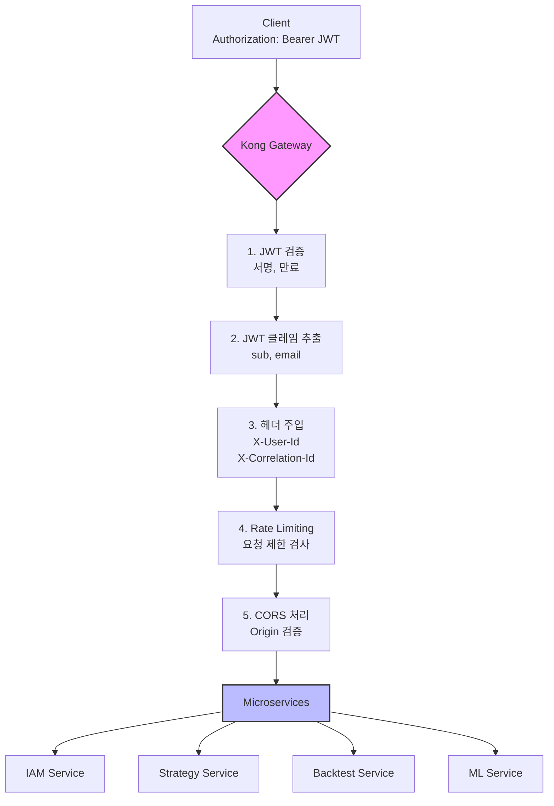

# API Gateway (Kong) 설정 가이드

**Version:** 2.2.1 | **Last Updated:** 2025-12-02

Kong Gateway를 사용한 MySingle 플랫폼의 API Gateway 설정 가이드입니다. JWT 인증, 라우팅, 플러그인 구성 등을 다룹니다.

---

## 📋 목차

1. [개요](#개요)
2. [Kong Gateway 설치](#kong-gateway-설치)
3. [서비스 및 라우트 설정](#서비스-및-라우트-설정)
4. [JWT 플러그인 설정](#jwt-플러그인-설정)
5. [CORS 설정](#cors-설정)
6. [Rate Limiting](#rate-limiting)
7. [헤더 전파 설정](#헤더-전파-설정)
8. [실전 설정 예제](#실전-설정-예제)

---

## 개요

### Kong Gateway 역할



### 주요 기능

- **JWT 인증**: IAM Service에서 발급한 토큰 검증
- **헤더 주입**: JWT 클레임을 HTTP 헤더로 변환
- **라우팅**: 경로 기반 서비스 라우팅
- **보안**: CORS, Rate Limiting, IP Filtering
- **모니터링**: 요청 로깅, 메트릭 수집

---

## Kong Gateway 설치

### 1. Docker Compose 설치 (권장)

**docker-compose.yml**:
```yaml
version: '3.8'

services:
  kong-database:
    image: postgres:15
    environment:
      POSTGRES_USER: kong
      POSTGRES_DB: kong
      POSTGRES_PASSWORD: kong
    ports:
      - "5432:5432"
    volumes:
      - kong_data:/var/lib/postgresql/data
    healthcheck:
      test: ["CMD", "pg_isready", "-U", "kong"]
      interval: 30s
      timeout: 30s
      retries: 3

  kong-migrations:
    image: kong:3.4
    command: kong migrations bootstrap
    environment:
      KONG_DATABASE: postgres
      KONG_PG_HOST: kong-database
      KONG_PG_USER: kong
      KONG_PG_PASSWORD: kong
    depends_on:
      - kong-database

  kong:
    image: kong:3.4
    environment:
      KONG_DATABASE: postgres
      KONG_PG_HOST: kong-database
      KONG_PG_USER: kong
      KONG_PG_PASSWORD: kong
      KONG_PROXY_ACCESS_LOG: /dev/stdout
      KONG_ADMIN_ACCESS_LOG: /dev/stdout
      KONG_PROXY_ERROR_LOG: /dev/stderr
      KONG_ADMIN_ERROR_LOG: /dev/stderr
      KONG_ADMIN_LISTEN: 0.0.0.0:8001
      KONG_PROXY_LISTEN: 0.0.0.0:8000
    ports:
      - "8000:8000"  # Proxy
      - "8443:8443"  # Proxy SSL
      - "8001:8001"  # Admin API
      - "8444:8444"  # Admin API SSL
    depends_on:
      - kong-database
      - kong-migrations
    healthcheck:
      test: ["CMD", "kong", "health"]
      interval: 10s
      timeout: 10s
      retries: 10

volumes:
  kong_data:
```

실행:
```bash
docker-compose up -d
```

### 2. Kong Admin API 확인

```bash
# Kong 상태 확인
curl http://localhost:8001/status

# 서비스 목록
curl http://localhost:8001/services
```

---

## 서비스 및 라우트 설정

### 1. IAM Service 등록

```bash
# 서비스 생성
curl -i -X POST http://localhost:8001/services \
  --data name=iam-service \
  --data url=http://iam-service:8000

# 라우트 생성
curl -i -X POST http://localhost:8001/services/iam-service/routes \
  --data 'paths[]=/api/v1/auth' \
  --data 'paths[]=/api/v1/users' \
  --data 'paths[]=/api/v1/oauth2' \
  --data 'paths[]=/api/v1/register' \
  --data 'paths[]=/api/v1/verify' \
  --data 'paths[]=/api/v1/reset-password' \
  --data name=iam-route
```

### 2. Strategy Service 등록

```bash
# 서비스 생성
curl -i -X POST http://localhost:8001/services \
  --data name=strategy-service \
  --data url=http://strategy-service:8000

# 라우트 생성
curl -i -X POST http://localhost:8001/services/strategy-service/routes \
  --data 'paths[]=/api/v1/strategies' \
  --data name=strategy-route
```

### 3. Backtest Service 등록

```bash
# 서비스 생성
curl -i -X POST http://localhost:8001/services \
  --data name=backtest-service \
  --data url=http://backtest-service:8000

# 라우트 생성
curl -i -X POST http://localhost:8001/services/backtest-service/routes \
  --data 'paths[]=/api/v1/backtests' \
  --data name=backtest-route
```

---

## JWT 플러그인 설정

### 1. JWT Consumer 생성

```bash
# Consumer 생성 (IAM Service)
curl -i -X POST http://localhost:8001/consumers \
  --data username=iam-service

# JWT Credential 생성
curl -i -X POST http://localhost:8001/consumers/iam-service/jwt \
  --data key=mysingle-iam \
  --data algorithm=HS256 \
  --data secret=your-jwt-secret-key-here
```

### 2. JWT 플러그인 활성화

```bash
# 전역 JWT 플러그인 (모든 서비스에 적용)
curl -i -X POST http://localhost:8001/plugins \
  --data name=jwt \
  --data config.claims_to_verify=exp \
  --data config.key_claim_name=iss \
  --data config.secret_is_base64=false

# 특정 라우트만 인증 제외 (공개 경로)
curl -i -X POST http://localhost:8001/routes/iam-route/plugins \
  --data name=request-termination \
  --data config.status_code=200 \
  --data config.message="Public route" \
  --data 'config.trigger=false'
```

### 3. JWT 클레임을 헤더로 변환 (Pre-function)

Kong의 `pre-function` 플러그인으로 JWT `sub` 클레임을 `X-User-Id` 헤더로 추출:

```bash
curl -i -X POST http://localhost:8001/plugins \
  --data name=pre-function \
  --data 'config.access[1]=local jwt_claims = kong.ctx.shared.jwt_claims
if jwt_claims and jwt_claims.sub then
  kong.service.request.set_header("X-User-Id", jwt_claims.sub)
end
if jwt_claims and jwt_claims.email then
  kong.service.request.set_header("X-User-Email", jwt_claims.email)
end'
```

### 4. Correlation ID 주입

```bash
curl -i -X POST http://localhost:8001/plugins \
  --data name=correlation-id \
  --data config.header_name=X-Correlation-Id \
  --data config.generator=uuid \
  --data config.echo_downstream=true
```

---

## CORS 설정

### 1. CORS 플러그인 활성화

```bash
curl -i -X POST http://localhost:8001/plugins \
  --data name=cors \
  --data 'config.origins=http://localhost:3000' \
  --data 'config.origins=https://mysingle.com' \
  --data 'config.origins=https://*.mysingle.com' \
  --data 'config.methods=GET' \
  --data 'config.methods=POST' \
  --data 'config.methods=PUT' \
  --data 'config.methods=PATCH' \
  --data 'config.methods=DELETE' \
  --data 'config.methods=OPTIONS' \
  --data 'config.headers=Accept' \
  --data 'config.headers=Authorization' \
  --data 'config.headers=Content-Type' \
  --data 'config.headers=X-User-Id' \
  --data 'config.headers=X-Correlation-Id' \
  --data config.exposed_headers=X-Auth-Token \
  --data config.credentials=true \
  --data config.max_age=3600
```

### 2. Preflight 요청 처리

Kong은 `OPTIONS` 요청을 자동으로 처리하므로 별도 설정 불필요.

---

## Rate Limiting

### 1. IP 기반 제한

```bash
# 전역 Rate Limiting (IP 기반)
curl -i -X POST http://localhost:8001/plugins \
  --data name=rate-limiting \
  --data config.minute=100 \
  --data config.hour=1000 \
  --data config.policy=local \
  --data config.limit_by=ip
```

### 2. 사용자 기반 제한 (X-User-Id)

```bash
# 사용자별 Rate Limiting
curl -i -X POST http://localhost:8001/plugins \
  --data name=rate-limiting \
  --data config.minute=60 \
  --data config.hour=1000 \
  --data config.policy=local \
  --data config.limit_by=header \
  --data config.header_name=X-User-Id
```

### 3. 엔드포인트별 제한

```bash
# 로그인 엔드포인트 제한 (무차별 대입 공격 방지)
curl -i -X POST http://localhost:8001/routes/iam-route/plugins \
  --data name=rate-limiting \
  --data config.minute=5 \
  --data config.hour=20 \
  --data config.policy=local \
  --data config.limit_by=ip \
  --data 'config.path=/api/v1/auth/login'
```

---

## 헤더 전파 설정

### 1. 필수 헤더

Kong Gateway가 다운스트림 서비스로 전달해야 하는 헤더:

| 헤더                | 출처               | 설명          |
| ------------------- | ------------------ | ------------- |
| `X-User-Id`         | JWT `sub` 클레임   | 사용자 ID     |
| `X-User-Email`      | JWT `email` 클레임 | 사용자 이메일 |
| `X-Correlation-Id`  | Kong 플러그인 생성 | 요청 추적 ID  |
| `X-Kong-Request-Id` | Kong 자동 생성     | Kong 요청 ID  |
| `X-Forwarded-For`   | 클라이언트 IP      | 원본 IP 주소  |
| `X-Real-IP`         | 클라이언트 IP      | 실제 IP 주소  |

### 2. 헤더 전파 플러그인

```bash
# Request Transformer - 헤더 추가/변환
curl -i -X POST http://localhost:8001/plugins \
  --data name=request-transformer \
  --data 'config.add.headers=X-Kong-Request-Id:$(kong.request.get_header("X-Kong-Request-Id"))' \
  --data 'config.add.headers=X-Forwarded-For:$(kong.client.get_forwarded_ip())' \
  --data 'config.add.headers=X-Real-IP:$(kong.client.get_ip())'
```

### 3. 민감 헤더 제거 (업스트림)

```bash
# Response Transformer - 응답 헤더 제거
curl -i -X POST http://localhost:8001/plugins \
  --data name=response-transformer \
  --data 'config.remove.headers=X-Kong-Upstream-Latency' \
  --data 'config.remove.headers=X-Kong-Proxy-Latency' \
  --data 'config.remove.headers=Server'
```

---

## 실전 설정 예제

### 1. 완전한 Kong 설정 (Declarative Config)

**kong.yml**:
```yaml
_format_version: "3.0"

services:
  - name: iam-service
    url: http://iam-service:8000
    routes:
      - name: iam-auth-route
        paths:
          - /api/v1/auth
          - /api/v1/users
          - /api/v1/oauth2
          - /api/v1/register
          - /api/v1/verify
          - /api/v1/reset-password
    plugins:
      # CORS
      - name: cors
        config:
          origins:
            - http://localhost:3000
            - https://mysingle.com
          methods:
            - GET
            - POST
            - PUT
            - PATCH
            - DELETE
            - OPTIONS
          headers:
            - Accept
            - Authorization
            - Content-Type
          credentials: true
          max_age: 3600

  - name: strategy-service
    url: http://strategy-service:8000
    routes:
      - name: strategy-route
        paths:
          - /api/v1/strategies
    plugins:
      # JWT 인증 (필수)
      - name: jwt
        config:
          claims_to_verify:
            - exp
          key_claim_name: iss
      # Rate Limiting
      - name: rate-limiting
        config:
          minute: 60
          policy: local
          limit_by: header
          header_name: X-User-Id

  - name: backtest-service
    url: http://backtest-service:8000
    routes:
      - name: backtest-route
        paths:
          - /api/v1/backtests
    plugins:
      - name: jwt
        config:
          claims_to_verify:
            - exp
      - name: rate-limiting
        config:
          minute: 30
          policy: local

# 전역 플러그인
plugins:
  # JWT 클레임 → 헤더 변환
  - name: pre-function
    config:
      access:
        - |
          local jwt_claims = kong.ctx.shared.jwt_claims
          if jwt_claims then
            if jwt_claims.sub then
              kong.service.request.set_header("X-User-Id", jwt_claims.sub)
            end
            if jwt_claims.email then
              kong.service.request.set_header("X-User-Email", jwt_claims.email)
            end
          end

  # Correlation ID
  - name: correlation-id
    config:
      header_name: X-Correlation-Id
      generator: uuid
      echo_downstream: true

  # 요청 로깅
  - name: file-log
    config:
      path: /tmp/kong-access.log
      reopen: true

consumers:
  - username: iam-service
    jwt_secrets:
      - key: mysingle-iam
        algorithm: HS256
        secret: your-jwt-secret-key-here
```

적용:
```bash
deck sync -s kong.yml
```

### 2. 공개 경로 설정

일부 경로는 인증 없이 접근 가능:

```yaml
services:
  - name: iam-service
    routes:
      # 공개 경로 (JWT 인증 제외)
      - name: iam-public-route
        paths:
          - /api/v1/auth/login
          - /api/v1/auth/register
          - /api/v1/oauth2/google/callback
        plugins:
          - name: request-termination
            enabled: false  # JWT 플러그인 비활성화

      # 보호 경로 (JWT 인증 필수)
      - name: iam-protected-route
        paths:
          - /api/v1/users/me
        plugins:
          - name: jwt
```

### 3. 환경별 설정

**개발 환경** (kong-dev.yml):
```yaml
_format_version: "3.0"

services:
  - name: iam-service
    url: http://localhost:8000  # 로컬 서비스

plugins:
  # 개발 환경: Rate Limiting 완화
  - name: rate-limiting
    config:
      minute: 1000
      hour: 10000
```

**프로덕션 환경** (kong-prod.yml):
```yaml
_format_version: "3.0"

services:
  - name: iam-service
    url: http://iam-service.prod.svc.cluster.local:8000  # Kubernetes 서비스

plugins:
  # 프로덕션: 엄격한 Rate Limiting
  - name: rate-limiting
    config:
      minute: 60
      hour: 500

  # IP 화이트리스트
  - name: ip-restriction
    config:
      allow:
        - 10.0.0.0/8
        - 172.16.0.0/12
```

---

## 참고 자료

### Kong 공식 문서
- [Kong Gateway Documentation](https://docs.konghq.com/gateway/latest/)
- [JWT Plugin](https://docs.konghq.com/hub/kong-inc/jwt/)
- [CORS Plugin](https://docs.konghq.com/hub/kong-inc/cors/)
- [Rate Limiting Plugin](https://docs.konghq.com/hub/kong-inc/rate-limiting/)

### MySingle 관련 문서
- [IAM Service 가이드](IAM_SERVICE_GUIDE.md)
- [NON_IAM Service 가이드](NON_IAM_SERVICE_GUIDE.md)
- [Auth 모듈 개요](../../src/mysingle/auth/README.md)

---

**Maintainers**: MySingle Platform Team
**License**: MIT
