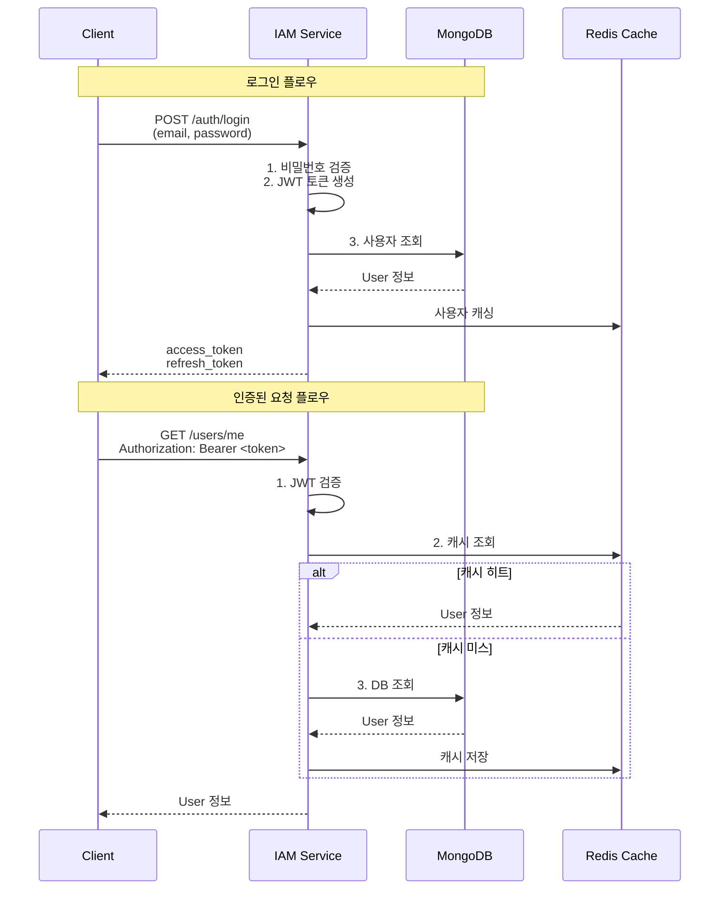

# IAM Service 인증 가이드

**Version:** 2.2.1 | **Last Updated:** 2025-12-02

IAM Service(Identity & Access Management Service)는 MySingle 플랫폼의 중앙 인증/인가 서비스로, 사용자 등록, 로그인, OAuth 연동 등 모든 사용자 관리 기능을 담당합니다.

---

## 📋 목차

1. [개요](#개요)
2. [서비스 설정](#서비스-설정)
3. [인증 아키텍처](#인증-아키텍처)
4. [사용자 관리](#사용자-관리)
5. [OAuth 2.0 통합](#oauth-20-통합)
6. [API 라우터](#api-라우터)
7. [보안 설정](#보안-설정)
8. [테스트 환경](#테스트-환경)

---

## 개요

### IAM Service의 역할

- **사용자 인증/인가**: 이메일/비밀번호, OAuth 2.0 기반 로그인
- **JWT 토큰 발급**: Access Token, Refresh Token 생성 및 검증
- **사용자 생명주기 관리**: 회원가입, 이메일 인증, 비밀번호 재설정
- **OAuth 연동**: Google, Kakao, Naver 계정 연동
- **MongoDB 직접 관리**: `users`, `oauth_accounts` 컬렉션 생성 및 관리

### 다른 서비스와의 차이점

| 항목           | IAM Service               | NON_IAM Service               |
| -------------- | ------------------------- | ----------------------------- |
| ServiceType    | `ServiceType.IAM_SERVICE` | `ServiceType.NON_IAM_SERVICE` |
| 인증 방식      | JWT 직접 검증             | Kong Gateway 헤더만 사용      |
| MongoDB 컬렉션 | User, OAuthAccount 생성   | 생성 안 함                    |
| 인증 라우터    | 전체 제공                 | 제공 안 함                    |
| 토큰 발급      | 직접 발급                 | 불가                          |

---

## 서비스 설정

### 1. FastAPI 앱 생성

```python
from mysingle.core import create_fastapi_app, create_service_config, ServiceType

# IAM Service 설정
config = create_service_config(
    service_name="iam-service",
    service_type=ServiceType.IAM_SERVICE,
    public_paths=[
        # 추가 공개 경로 (기본 인증 경로는 자동 포함)
        "/api/v1/public/status",
    ],
)

# FastAPI 앱 생성
app = create_fastapi_app(
    service_config=config,
    # IAM Service는 User/OAuthAccount가 자동 생성되므로
    # document_models에 추가 불필요
)
```

### 2. 환경변수 설정

**.env**:
```bash
# 서비스 설정
SERVICE_NAME=iam-service
ENVIRONMENT=production

# MongoDB
MONGO_URI=mongodb://localhost:27017
MONGO_DB_NAME=mysingle_iam

# JWT 설정
JWT_SECRET=your-secret-key-here
JWT_ALGORITHM=HS256
ACCESS_TOKEN_EXPIRE_MINUTES=30
REFRESH_TOKEN_EXPIRE_DAYS=7

# OAuth 2.0 - Google
GOOGLE_CLIENT_ID=your-google-client-id
GOOGLE_CLIENT_SECRET=your-google-client-secret

# OAuth 2.0 - Kakao
KAKAO_CLIENT_ID=your-kakao-client-id
KAKAO_CLIENT_SECRET=your-kakao-client-secret

# OAuth 2.0 - Naver
NAVER_CLIENT_ID=your-naver-client-id
NAVER_CLIENT_SECRET=your-naver-client-secret

# 이메일 (비밀번호 재설정, 이메일 인증)
SMTP_HOST=smtp.gmail.com
SMTP_PORT=587
SMTP_USER=your-email@gmail.com
SMTP_PASSWORD=your-app-password
EMAILS_FROM_EMAIL=noreply@mysingle.com
EMAILS_FROM_NAME=MySingle

# Redis (캐시)
REDIS_HOST=localhost
REDIS_PORT=6379
REDIS_DB=0

# 토큰 전송 방식 (cookie 또는 bearer)
TOKEN_TRANSPORT_TYPE=bearer
```

### 3. 자동 생성 컬렉션

IAM Service 시작 시 자동 생성:

```python
# users 컬렉션
{
    "_id": ObjectId,
    "email": "user@example.com",
    "hashed_password": "...",
    "full_name": "홍길동",
    "is_active": true,
    "is_superuser": false,
    "is_verified": true,
    "avatar_url": "https://...",
    "oauth_accounts": [...],
    "last_login_at": ISODate,
    "last_activity_at": ISODate,
    "login_count": 10,
    "created_at": ISODate,
    "updated_at": ISODate
}

# oauth_accounts 컬렉션
{
    "_id": ObjectId,
    "oauth_name": "google",
    "account_id": "google-user-id",
    "account_email": "user@gmail.com",
    "access_token": "...",
    "refresh_token": "...",
    "expires_at": 1234567890,
    "name": "홍길동",
    "avatar_url": "https://...",
    "created_at": ISODate,
    "updated_at": ISODate
}
```

---

## 인증 아키텍처

### 1. 인증 플로우



### 2. JWT 토큰 구조

**Access Token** (30분 만료):
```json
{
  "sub": "507f1f77bcf86cd799439011",  // User ID
  "email": "user@example.com",
  "aud": "quant-users",
  "type": "access",
  "is_verified": true,
  "is_superuser": false,
  "is_active": true,
  "exp": 1234567890,
  "iat": 1234565090
}
```

**Refresh Token** (7일 만료):
```json
{
  "sub": "507f1f77bcf86cd799439011",
  "email": "user@example.com",
  "aud": "quant-users",
  "type": "refresh",
  "exp": 1235171890,
  "iat": 1234565090
}
```

### 3. 미들웨어 인증 로직

```python
# AuthMiddleware - IAM Service 전용
async def _authenticate_iam_service(request: Request) -> Optional[User]:
    # 1. Authorization 헤더에서 Bearer 토큰 추출
    token = request.headers.get("Authorization", "").replace("Bearer ", "")

    # 2. 쿠키에서 access_token 추출 (브라우저 대비)
    if not token:
        token = request.cookies.get("access_token")

    if not token:
        return None

    # 3. JWT 토큰 검증
    decoded = jwt_manager.decode_token(token)
    user_id = decoded.get("sub")

    # 4. 캐시 우선 조회 (Redis)
    user = await user_cache.get_user(user_id)

    # 5. 캐시 미스 시 DB 조회
    if not user:
        user = await User.get(user_id)
        await user_cache.set_user(user)  # 캐시 저장

    return user
```

---

## 사용자 관리

### 1. UserManager

모든 사용자 관리 로직은 `UserManager` 클래스로 캡슐화:

```python
from mysingle.auth.user_manager import UserManager

user_manager = UserManager()

# 사용자 생성
user = await user_manager.create_user(
    email="user@example.com",
    password="secure_password",
    full_name="홍길동",
    is_verified=False,
)

# 비밀번호 검증
is_valid = await user_manager.verify_password(
    plain_password="user_input",
    user=user,
)

# 이메일 인증 토큰 발급
verify_token = user_manager.generate_verify_token(user)

# 비밀번호 재설정 토큰 발급
reset_token = user_manager.generate_reset_password_token(user)

# OAuth 계정 연동
oauth_user = await user_manager.oauth_callback(
    oauth_name="google",
    access_token="...",
    account_id="google-user-id",
    account_email="user@gmail.com",
)
```

### 2. 비밀번호 보안

```python
from mysingle.auth.security.password import password_helper

# 비밀번호 해싱 (Argon2 + Bcrypt)
hashed = password_helper.hash("plain_password")

# 비밀번호 검증 및 재해싱
is_valid, new_hash = password_helper.verify_and_update(
    plain_password="user_input",
    hashed_password=hashed,
)

# 안전한 임시 비밀번호 생성
temp_password = password_helper.generate_secure_password(length=12)
```

### 3. 이메일 인증

```python
# 이메일 인증 토큰 발급 (24시간 유효)
verify_token = jwt_manager.create_email_verify_token(
    user_id=str(user.id),
    email=user.email,
)

# 이메일 발송
await send_email(
    email_to=user.email,
    subject="이메일 인증",
    html_content=generate_verification_email(
        email=user.email,
        token=verify_token,
    ),
)

# 토큰 검증 및 사용자 활성화
decoded = jwt_manager.decode_token(verify_token)
user_id = decoded.get("sub")
user = await User.get(user_id)
user.is_verified = True
await user.save()
```

---

## OAuth 2.0 통합

### 1. 지원 프로바이더

- **Google**: `googleusercontent.com`
- **Kakao**: `kakao.com`
- **Naver**: `naver.com`

### 2. OAuth 플로우

```python
from mysingle.auth.oauth_manager import OAuthManager

oauth_manager = OAuthManager()

# Step 1: 인증 URL 생성
auth_url = await oauth_manager.get_authorization_url(
    provider="google",
    redirect_uri="https://your-domain.com/api/v1/oauth2/google/callback",
)
# → 사용자를 auth_url로 리디렉션

# Step 2: Callback 처리
access_token = await oauth_manager.get_access_token(
    provider="google",
    code="authorization_code_from_callback",
    redirect_uri="https://your-domain.com/api/v1/oauth2/google/callback",
)

# Step 3: 사용자 프로필 조회
profile = await oauth_manager.get_user_profile(
    provider="google",
    access_token=access_token,
)

# Step 4: 사용자 생성 또는 로그인
user = await user_manager.oauth_callback(
    oauth_name="google",
    access_token=profile.access_token,
    account_id=profile.account_id,
    account_email=profile.account_email,
    name=profile.name,
    avatar_url=profile.avatar_url,
)
```

### 3. OAuth 계정 관리

```python
# 사용자의 연동 계정 조회
oauth_accounts = user.oauth_accounts  # List[OAuthAccount]

# 특정 OAuth 계정 연동 해제
await user_manager.unlink_oauth_account(
    user=user,
    oauth_name="google",
)

# 연동된 OAuth 계정으로 로그인
oauth_user = await user_manager.oauth_login(
    oauth_name="google",
    account_email="user@gmail.com",
)
```

---

## API 라우터

### 1. 인증 라우터 (`/api/v1/auth`)

```python
from mysingle.auth.router import create_auth_router

router = create_auth_router()
app.include_router(router, prefix="/api/v1/auth", tags=["auth"])
```

**엔드포인트**:

- `POST /login` - 로그인 (이메일/비밀번호)
- `POST /logout` - 로그아웃 (쿠키 삭제)
- `POST /refresh` - Access Token 갱신 (Refresh Token 사용)

### 2. 회원가입 라우터 (`/api/v1/register`)

```python
from mysingle.auth.router import get_register_router

router = get_register_router()
app.include_router(router, prefix="/api/v1", tags=["register"])
```

**엔드포인트**:

- `POST /register` - 회원가입

### 3. 이메일 인증 라우터 (`/api/v1/verify`)

```python
from mysingle.auth.router import get_verify_router

router = get_verify_router()
app.include_router(router, prefix="/api/v1", tags=["verify"])
```

**엔드포인트**:

- `POST /request-verify-token` - 인증 이메일 재발송
- `POST /verify` - 이메일 인증 완료

### 4. 비밀번호 재설정 라우터 (`/api/v1/reset-password`)

```python
from mysingle.auth.router import get_reset_password_router

router = get_reset_password_router()
app.include_router(router, prefix="/api/v1", tags=["reset-password"])
```

**엔드포인트**:

- `POST /forgot-password` - 비밀번호 재설정 이메일 발송
- `POST /reset-password` - 비밀번호 재설정 완료

### 5. 사용자 라우터 (`/api/v1/users`)

```python
from mysingle.auth.router import get_users_router

router = get_users_router()
app.include_router(router, prefix="/api/v1", tags=["users"])
```

**엔드포인트**:

- `GET /me` - 현재 사용자 정보
- `PATCH /me` - 현재 사용자 정보 수정
- `DELETE /me` - 회원 탈퇴

### 6. OAuth 라우터 (`/api/v1/oauth2`)

```python
from mysingle.auth.router import get_oauth2_router

router = get_oauth2_router()
app.include_router(router, prefix="/api/v1", tags=["oauth2"])
```

**엔드포인트**:

- `GET /{provider}/authorize` - OAuth 인증 시작
- `GET /{provider}/callback` - OAuth 콜백 처리
  - 지원 프로바이더: `google`, `kakao`, `naver`

### 7. OAuth 관리 라우터 (`/api/v1/oauth-management`)

```python
from mysingle.auth.router import get_oauth_management_router

router = get_oauth_management_router()
app.include_router(router, prefix="/api/v1", tags=["oauth-management"])
```

**엔드포인트**:

- `GET /accounts` - 연동된 OAuth 계정 목록
- `DELETE /accounts/{oauth_name}` - OAuth 계정 연동 해제

---

## 보안 설정

### 1. CORS 설정

```python
from fastapi.middleware.cors import CORSMiddleware

app.add_middleware(
    CORSMiddleware,
    allow_origins=[
        "http://localhost:3000",
        "https://mysingle.com",
    ],
    allow_credentials=True,
    allow_methods=["*"],
    allow_headers=["*"],
)
```

### 2. Rate Limiting

Kong Gateway에서 설정 권장:

```yaml
# Kong Rate Limiting Plugin
plugins:
  - name: rate-limiting
    config:
      minute: 20  # 로그인 시도 제한
      policy: local
      limit_by: ip
```

### 3. 비밀번호 정책

```python
# 최소 8자, 대소문자, 숫자, 특수문자 포함
import re

def validate_password(password: str) -> bool:
    if len(password) < 8:
        return False
    if not re.search(r"[A-Z]", password):
        return False
    if not re.search(r"[a-z]", password):
        return False
    if not re.search(r"[0-9]", password):
        return False
    if not re.search(r"[!@#$%^&*]", password):
        return False
    return True
```

### 4. 세션 관리

```python
# Redis를 사용한 세션 캐싱
from mysingle.auth.cache import get_user_cache

cache = get_user_cache()

# 사용자 캐싱 (TTL: 30분)
await cache.set_user(user, ttl=1800)

# 캐시 조회
cached_user = await cache.get_user(user_id)

# 로그아웃 시 캐시 삭제
await cache.delete_user(user_id)
```

---

## 테스트 환경

### 1. 인증 우회 모드

개발/테스트 환경에서 인증 우회:

```bash
# .env.test
MYSINGLE_AUTH_BYPASS=true
ENVIRONMENT=development

# 테스트 사용자 정보
TEST_USER_EMAIL=test_user@test.com
TEST_USER_FULLNAME=Test User

# 관리자 모드
MYSINGLE_AUTH_BYPASS_ADMIN=true
TEST_ADMIN_EMAIL=test_admin@test.com
TEST_ADMIN_FULLNAME=Test Admin
```

**주의**: 프로덕션 환경에서는 자동 비활성화됨

### 2. 테스트 코드 예시

```python
import pytest
from httpx import AsyncClient

@pytest.mark.asyncio
async def test_login():
    async with AsyncClient(app=app, base_url="http://test") as client:
        response = await client.post(
            "/api/v1/auth/login",
            json={
                "email": "user@example.com",
                "password": "password123",
            },
        )
        assert response.status_code == 200
        assert "access_token" in response.json()

@pytest.mark.asyncio
async def test_get_current_user():
    # 인증 우회 모드에서는 토큰 없이도 request.state.user 자동 주입
    async with AsyncClient(app=app, base_url="http://test") as client:
        response = await client.get("/api/v1/users/me")
        assert response.status_code == 200
        assert response.json()["email"] == "test_user@test.com"
```

### 3. 초기 데이터 생성

```python
from mysingle.auth.init_data import create_initial_users

# 슈퍼유저 자동 생성
await create_initial_users()
# → FIRST_SUPERUSER_EMAIL, FIRST_SUPERUSER_PASSWORD 환경변수 사용
```

---

## 참고 문서

- [NON_IAM Service 가이드](NON_IAM_SERVICE_GUIDE.md)
- [API Gateway 설정 가이드](API_GATEWAY_CONFIG_GUIDE.md)
- [Auth 모듈 개요](../../src/mysingle/auth/README.md)

---

**Maintainers**: MySingle Platform Team
**License**: MIT
