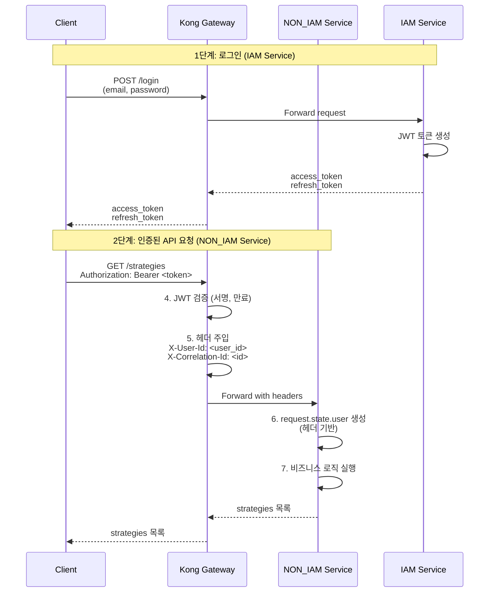

# NON_IAM Service 인증 가이드

**Version:** 2.2.1 | **Last Updated:** 2025-12-02

NON_IAM Service는 Kong Gateway를 통해 전달된 인증 정보만을 사용하는 마이크로서비스입니다. 사용자 관리 기능 없이 인증된 요청만 처리합니다.

---

## 📋 목차

1. [개요](#개요)
2. [서비스 설정](#서비스-설정)
3. [인증 플로우](#인증-플로우)
4. [Request 기반 인증](#request-기반-인증)
5. [Kong Gateway 헤더](#kong-gateway-헤더)
6. [실전 예제](#실전-예제)
7. [테스트 환경](#테스트-환경)

---

## 개요

### NON_IAM Service의 특징

- **Kong Gateway 의존**: JWT 검증은 Kong Gateway에서 수행
- **헤더 기반 인증**: `X-User-Id`, `X-Correlation-Id` 등 헤더만 사용
- **사용자 DB 없음**: `users`, `oauth_accounts` 컬렉션 생성 안 함
- **토큰 발급 불가**: 인증 관련 API 라우터 제공 안 함
- **경량 서비스**: 비즈니스 로직에만 집중

### IAM Service와의 차이점

| 항목           | IAM Service               | NON_IAM Service                    |
| -------------- | ------------------------- | ---------------------------------- |
| ServiceType    | `ServiceType.IAM_SERVICE` | `ServiceType.NON_IAM_SERVICE`      |
| 인증 방식      | JWT 직접 검증             | Kong Gateway 헤더만 사용           |
| MongoDB 컬렉션 | User, OAuthAccount 생성   | 사용자 정의 컬렉션만 생성          |
| 인증 라우터    | 전체 제공                 | 제공 안 함                         |
| 토큰 발급      | 직접 발급                 | 불가                               |
| 사용 예시      | iam-service               | strategy-service, backtest-service |

---

## 서비스 설정

### 1. FastAPI 앱 생성

```python
from mysingle.core import create_fastapi_app, create_service_config, ServiceType
from app.models import Strategy, Backtest

# NON_IAM Service 설정
config = create_service_config(
    service_name="strategy-service",
    service_type=ServiceType.NON_IAM_SERVICE,
    public_paths=[
        # 공개 API 경로 (인증 불필요)
        "/api/v1/public/strategies",
    ],
)

# FastAPI 앱 생성
app = create_fastapi_app(
    service_config=config,
    document_models=[
        # NON_IAM Service는 사용자 정의 모델만 등록
        Strategy,
        Backtest,
    ],
)
```

### 2. 환경변수 설정

**.env**:
```bash
# 서비스 설정
SERVICE_NAME=strategy-service
ENVIRONMENT=production

# MongoDB (사용자 정의 컬렉션만)
MONGO_URI=mongodb://localhost:27017
MONGO_DB_NAME=mysingle_strategy

# Redis (캐시)
REDIS_HOST=localhost
REDIS_PORT=6379
REDIS_DB=1

# Kong Gateway (환경변수로 엔드포인트 관리)
IAM_SERVICE_URL=http://iam-service:8000
KONG_GATEWAY_URL=http://kong-gateway:8000
```

### 3. 사용자 정의 모델만 생성

```python
from mysingle.core.base import BaseTimeDocWithUserId

class Strategy(BaseTimeDocWithUserId):
    """전략 문서 (user_id 자동 포함)"""
    name: str
    code: str
    description: str | None = None

    class Settings:
        name = "strategies"
        indexes = ["user_id", "name"]

class Backtest(BaseTimeDocWithUserId):
    """백테스트 문서"""
    strategy_id: str
    start_date: datetime
    end_date: datetime
    results: dict

    class Settings:
        name = "backtests"
        indexes = ["user_id", "strategy_id"]
```

**중요**: `User`, `OAuthAccount` 컬렉션은 생성되지 않습니다.

---

## 인증 플로우

### 1. 전체 인증 플로우



### 2. Kong Gateway 역할

1. **JWT 검증**: Kong의 JWT 플러그인이 토큰 서명 검증
2. **클레임 추출**: JWT의 `sub` 클레임을 `X-User-Id` 헤더로 변환
3. **헤더 전달**: 다운스트림 서비스로 인증 헤더 전달
4. **에러 처리**: 유효하지 않은 토큰은 401 반환

---

## Request 기반 인증

### 1. 핵심 함수

NON_IAM Service에서는 `Request` 객체를 통해서만 사용자 정보 접근:

```python
from mysingle.auth import (
    get_current_user,                    # 기본 사용자
    get_current_active_user,             # 활성 사용자
    get_current_active_verified_user,    # 검증된 사용자 (권장)
    get_current_user_optional,           # 선택적 인증
)
from fastapi import Request

@router.get("/strategies")
async def list_strategies(request: Request):
    # Kong Gateway가 주입한 헤더에서 사용자 정보 추출
    user = get_current_active_verified_user(request)

    # user는 request.state.user에서 가져옴
    strategies = await Strategy.find(
        Strategy.user_id == str(user.id)
    ).to_list()

    return strategies
```

### 2. request.state.user 구조

Kong Gateway 헤더를 기반으로 `AuthMiddleware`가 자동 생성:

```python
# request.state.user (NON_IAM Service)
User(
    id=ObjectId("507f1f77bcf86cd799439011"),  # X-User-Id 헤더
    email="user@example.com",                 # JWT 클레임 or 기본값
    full_name="Unknown User",                 # 기본값
    is_active=True,                           # 기본값
    is_verified=True,                         # 기본값
    is_superuser=False,                       # 기본값
    # MongoDB 조회 없이 생성된 최소 컨텍스트
)
```

**중요**: NON_IAM Service는 MongoDB에서 사용자를 조회하지 않습니다. Kong Gateway 헤더만으로 최소한의 사용자 컨텍스트를 생성합니다.

### 3. 인증 함수 동작

```python
def get_current_user(request: Request) -> User:
    """Kong Gateway 헤더 기반 사용자 반환"""
    user = getattr(request.state, "user", None)

    if not user:
        raise HTTPException(status_code=401, detail="Not authenticated")

    # Kong Gateway 헤더와 교차 검증
    kong_user_id = get_kong_user_id(request)
    if kong_user_id and str(user.id) != kong_user_id:
        raise HTTPException(status_code=401, detail="User mismatch")

    return user

def get_current_active_verified_user(request: Request) -> User:
    """활성 + 검증된 사용자 (권장)"""
    user = get_current_user(request)

    if not user.is_active:
        raise HTTPException(status_code=403, detail="Inactive user")

    if not user.is_verified:
        raise HTTPException(status_code=403, detail="Email verification required")

    return user
```

---

## Kong Gateway 헤더

### 1. 필수 헤더

NON_IAM Service가 의존하는 Kong Gateway 헤더:

| 헤더                | 설명                       | 예시                       |
| ------------------- | -------------------------- | -------------------------- |
| `X-User-Id`         | 사용자 ID (JWT sub 클레임) | `507f1f77bcf86cd799439011` |
| `X-Correlation-Id`  | 요청 추적 ID               | `abc123-def456-ghi789`     |
| `X-Kong-Request-Id` | Kong 요청 ID               | `kong-req-12345`           |

### 2. 헤더 추출 함수

```python
from mysingle.auth import (
    get_kong_user_id,
    get_kong_correlation_id,
    get_kong_request_id,
    is_kong_authenticated,
)

@router.get("/strategies/{strategy_id}")
async def get_strategy(strategy_id: str, request: Request):
    # 사용자 ID 추출
    user_id = get_kong_user_id(request)
    # → "507f1f77bcf86cd799439011"

    # Correlation ID (로깅/추적용)
    correlation_id = get_kong_correlation_id(request)
    logger.info("Get strategy", extra={"correlation_id": correlation_id})

    # Kong 인증 여부 확인
    if not is_kong_authenticated(request):
        raise HTTPException(status_code=401, detail="Not authenticated")

    strategy = await Strategy.get(strategy_id)
    if strategy.user_id != user_id:
        raise HTTPException(status_code=403, detail="Access denied")

    return strategy
```

### 3. Kong Gateway 설정 예시

Kong Gateway에서 JWT 플러그인 설정:

```yaml
# Kong JWT Plugin
plugins:
  - name: jwt
    config:
      uri_param_names: []
      cookie_names: []
      key_claim_name: iss
      secret_is_base64: false
      claims_to_verify:
        - exp
      anonymous: null
      run_on_preflight: true

  # JWT sub 클레임을 X-User-Id 헤더로 변환
  - name: pre-function
    config:
      access:
        - |
          local jwt_claims = kong.ctx.shared.jwt_claims
          if jwt_claims and jwt_claims.sub then
            kong.service.request.set_header("X-User-Id", jwt_claims.sub)
          end
```

---

## 실전 예제

### 1. 기본 CRUD API

```python
from fastapi import APIRouter, Request, HTTPException
from mysingle.auth import get_current_active_verified_user
from app.models import Strategy

router = APIRouter(prefix="/api/v1/strategies", tags=["strategies"])

@router.post("/", status_code=201)
async def create_strategy(
    request: Request,
    name: str,
    code: str,
):
    """전략 생성"""
    user = get_current_active_verified_user(request)

    strategy = Strategy(
        user_id=str(user.id),
        name=name,
        code=code,
    )
    await strategy.insert()

    return strategy

@router.get("/")
async def list_strategies(request: Request):
    """사용자의 전략 목록"""
    user = get_current_active_verified_user(request)

    strategies = await Strategy.find(
        Strategy.user_id == str(user.id)
    ).to_list()

    return strategies

@router.get("/{strategy_id}")
async def get_strategy(strategy_id: str, request: Request):
    """전략 상세 조회"""
    user = get_current_active_verified_user(request)

    strategy = await Strategy.get(strategy_id)
    if not strategy:
        raise HTTPException(status_code=404, detail="Strategy not found")

    # 소유권 확인
    if strategy.user_id != str(user.id):
        raise HTTPException(status_code=403, detail="Access denied")

    return strategy

@router.delete("/{strategy_id}")
async def delete_strategy(strategy_id: str, request: Request):
    """전략 삭제"""
    user = get_current_active_verified_user(request)

    strategy = await Strategy.get(strategy_id)
    if not strategy:
        raise HTTPException(status_code=404, detail="Strategy not found")

    if strategy.user_id != str(user.id):
        raise HTTPException(status_code=403, detail="Access denied")

    await strategy.delete()
    return {"message": "Strategy deleted"}
```

### 2. 선택적 인증 (공개 API)

```python
from mysingle.auth import get_current_user_optional

@router.get("/public/strategies")
async def list_public_strategies(request: Request):
    """공개 전략 목록 (인증 선택)"""
    user = get_current_user_optional(request)

    if user:
        # 인증된 사용자: 본인 전략 + 공개 전략
        strategies = await Strategy.find(
            (Strategy.user_id == str(user.id)) | (Strategy.is_public == True)
        ).to_list()
    else:
        # 비인증 사용자: 공개 전략만
        strategies = await Strategy.find(
            Strategy.is_public == True
        ).to_list()

    return strategies
```

### 3. 서비스 간 통신 (gRPC)

```python
from mysingle.clients import BaseGrpcClient
from app.grpc import backtest_service_pb2_grpc

class BacktestServiceClient(BaseGrpcClient):
    def __init__(self, user_id: str, correlation_id: str | None = None):
        super().__init__(
            service_name="backtest-service",
            default_port=50051,
            user_id=user_id,  # Kong에서 받은 user_id 전달
            correlation_id=correlation_id,
        )
        self.stub = backtest_service_pb2_grpc.BacktestServiceStub(self.channel)

@router.post("/{strategy_id}/backtest")
async def run_backtest(strategy_id: str, request: Request):
    """백테스트 실행 (다른 서비스 호출)"""
    user = get_current_active_verified_user(request)
    correlation_id = get_kong_correlation_id(request)

    # 소유권 확인
    strategy = await Strategy.get(strategy_id)
    if strategy.user_id != str(user.id):
        raise HTTPException(status_code=403, detail="Access denied")

    # 백테스트 서비스 호출 (gRPC)
    async with BacktestServiceClient(
        user_id=str(user.id),
        correlation_id=correlation_id,
    ) as client:
        result = await client.stub.RunBacktest(
            backtest_service_pb2.BacktestRequest(
                strategy_id=strategy_id,
                strategy_code=strategy.code,
            )
        )

    return {"backtest_id": result.backtest_id}
```

### 4. 로깅 및 모니터링

```python
from mysingle.core.logging import get_structured_logger
from mysingle.auth import get_kong_correlation_id, get_kong_request_id

logger = get_structured_logger(__name__)

@router.post("/strategies/{strategy_id}/execute")
async def execute_strategy(strategy_id: str, request: Request):
    """전략 실행 (구조화된 로깅)"""
    user = get_current_active_verified_user(request)
    correlation_id = get_kong_correlation_id(request)
    kong_request_id = get_kong_request_id(request)

    logger.info(
        "Strategy execution started",
        extra={
            "user_id": str(user.id),
            "strategy_id": strategy_id,
            "correlation_id": correlation_id,
            "kong_request_id": kong_request_id,
        },
    )

    try:
        # 전략 실행 로직
        result = await execute(strategy_id)

        logger.info(
            "Strategy execution completed",
            extra={
                "user_id": str(user.id),
                "strategy_id": strategy_id,
                "correlation_id": correlation_id,
                "result": result,
            },
        )

        return result
    except Exception as e:
        logger.error(
            "Strategy execution failed",
            extra={
                "user_id": str(user.id),
                "strategy_id": strategy_id,
                "correlation_id": correlation_id,
                "error": str(e),
            },
        )
        raise
```

---

## 테스트 환경

### 1. 인증 우회 모드

개발/테스트 환경에서 Kong Gateway 없이 테스트:

```bash
# .env.test
MYSINGLE_AUTH_BYPASS=true
ENVIRONMENT=development

# 테스트 사용자 정보
TEST_USER_EMAIL=test_user@test.com
TEST_USER_FULLNAME=Test User
```

**동작**:
- `AuthMiddleware`가 자동으로 테스트 사용자를 `request.state.user`에 주입
- Kong Gateway 헤더 없이도 인증 통과
- 프로덕션 환경에서는 자동 비활성화

### 2. 테스트 코드

```python
import pytest
from httpx import AsyncClient

@pytest.mark.asyncio
async def test_create_strategy():
    """인증 우회 모드에서 전략 생성 테스트"""
    async with AsyncClient(app=app, base_url="http://test") as client:
        response = await client.post(
            "/api/v1/strategies/",
            json={
                "name": "Test Strategy",
                "code": "def strategy(): pass",
            },
        )
        assert response.status_code == 201
        assert response.json()["name"] == "Test Strategy"

@pytest.mark.asyncio
async def test_list_strategies():
    """사용자의 전략 목록 조회"""
    async with AsyncClient(app=app, base_url="http://test") as client:
        response = await client.get("/api/v1/strategies/")
        assert response.status_code == 200
        assert isinstance(response.json(), list)
```

### 3. Kong Gateway 모의 헤더

프로덕션과 유사한 환경 테스트:

```python
@pytest.mark.asyncio
async def test_with_kong_headers():
    """Kong Gateway 헤더 포함 테스트"""
    headers = {
        "X-User-Id": "507f1f77bcf86cd799439011",
        "X-Correlation-Id": "test-correlation-id",
        "Authorization": "Bearer fake-token-for-test",
    }

    async with AsyncClient(app=app, base_url="http://test") as client:
        response = await client.get(
            "/api/v1/strategies/",
            headers=headers,
        )
        assert response.status_code == 200
```

---

## 참고 문서

- [IAM Service 가이드](IAM_SERVICE_GUIDE.md)
- [API Gateway 설정 가이드](API_GATEWAY_CONFIG_GUIDE.md)
- [Auth 모듈 개요](../../src/mysingle/auth/README.md)
- [gRPC 클라이언트 가이드](../../src/mysingle/clients/README.md)

---

**Maintainers**: MySingle Platform Team
**License**: MIT
