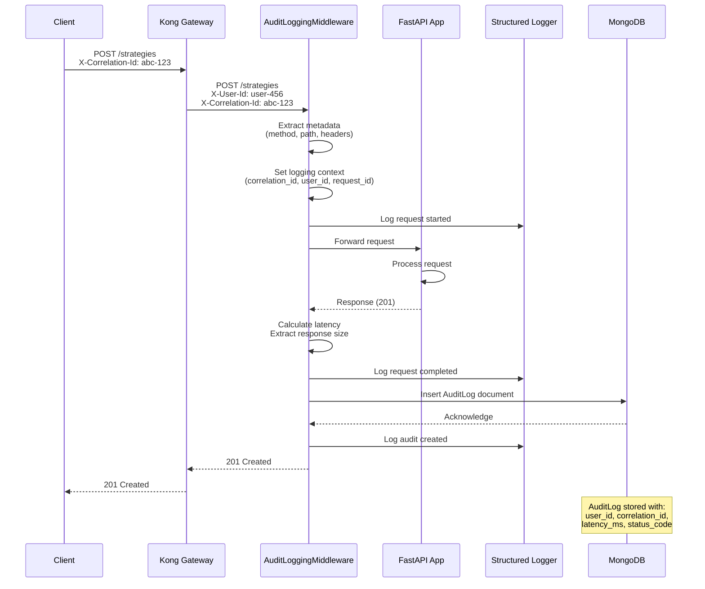
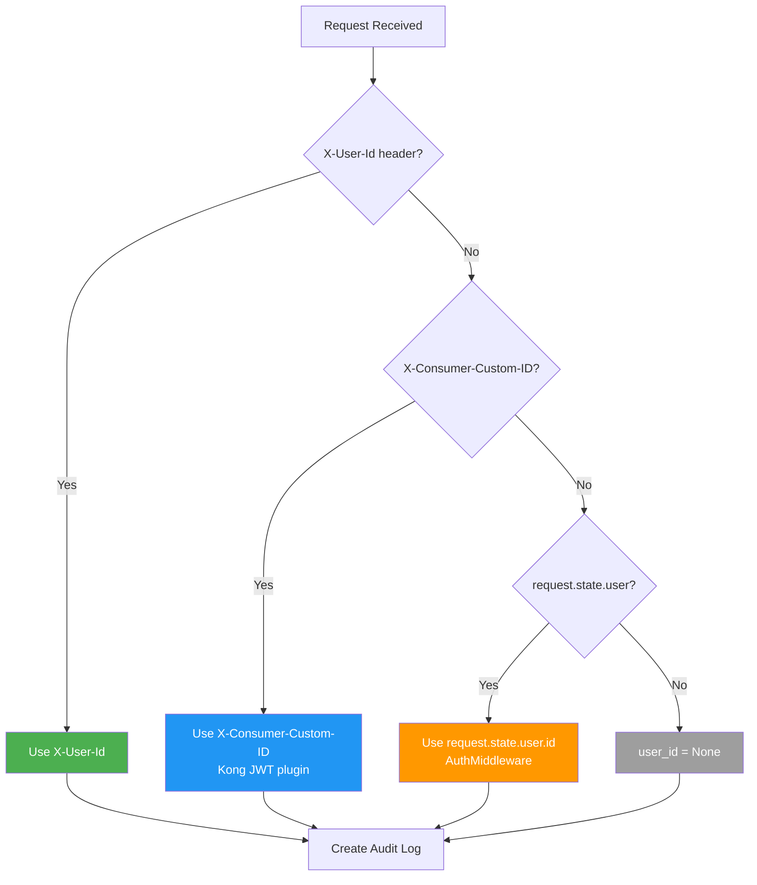

# Audit Logging Guide

**Version:** 2.2.1 | **Module:** `mysingle.core.audit`

> **📖 Core Module Overview:** [mysingle.core README](../../src/mysingle/core/README.md)

HTTP request/response audit logging with distributed tracing and compliance tracking.

---

## Overview

Automated audit logging for all HTTP requests with MongoDB storage and distributed tracing support.

**For common patterns and automatic setup, see:** [Core README - Observability Stack](../../src/mysingle/core/README.md#3-audit-logging)

| Purpose           | Data Captured                            |
| ----------------- | ---------------------------------------- |
| **Compliance**    | User ID, IP address, timestamps          |
| **Security**      | User agents, request paths, status codes |
| **Performance**   | Latency, request/response sizes          |
| **Observability** | Correlation IDs, trace IDs, request IDs  |

---

## Quick Start

### Automatic Setup (Recommended)

When using `create_fastapi_app()`, audit logging is enabled by default:

```python
from mysingle.core import create_fastapi_app, create_service_config, ServiceType

config = create_service_config(
    service_name="strategy-service",

    enable_audit_logging=True,  # Default: True
)

app = create_fastapi_app(service_config=config)
```

**That's it!** Audit logs are automatically created for all HTTP requests.

### Manual Setup

For custom FastAPI applications:

```python
from fastapi import FastAPI
from mysingle.core import AuditLoggingMiddleware

app = FastAPI()

app.add_middleware(
    AuditLoggingMiddleware,
    service_name="strategy-service",
    enabled=True,
)
```

---

## Architecture



---

## AuditLog Model

### Document Structure

```python
from mysingle.core import AuditLog
from datetime import datetime, UTC

audit = AuditLog(
    # Context
    user_id="507f1f77bcf86cd799439011",       # User who made request
    service="strategy-service",               # Service name
    request_id="req-abc-123",                 # Unique request ID
    trace_id="trace-xyz-789",                 # Distributed trace ID
    correlation_id="corr-def-456",            # Correlation ID for tracking

    # Request
    method="POST",                            # HTTP method
    path="/api/strategies",                   # Request path
    ip="192.168.1.100",                       # Client IP
    user_agent="Mozilla/5.0...",              # User agent
    req_bytes=1024,                           # Request size (bytes)

    # Response
    status_code=201,                          # HTTP status
    resp_bytes=512,                           # Response size (bytes)

    # Performance
    latency_ms=123,                           # Processing time (ms)
    occurred_at=datetime.now(UTC),            # Timestamp
)

await audit.insert()
```

### Field Reference

| Field              | Type              | Description                      | Example                    |
| ------------------ | ----------------- | -------------------------------- | -------------------------- |
| **user_id**        | PydanticObjectId? | User ID from authentication      | `507f1f77bcf86cd799439011` |
| **service**        | str               | Service handling request         | `strategy-service`         |
| **request_id**     | str?              | Unique request identifier        | `req-abc-123`              |
| **trace_id**       | str?              | Distributed tracing ID           | `00-abc...`                |
| **correlation_id** | str?              | Correlation ID for request chain | `corr-def-456`             |
| **method**         | str               | HTTP method                      | `POST`                     |
| **path**           | str               | Request path                     | `/api/strategies`          |
| **ip**             | str?              | Client IP address                | `192.168.1.100`            |
| **user_agent**     | str?              | Client user agent                | `Mozilla/5.0...`           |
| **req_bytes**      | int               | Request payload size             | `1024`                     |
| **status_code**    | int               | HTTP response status             | `201`                      |
| **resp_bytes**     | int               | Response payload size            | `512`                      |
| **latency_ms**     | int               | Request processing time (ms)     | `123`                      |
| **occurred_at**    | datetime          | Request timestamp (UTC)          | `2025-12-02T10:30:00Z`     |

### Indexes

The following indexes are automatically created for efficient querying:

```python
# In AuditLog.Settings
indexes = [
    "user_id",         # User activity queries
    "service",         # Service-specific queries
    "occurred_at",     # Time-based queries
    "trace_id",        # Distributed tracing
    "correlation_id",  # Request chain tracking
]
```

---

## User Context Extraction

### Priority Order

The middleware extracts user ID from multiple sources:



### Implementation

```python
def _extract_user_id(self, request: Request) -> str | None:
    """Extract user ID from request context."""
    from mysingle.constants import HEADER_KONG_USER_ID, HEADER_USER_ID

    # Priority 1: X-User-Id (standard)
    user_id = request.headers.get(HEADER_USER_ID)
    if user_id:
        return user_id.strip()

    # Priority 2: X-Consumer-Custom-ID (Kong)
    kong_user_id = request.headers.get(HEADER_KONG_USER_ID)
    if kong_user_id:
        return kong_user_id.strip()

    # Priority 3: request.state.user (AuthMiddleware)
    try:
        user = getattr(request.state, "user", None)
        if user and hasattr(user, "id"):
            return user_id
    except Exception:
        return None

    return None
```

---

## Correlation ID Propagation

### Automatic Propagation

```python
# Middleware automatically:
# 1. Extracts correlation ID from X-Correlation-Id header
# 2. Generates new UUID if missing
# 3. Sets it in logging context
# 4. Stores it in AuditLog

correlation_id = (
    request.headers.get("x-correlation-id")
    or get_correlation_id()
    or str(uuid.uuid4())
)

set_correlation_id(correlation_id)
```

### Client Example

```python
import httpx
import uuid

correlation_id = str(uuid.uuid4())

response = await httpx.post(
    "https://api.mysingle.io/strategies",
    headers={"X-Correlation-Id": correlation_id},
    json={"name": "My Strategy"},
)

# All downstream services will use the same correlation_id
# All audit logs will share this correlation_id
```

### Query by Correlation ID

```python
from mysingle.core import AuditLog

# Find all requests in a request chain
audit_logs = await AuditLog.find(
    AuditLog.correlation_id == "corr-abc-123"
).to_list()

for log in audit_logs:
    print(f"{log.service}: {log.method} {log.path} -> {log.status_code}")
```

**Output:**
```
strategy-service: POST /api/strategies -> 201
backtest-service: POST /api/backtests -> 201
ml-service: POST /api/analyze -> 200
```

---

## Querying Audit Logs

### By User

```python
from mysingle.core import AuditLog
from beanie import PydanticObjectId

user_id = PydanticObjectId("507f1f77bcf86cd799439011")

# Get all requests by user
user_logs = await AuditLog.find(
    AuditLog.user_id == user_id
).sort(-AuditLog.occurred_at).to_list()

print(f"User made {len(user_logs)} requests")
```

### By Service

```python
# Get all requests to a specific service
service_logs = await AuditLog.find(
    AuditLog.service == "strategy-service"
).to_list()

# Calculate average latency
avg_latency = sum(log.latency_ms for log in service_logs) / len(service_logs)
print(f"Average latency: {avg_latency:.2f}ms")
```

### By Time Range

```python
from datetime import datetime, timedelta, UTC

# Get logs from last 24 hours
yesterday = datetime.now(UTC) - timedelta(days=1)

recent_logs = await AuditLog.find(
    AuditLog.occurred_at >= yesterday
).to_list()

print(f"Requests in last 24h: {len(recent_logs)}")
```

### By Status Code

```python
# Find all errors (4xx, 5xx)
error_logs = await AuditLog.find(
    AuditLog.status_code >= 400
).to_list()

# Group by status code
from collections import Counter
status_counts = Counter(log.status_code for log in error_logs)

for status, count in status_counts.most_common():
    print(f"{status}: {count} errors")
```

### Complex Query

```python
from datetime import datetime, timedelta, UTC

# Find slow requests by user in last hour
one_hour_ago = datetime.now(UTC) - timedelta(hours=1)
user_id = PydanticObjectId("507f1f77bcf86cd799439011")

slow_requests = await AuditLog.find(
    AuditLog.user_id == user_id,
    AuditLog.occurred_at >= one_hour_ago,
    AuditLog.latency_ms > 1000,  # Slower than 1 second
).sort(-AuditLog.latency_ms).limit(10).to_list()

for log in slow_requests:
    print(f"{log.method} {log.path}: {log.latency_ms}ms")
```

---

## Performance Analysis

### Latency Distribution

```python
from mysingle.core import AuditLog

# Aggregate latency by endpoint
pipeline = [
    {"$group": {
        "_id": "$path",
        "avg_latency": {"$avg": "$latency_ms"},
        "max_latency": {"$max": "$latency_ms"},
        "min_latency": {"$min": "$latency_ms"},
        "count": {"$sum": 1},
    }},
    {"$sort": {"avg_latency": -1}},
]

results = await AuditLog.aggregate(pipeline).to_list()

for item in results:
    print(f"{item['_id']}:")
    print(f"  Avg: {item['avg_latency']:.2f}ms")
    print(f"  Max: {item['max_latency']}ms")
    print(f"  Count: {item['count']}")
```

### Bandwidth Analysis

```python
# Calculate total bandwidth by service
pipeline = [
    {"$group": {
        "_id": "$service",
        "total_req_bytes": {"$sum": "$req_bytes"},
        "total_resp_bytes": {"$sum": "$resp_bytes"},
        "request_count": {"$sum": 1},
    }},
]

results = await AuditLog.aggregate(pipeline).to_list()

for item in results:
    total_mb = (item['total_req_bytes'] + item['total_resp_bytes']) / 1024 / 1024
    print(f"{item['_id']}: {total_mb:.2f} MB ({item['request_count']} requests)")
```

### User Activity

```python
from datetime import datetime, timedelta, UTC

# Most active users in last 7 days
week_ago = datetime.now(UTC) - timedelta(days=7)

pipeline = [
    {"$match": {"occurred_at": {"$gte": week_ago}}},
    {"$group": {
        "_id": "$user_id",
        "request_count": {"$sum": 1},
        "error_count": {"$sum": {
            "$cond": [{"$gte": ["$status_code", 400]}, 1, 0]
        }},
    }},
    {"$sort": {"request_count": -1}},
    {"$limit": 10},
]

top_users = await AuditLog.aggregate(pipeline).to_list()

for user in top_users:
    print(f"User {user['_id']}: {user['request_count']} requests, {user['error_count']} errors")
```

---

## Structured Logging Integration

### Request Lifecycle

```python
# AuditLoggingMiddleware automatically logs:

# 1. Request start (DEBUG level)
logger.debug(
    "HTTP request started",
    method="POST",
    path="/api/strategies",
    correlation_id="corr-abc-123",
    request_id="req-xyz-789",
)

# 2. Request completion (INFO level)
logger.info(
    "HTTP request completed",
    method="POST",
    path="/api/strategies",
    status_code=201,
    latency_ms=123,
    req_bytes=1024,
    resp_bytes=512,
)

# 3. Audit log created (DEBUG level)
logger.debug(
    "Audit log created",
    audit_id="507f1f77bcf86cd799439011",
    user_id="user-456",
)
```

### Error Handling

```python
# On audit insert failure (ERROR level)
logger.error(
    "Failed to insert audit log",
    error="Connection timeout",
    error_type="TimeoutError",
    method="POST",
    path="/api/strategies",
    status_code=201,
)
```

### Log Output (Development)

```
2025-12-02T10:30:00.123Z [debug    ] HTTP request started    method=POST path=/api/strategies correlation_id=corr-abc-123
2025-12-02T10:30:00.246Z [info     ] HTTP request completed  method=POST path=/api/strategies status_code=201 latency_ms=123
2025-12-02T10:30:00.250Z [debug    ] Audit log created       audit_id=507f1f77bcf86cd799439011 user_id=user-456
```

### Log Output (Production JSON)

```json
{
  "timestamp": "2025-12-02T10:30:00.246Z",
  "level": "info",
  "event": "HTTP request completed",
  "service": "strategy-service",
  "method": "POST",
  "path": "/api/strategies",
  "status_code": 201,
  "latency_ms": 123,
  "req_bytes": 1024,
  "resp_bytes": 512,
  "correlation_id": "corr-abc-123",
  "request_id": "req-xyz-789",
  "user_id": "user-456"
}
```

---

## Configuration

### Enable/Disable

```python
# Via create_fastapi_app
config = create_service_config(
    service_name="strategy-service",
    enable_audit_logging=True,  # Set to False to disable
)

# Via manual setup
app.add_middleware(
    AuditLoggingMiddleware,
    service_name="strategy-service",
    enabled=True,  # Set to False to disable
)
```

### Environment Behavior

| Environment | Audit Logging | Reason                           |
| ----------- | ------------- | -------------------------------- |
| test        | ❌ Disabled    | Avoid pollution in test database |
| development | ✅ Enabled     | Full audit trail for debugging   |
| production  | ✅ Enabled     | Compliance and security tracking |

### Custom Filtering

```python
from mysingle.core import AuditLoggingMiddleware
from fastapi import Request, Response

class CustomAuditMiddleware(AuditLoggingMiddleware):
    """Custom audit middleware with path filtering."""

    async def dispatch(self, request: Request, call_next) -> Response:
        # Skip health check endpoints
        if request.url.path in ["/health", "/ready", "/metrics"]:
            return await call_next(request)

        # Delegate to parent for normal requests
        return await super().dispatch(request, call_next)

app.add_middleware(
    CustomAuditMiddleware,
    service_name="strategy-service",
)
```

---

## Data Retention

### Time-Based Cleanup

```python
from mysingle.core import AuditLog
from datetime import datetime, timedelta, UTC

async def cleanup_old_audit_logs(days: int = 90):
    """Delete audit logs older than specified days."""
    cutoff_date = datetime.now(UTC) - timedelta(days=days)

    result = await AuditLog.find(
        AuditLog.occurred_at < cutoff_date
    ).delete()

    print(f"Deleted {result.deleted_count} audit logs older than {days} days")

# Run monthly via cron job
await cleanup_old_audit_logs(days=90)
```

### Size-Based Archival

```python
async def archive_audit_logs():
    """Archive old logs to cold storage and delete from MongoDB."""
    import json
    from datetime import datetime, timedelta, UTC

    # Export logs older than 30 days
    cutoff = datetime.now(UTC) - timedelta(days=30)
    old_logs = await AuditLog.find(
        AuditLog.occurred_at < cutoff
    ).to_list()

    # Save to JSON file
    archive_file = f"audit_logs_{cutoff.strftime('%Y%m%d')}.json"
    with open(archive_file, "w") as f:
        json.dump([log.model_dump(mode="json") for log in old_logs], f)

    # Delete from MongoDB
    await AuditLog.find(AuditLog.occurred_at < cutoff).delete()

    print(f"Archived {len(old_logs)} logs to {archive_file}")
```

---

## Security Considerations

### Sensitive Data

**❌ DON'T log sensitive data:**

```python
# BAD: Request/response bodies may contain passwords, tokens
audit = AuditLog(
    request_body=request.body,  # May contain sensitive data
    response_body=response.body,
)
```

**✅ DO log metadata only:**

```python
# GOOD: Only metadata (sizes, not content)
audit = AuditLog(
    req_bytes=len(request.body),
    resp_bytes=len(response.body),
)
```

### PII Compliance

```python
# Anonymize IP addresses for GDPR compliance
def anonymize_ip(ip: str) -> str:
    """Anonymize last octet of IPv4 address."""
    parts = ip.split(".")
    if len(parts) == 4:
        parts[-1] = "0"
        return ".".join(parts)
    return ip

# Custom middleware
class GDPRAuditMiddleware(AuditLoggingMiddleware):
    async def dispatch(self, request: Request, call_next) -> Response:
        # Anonymize IP before logging
        if request.client:
            request.client.host = anonymize_ip(request.client.host)

        return await super().dispatch(request, call_next)
```

---

## Testing

### Mock Audit Logging

```python
import pytest
from unittest.mock import AsyncMock, patch

@pytest.mark.asyncio
async def test_audit_logging_disabled_in_test(client):
    """Audit logging should be disabled in test environment."""
    with patch("mysingle.core.audit.models.AuditLog.insert") as mock_insert:
        response = await client.post("/api/strategies", json={"name": "Test"})

        assert response.status_code == 201
        mock_insert.assert_not_called()  # Not called in test
```

### Enable for Testing

```python
@pytest.mark.asyncio
async def test_audit_log_created(client, monkeypatch):
    """Test audit log is created for request."""
    # Force enable in test
    monkeypatch.setenv("ENVIRONMENT", "development")

    response = await client.post("/api/strategies", json={"name": "Test"})

    # Verify audit log exists
    audit = await AuditLog.find_one(
        AuditLog.path == "/api/strategies",
        AuditLog.method == "POST",
    )

    assert audit is not None
    assert audit.status_code == 201
    assert audit.latency_ms > 0
```

### Verify User Context

```python
@pytest.mark.asyncio
async def test_user_context_extraction(client, test_user):
    """Test user ID is extracted from headers."""
    response = await client.post(
        "/api/strategies",
        headers={"X-User-Id": str(test_user.id)},
        json={"name": "Test"},
    )

    audit = await AuditLog.find_one(
        AuditLog.user_id == test_user.id
    )

    assert audit is not None
    assert audit.user_id == test_user.id
```

---

## Best Practices

### ✅ DO

```python
# Use automatic setup via create_fastapi_app
config = create_service_config(
    service_name="strategy-service",
    enable_audit_logging=True,
)
app = create_fastapi_app(service_config=config)

# Query with indexes for performance
audit_logs = await AuditLog.find(
    AuditLog.user_id == user_id,  # Indexed
    AuditLog.occurred_at >= yesterday,  # Indexed
).to_list()

# Clean up old logs regularly
await cleanup_old_audit_logs(days=90)

# Use correlation IDs for distributed tracing
headers = {"X-Correlation-Id": str(uuid.uuid4())}
```

### ❌ DON'T

```python
# Don't log request/response bodies (sensitive data)
audit.request_body = request.body  # BAD

# Don't query without indexes
await AuditLog.find(
    AuditLog.user_agent.contains("Chrome")  # Not indexed, slow
).to_list()

# Don't keep logs forever (storage costs)
# Set up retention policy!

# Don't disable in production (compliance risk)
enable_audit_logging=False  # BAD for production
```

---

## Troubleshooting

### Audit Logs Not Created

**Problem:** No audit logs in MongoDB

**Solution:**
```python
# 1. Check environment
print(os.getenv("ENVIRONMENT"))  # Should not be "test"

# 2. Check middleware enabled
print(middleware.enabled)  # Should be True

# 3. Check MongoDB connection
from mysingle.core import AuditLog
audit_count = await AuditLog.count()
print(f"Audit logs: {audit_count}")

# 4. Check logs for errors
# Look for "Failed to insert audit log" in logs
```

### User ID Not Captured

**Problem:** `user_id` is always None

**Solution:**
```python
# 1. Verify Kong Gateway headers
print(request.headers.get("X-User-Id"))

# 2. Verify AuthMiddleware is installed
print(hasattr(request.state, "user"))

# 3. Check middleware order (AuthMiddleware before AuditLoggingMiddleware)
# Good order:
app.add_middleware(AuthMiddleware)
app.add_middleware(AuditLoggingMiddleware)
```

### High Storage Usage

**Problem:** AuditLog collection too large

**Solution:**
```python
# 1. Check collection size
from motor.motor_asyncio import AsyncIOMotorClient
db = AsyncIOMotorClient()["your_database"]
stats = await db.command("collStats", "audit_logs")
print(f"Size: {stats['size'] / 1024 / 1024:.2f} MB")

# 2. Set up retention policy
await cleanup_old_audit_logs(days=30)

# 3. Enable MongoDB TTL index (auto-delete after 90 days)
await db.audit_logs.create_index(
    "occurred_at",
    expireAfterSeconds=90 * 24 * 60 * 60,
)
```

---

## API Reference

### AuditLog Model

| Method / Property | Description               |
| ----------------- | ------------------------- |
| `insert()`        | Save audit log to MongoDB |
| `find()`          | Query audit logs          |
| `aggregate()`     | Run aggregation pipeline  |
| `count()`         | Count matching documents  |
| `delete()`        | Delete matching documents |

### AuditLoggingMiddleware

| Method / Property    | Description                          |
| -------------------- | ------------------------------------ |
| `__init__()`         | Initialize middleware                |
| `dispatch()`         | Process HTTP request                 |
| `_extract_user_id()` | Extract user ID from request context |

---

## Related Documentation

- [Structured Logging Guide](./STRUCTURED_LOGGING_GUIDE.md) - Logging system integration
- [Auth Module README](../auth/README.md) - User authentication
- [Clients README](../../src/mysingle/clients/README.md) - Service communication
- [App Factory Guide](../MYSINGLE_APP_FACTORY_USAGE_GUIDE.md) - FastAPI app setup

---

**Version:** 2.2.1
**Module:** `mysingle.core.audit`
**License:** MIT
