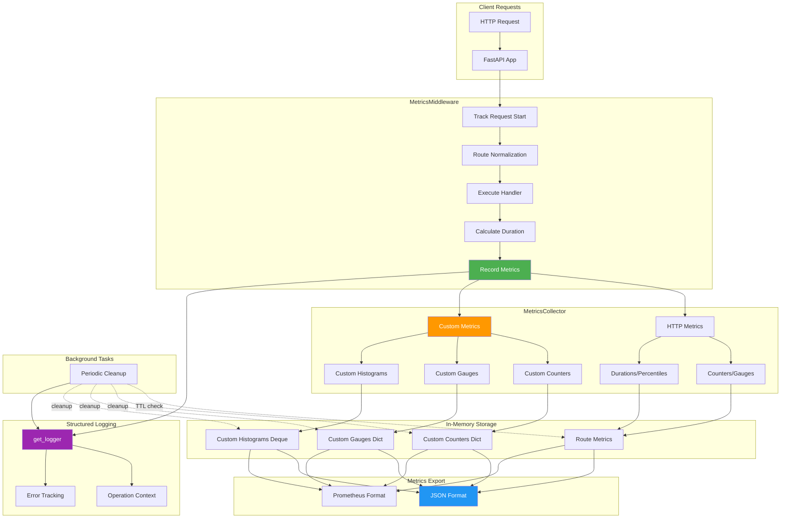

# Metrics Collection Guide

**Version:** 2.2.1 | **Module:** `mysingle.core.metrics`

> **📖 Core Module Overview:** [mysingle.core README](../../src/mysingle/core/README.md)

Production-ready metrics collection with custom metrics support and Prometheus integration.

---

## Overview

Comprehensive metrics collection for FastAPI services with HTTP metrics and service-specific custom metrics.

**For common patterns and basic setup, see:** [Core README - Custom Metrics](../../src/mysingle/core/README.md#4-custom-metrics)

| Feature                    | Description                                               |
| -------------------------- | --------------------------------------------------------- |
| **HTTP Request Metrics**   | Automatic tracking of requests, errors, latency           |
| **Custom Metrics**         | Counters, gauges, histograms for service-specific metrics |
| **Prometheus Compatible**  | Native Prometheus exposition format support               |
| **Performance Optimized**  | Efficient data structures, background cleanup             |
| **Percentile Calculation** | P50, P90, P95, P99 response time percentiles              |

---

## Quick Start

### Basic Setup

```python
from fastapi import FastAPI
from mysingle.core.metrics import (
    MetricsCollector,
    MetricsConfig,
    MetricsMiddleware,
    create_metrics_middleware,
    create_metrics_router,
    get_metrics_collector,
)

# 1. Create FastAPI app
app = FastAPI(title="My Service")

# 2. Initialize metrics collector
create_metrics_middleware(
    service_name="my-service",
    config=MetricsConfig(
        enable_custom_metrics=True,  # Enable service-specific metrics
        enable_percentiles=True,
        enable_histogram=True,
    ),
)

# 3. Add metrics middleware
app.add_middleware(
    MetricsMiddleware,
    collector=get_metrics_collector(),
    exclude_paths={"/health", "/metrics"},  # Don't track these
)

# 4. Include metrics router
app.include_router(create_metrics_router())

# 5. Use custom metrics in your endpoints
@app.post("/strategies")
async def create_strategy(strategy_data: dict):
    collector = get_metrics_collector()

    # Increment custom counter
    collector.increment_counter("strategy_created", labels={"type": "momentum"})

    # Set gauge value
    collector.set_gauge("active_strategies", value=42)

    # Observe histogram value
    collector.observe_histogram("strategy_creation_time", value=0.123)

    return {"status": "created"}
```

---

## Architecture



---

## Core Components

### MetricsCollector

Central class for collecting and managing all metrics.

#### Initialization

```python
from mysingle.core.metrics import MetricsCollector, MetricsConfig

config = MetricsConfig(
    max_duration_samples=1000,        # Max samples per route
    max_histogram_buckets=20,         # Histogram bucket count
    enable_percentiles=True,          # Calculate percentiles
    enable_histogram=True,            # Generate histograms
    enable_custom_metrics=True,       # Allow custom metrics
    retention_period_seconds=3600,    # 1 hour retention
    cleanup_interval_seconds=300,     # Cleanup every 5 minutes
)

collector = MetricsCollector(service_name="my-service", config=config)
```

#### HTTP Metrics Methods

| Method                     | Description                 |
| -------------------------- | --------------------------- |
| `record_request()`         | Record HTTP request (async) |
| `record_request_sync()`    | Record HTTP request (sync)  |
| `get_metrics()`            | Get all metrics as dict     |
| `get_prometheus_metrics()` | Get Prometheus format       |
| `reset_metrics()`          | Clear all metrics (testing) |

#### Custom Metrics Methods

| Method                | Description                   |
| --------------------- | ----------------------------- |
| `increment_counter()` | Increment a counter metric    |
| `set_gauge()`         | Set a gauge metric value      |
| `observe_histogram()` | Observe a value for histogram |

---

## Custom Metrics Usage

### Counters

Track cumulative values that only increase.

```python
collector = get_metrics_collector()

# Simple counter
collector.increment_counter("trades_executed")

# Counter with value
collector.increment_counter("trades_executed", value=5)

# Counter with labels (for grouping)
collector.increment_counter(
    name="backtest_completed",
    value=1,
    labels={
        "strategy_type": "momentum",
        "symbol": "AAPL",
    }
)

# Multiple increments
for trade in trades:
    collector.increment_counter(
        "trade_volume",
        value=trade.quantity,
        labels={"side": trade.side}
    )
```

**Use Cases:**
- Total requests processed
- Number of trades executed
- Error counts by type
- User registrations

### Gauges

Track values that can increase or decrease.

```python
# Current active connections
collector.set_gauge("active_websockets", value=42)

# Queue size
collector.set_gauge("pending_orders", value=len(order_queue))

# With labels
collector.set_gauge(
    name="strategy_count",
    value=active_strategies,
    labels={"status": "running"}
)

# Resource usage
collector.set_gauge("memory_usage_mb", value=get_memory_usage())
collector.set_gauge("cpu_usage_percent", value=get_cpu_usage())
```

**Use Cases:**
- Active users/connections
- Queue sizes
- Resource usage (CPU, memory)
- Cache sizes

### Histograms

Track distribution of values over time.

```python
import time

# Measure operation duration
start = time.time()
result = execute_backtest(strategy)
duration = time.time() - start

collector.observe_histogram(
    name="backtest_duration_seconds",
    value=duration,
    labels={"strategy_type": strategy.type}
)

# Record data sizes
collector.observe_histogram(
    "order_book_depth",
    value=len(order_book),
)

# Performance metrics
collector.observe_histogram(
    "optimization_time_seconds",
    value=optimization_duration,
    labels={"algorithm": "genetic"}
)
```

**Use Cases:**
- Request/response latencies
- Data processing times
- File sizes
- Batch sizes

---

## Complete Example: Backtest Service

```python
from fastapi import FastAPI, HTTPException
from mysingle.core.metrics import (
    create_metrics_middleware,
    create_metrics_router,
    get_metrics_collector,
    MetricsConfig,
    MetricsMiddleware,
)
import time

app = FastAPI(title="Backtest Service")

# Initialize metrics
create_metrics_middleware(
    service_name="backtest-service",
    config=MetricsConfig(
        enable_custom_metrics=True,
        enable_percentiles=True,
        retention_period_seconds=7200,  # 2 hours
    ),
)

# Add middleware
app.add_middleware(
    MetricsMiddleware,
    collector=get_metrics_collector(),
    exclude_paths={"/health", "/metrics"},
)

# Include metrics endpoints
app.include_router(create_metrics_router())

@app.post("/backtests")
async def run_backtest(strategy_id: str, config: dict):
    """Run a backtest with custom metrics tracking"""
    collector = get_metrics_collector()

    # Track backtest initiation
    collector.increment_counter(
        "backtest_started",
        labels={"strategy_type": config.get("type", "unknown")}
    )

    # Update active backtests gauge
    active_backtests = get_active_backtest_count()
    collector.set_gauge("active_backtests", value=active_backtests)

    start_time = time.time()

    try:
        # Execute backtest
        result = await execute_backtest(strategy_id, config)

        # Record completion metrics
        duration = time.time() - start_time
        collector.observe_histogram(
            "backtest_duration_seconds",
            value=duration,
            labels={
                "strategy_type": config.get("type"),
                "status": "success",
            }
        )

        # Track result metrics
        collector.increment_counter("backtest_completed")
        collector.observe_histogram(
            "backtest_trade_count",
            value=len(result.trades),
        )
        collector.observe_histogram(
            "backtest_return_pct",
            value=result.total_return * 100,
        )

        return result

    except Exception as e:
        # Track failures
        collector.increment_counter(
            "backtest_failed",
            labels={"error_type": type(e).__name__}
        )

        duration = time.time() - start_time
        collector.observe_histogram(
            "backtest_duration_seconds",
            value=duration,
            labels={
                "strategy_type": config.get("type"),
                "status": "error",
            }
        )

        raise HTTPException(status_code=500, detail=str(e))

    finally:
        # Update active count
        active_backtests = get_active_backtest_count()
        collector.set_gauge("active_backtests", value=active_backtests)

@app.get("/strategies/{strategy_id}/metrics")
async def get_strategy_metrics(strategy_id: str):
    """Get custom metrics for a specific strategy"""
    collector = get_metrics_collector()
    all_metrics = collector.get_metrics()

    # Filter metrics by strategy
    custom_metrics = all_metrics.get("custom_metrics", {})

    return {
        "strategy_id": strategy_id,
        "metrics": custom_metrics,
        "timestamp": all_metrics["timestamp"],
    }
```

---

## Metrics Endpoints

### Public Endpoints (No Auth Required)

#### GET /metrics/

Get metrics in JSON or Prometheus format.

```bash
# JSON format (default)
curl http://localhost:8000/metrics/

# Prometheus format
curl http://localhost:8000/metrics/?format=prometheus
```

#### GET /metrics/json

Get comprehensive metrics in JSON format.

```json
{
  "service": "backtest-service",
  "timestamp": 1701518400.123,
  "uptime_seconds": 3600.5,
  "total_requests": 1250,
  "total_errors": 15,
  "error_rate": 0.012,
  "requests_per_second": 0.347,
  "active_routes": 8,
  "config": {
    "enable_custom_metrics": true,
    "enable_percentiles": true,
    "enable_histogram": true
  },
  "routes": {
    "POST:/backtests": {
      "request_count": 450,
      "error_count": 5,
      "error_rate": 0.011,
      "avg_response_time": 1.234,
      "min_response_time": 0.523,
      "max_response_time": 3.456,
      "p50": 1.123,
      "p90": 2.345,
      "p95": 2.678,
      "p99": 3.012
    }
  },
  "custom_metrics": {
    "counters": {
      "backtest_started{strategy_type=momentum}": 150,
      "backtest_completed": 145,
      "backtest_failed{error_type=ValidationError}": 3
    },
    "gauges": {
      "active_backtests": 5,
      "memory_usage_mb": 2048.5
    },
    "histograms": {
      "backtest_duration_seconds{strategy_type=momentum,status=success}": {
        "count": 145,
        "min": 0.523,
        "max": 3.456,
        "avg": 1.234,
        "p50": 1.123
      }
    }
  }
}
```

#### GET /metrics/prometheus

Get metrics in Prometheus exposition format.

```prometheus
# HELP backtest_service_uptime_seconds Service uptime in seconds
# TYPE backtest_service_uptime_seconds gauge
backtest_service_uptime_seconds 3600.50

# HELP backtest_service_requests_total Total number of requests
# TYPE backtest_service_requests_total counter
backtest_service_requests_total 1250

# HELP backtest_service_custom_backtest_started Custom counter metric: backtest_started
# TYPE backtest_service_custom_backtest_started counter
backtest_service_custom_backtest_started{strategy_type="momentum"} 150

# HELP backtest_service_custom_active_backtests Custom gauge metric: active_backtests
# TYPE backtest_service_custom_active_backtests gauge
backtest_service_custom_active_backtests 5

# HELP backtest_service_custom_backtest_duration_seconds Custom histogram metric: backtest_duration_seconds
# TYPE backtest_service_custom_backtest_duration_seconds summary
backtest_service_custom_backtest_duration_seconds_count{strategy_type="momentum",status="success"} 145
backtest_service_custom_backtest_duration_seconds_sum{strategy_type="momentum",status="success"} 178.9300
backtest_service_custom_backtest_duration_seconds{quantile="0.5",strategy_type="momentum",status="success"} 1.1230
backtest_service_custom_backtest_duration_seconds{quantile="0.9",strategy_type="momentum",status="success"} 2.3450
backtest_service_custom_backtest_duration_seconds{quantile="0.99",strategy_type="momentum",status="success"} 3.0120
```

#### GET /metrics/health

Check metrics system health.

```json
{
  "status": "healthy",
  "service": "backtest-service",
  "uptime_seconds": 3600.5,
  "total_requests": 1250,
  "error_rate": 0.012,
  "active_routes": 8,
  "issues": [],
  "timestamp": 1701518400.123
}
```

#### GET /metrics/summary

Get summarized metrics without detailed route information.

```json
{
  "service": "backtest-service",
  "timestamp": 1701518400.123,
  "uptime_seconds": 3600.5,
  "total_requests": 1250,
  "total_errors": 15,
  "error_rate": 0.012,
  "requests_per_second": 0.347,
  "active_routes": 8,
  "config": {
    "enable_custom_metrics": true,
    "enable_percentiles": true,
    "enable_histogram": true
  }
}
```

### Protected Endpoints (Auth Required)

#### GET /metrics/routes

Get detailed metrics for specific routes (authenticated users only).

```bash
# All routes
curl -H "Authorization: Bearer <token>" \
  http://localhost:8000/metrics/routes

# Filter by pattern
curl -H "Authorization: Bearer <token>" \
  "http://localhost:8000/metrics/routes?route_filter=backtest"
```

#### POST /metrics/reset

Reset all metrics (superuser only).

```bash
curl -X POST \
  -H "Authorization: Bearer <token>" \
  http://localhost:8000/metrics/reset
```

---

## Configuration

### MetricsConfig Options

```python
from mysingle.core.metrics import MetricsConfig

config = MetricsConfig(
    # Sample size for duration tracking
    max_duration_samples=1000,

    # Histogram configuration
    max_histogram_buckets=20,
    enable_histogram=True,

    # Percentile calculation
    enable_percentiles=True,

    # Custom metrics support
    enable_custom_metrics=True,

    # Data retention
    retention_period_seconds=3600,    # 1 hour
    cleanup_interval_seconds=300,     # 5 minutes
)
```

### Middleware Configuration

```python
from mysingle.core.metrics import MetricsMiddleware

app.add_middleware(
    MetricsMiddleware,
    collector=get_metrics_collector(),
    exclude_paths={
        "/health",
        "/metrics",
        "/docs",
        "/redoc",
        "/openapi.json",
    },
    include_response_headers=True,    # Add X-Response-Time header
    track_user_agents=False,          # Don't track user agents
)
```

---

## Advanced Usage

### Custom Metric Patterns

#### Business Metrics

```python
# Track revenue-related metrics
collector.observe_histogram(
    "order_value_usd",
    value=order.total_value,
    labels={"currency": order.currency}
)

collector.increment_counter(
    "subscription_started",
    labels={"tier": "premium", "billing": "monthly"}
)

# Customer satisfaction
collector.set_gauge(
    "nps_score",
    value=calculate_nps(),
)
```

#### Performance Metrics

```python
# Database query performance
start = time.time()
results = await db.query(...)
duration = time.time() - start

collector.observe_histogram(
    "db_query_duration_seconds",
    value=duration,
    labels={
        "operation": "select",
        "table": "strategies",
    }
)

# Cache hit rate
cache_hits = get_cache_hits()
cache_total = get_cache_total()
hit_rate = cache_hits / cache_total if cache_total > 0 else 0

collector.set_gauge("cache_hit_rate", value=hit_rate)
```

#### Resource Metrics

```python
import psutil

# System resources
collector.set_gauge("cpu_percent", value=psutil.cpu_percent())
collector.set_gauge("memory_percent", value=psutil.virtual_memory().percent)

# Application-specific
collector.set_gauge("thread_count", value=threading.active_count())
collector.set_gauge("queue_size", value=task_queue.qsize())
```

### Metric Aggregation

```python
def calculate_strategy_metrics(strategy_id: str) -> dict:
    """Calculate aggregated metrics for a strategy"""
    collector = get_metrics_collector()
    metrics = collector.get_metrics()

    # Extract custom metrics
    custom = metrics.get("custom_metrics", {})
    counters = custom.get("counters", {})
    histograms = custom.get("histograms", {})

    # Filter by strategy_id label
    strategy_label = f"strategy_id={strategy_id}"

    strategy_metrics = {
        "total_executions": sum(
            count for key, count in counters.items()
            if strategy_label in key and "execution" in key
        ),
        "avg_duration": None,
    }

    # Get duration histogram
    for key, hist_data in histograms.items():
        if strategy_label in key and "duration" in key:
            strategy_metrics["avg_duration"] = hist_data.get("avg")
            strategy_metrics["p95_duration"] = hist_data.get("p95")

    return strategy_metrics
```

---

## Structured Logging

All metrics operations emit structured logs.

### Log Examples

```json
// Collector initialization
{
  "timestamp": "2024-12-02T10:30:45.123Z",
  "level": "info",
  "event": "Metrics collector initialized",
  "service_name": "backtest-service",
  "max_duration_samples": 1000,
  "enable_percentiles": true,
  "enable_histogram": true,
  "enable_custom_metrics": true,
  "retention_period_seconds": 3600
}

// Custom counter incremented
{
  "timestamp": "2024-12-02T10:31:12.456Z",
  "level": "debug",
  "event": "Custom counter incremented",
  "service": "backtest-service",
  "counter_name": "backtest_started",
  "increment_value": 1,
  "new_value": 151,
  "labels": {"strategy_type": "momentum"}
}

// Metrics cleanup
{
  "timestamp": "2024-12-02T10:35:00.789Z",
  "level": "debug",
  "event": "Cleaned up old route metrics",
  "service": "backtest-service",
  "routes_removed": 3,
  "retention_period_seconds": 3600
}

// Middleware error
{
  "timestamp": "2024-12-02T10:36:15.321Z",
  "level": "error",
  "event": "Error processing request",
  "method": "POST",
  "path": "/backtests",
  "duration_seconds": 0.123,
  "error": "Database connection failed",
  "error_type": "ConnectionError"
}
```

---

## Best Practices

### ✅ DO

```python
# Use meaningful metric names
collector.increment_counter("user_login_success")  # Good
collector.increment_counter("event")              # Bad

# Add relevant labels for grouping
collector.increment_counter(
    "api_requests",
    labels={"endpoint": "/strategies", "method": "POST"}
)

# Track both success and failure
try:
    result = execute_operation()
    collector.increment_counter("operation_success")
except Exception as e:
    collector.increment_counter(
        "operation_failed",
        labels={"error_type": type(e).__name__}
    )
    raise

# Use appropriate metric types
collector.increment_counter("requests_total")      # Counter - cumulative
collector.set_gauge("active_connections")          # Gauge - current value
collector.observe_histogram("request_duration")    # Histogram - distribution

# Clean metric names (lowercase, underscores)
collector.increment_counter("backtest_completed")  # Good
collector.increment_counter("Backtest-Completed")  # Bad
```

### ❌ DON'T

```python
# Don't use high-cardinality labels
collector.increment_counter(
    "requests",
    labels={"user_id": user_id}  # BAD - too many unique values
)

# Don't increment gauges (use set_gauge)
collector.increment_counter("queue_size")  # WRONG - use set_gauge

# Don't observe counters (use increment_counter)
collector.observe_histogram("request_count")  # WRONG - use increment_counter

# Don't ignore custom metrics config
if collector.config.enable_custom_metrics:
    collector.increment_counter("my_metric")  # Check before using

# Don't create metrics in tight loops without sampling
for item in million_items:
    collector.increment_counter("processed")  # OK for counters
    collector.observe_histogram("size", len(item))  # Consider sampling
```

### Metric Naming Conventions

```python
# Format: <namespace>_<name>_<unit>
# Examples:
collector.observe_histogram("backtest_duration_seconds")
collector.set_gauge("memory_usage_bytes")
collector.increment_counter("requests_total")

# With labels:
collector.increment_counter(
    "http_requests_total",
    labels={
        "method": "POST",
        "endpoint": "/strategies",
        "status": "200",
    }
)
```

---

## Testing

### Mock Metrics Collector

```python
import pytest
from unittest.mock import MagicMock
from mysingle.core.metrics import MetricsCollector

@pytest.fixture
def mock_metrics():
    """Mock metrics collector for testing"""
    collector = MagicMock(spec=MetricsCollector)
    collector.increment_counter = MagicMock()
    collector.set_gauge = MagicMock()
    collector.observe_histogram = MagicMock()
    return collector

def test_backtest_metrics(mock_metrics):
    """Test backtest metrics collection"""
    # Your test logic
    execute_backtest(strategy_id, config, metrics=mock_metrics)

    # Verify metrics were recorded
    mock_metrics.increment_counter.assert_called_with(
        "backtest_started",
        labels={"strategy_type": "momentum"}
    )
```

### In-Memory Testing

```python
def test_with_real_collector():
    """Test with real metrics collector"""
    from mysingle.core.metrics import MetricsCollector, MetricsConfig

    collector = MetricsCollector(
        service_name="test-service",
        config=MetricsConfig(enable_custom_metrics=True)
    )

    # Record some metrics
    collector.increment_counter("test_counter")
    collector.set_gauge("test_gauge", value=42)
    collector.observe_histogram("test_histogram", value=1.23)

    # Verify
    metrics = collector.get_metrics()
    assert metrics["custom_metrics"]["counters"]["test_counter"] == 1
    assert metrics["custom_metrics"]["gauges"]["test_gauge"] == 42

    # Cleanup
    collector.reset_metrics()
```

### Fixture for Integration Tests

```python
import pytest
from fastapi.testclient import TestClient

@pytest.fixture
def app_with_metrics():
    """Create app with metrics for testing"""
    from fastapi import FastAPI
    from mysingle.core.metrics import (
        create_metrics_middleware,
        create_metrics_router,
        MetricsMiddleware,
        get_metrics_collector,
    )

    app = FastAPI()
    create_metrics_middleware(service_name="test-service")
    app.add_middleware(
        MetricsMiddleware,
        collector=get_metrics_collector(),
    )
    app.include_router(create_metrics_router())

    return app

def test_metrics_endpoint(app_with_metrics):
    """Test metrics endpoint"""
    client = TestClient(app_with_metrics)

    # Make some requests
    client.get("/test")
    client.post("/test", json={})

    # Check metrics
    response = client.get("/metrics/json")
    assert response.status_code == 200

    metrics = response.json()
    assert metrics["total_requests"] >= 2
```

---

## Performance Considerations

### Memory Usage

```python
# Limit sample sizes
config = MetricsConfig(
    max_duration_samples=500,  # Reduce for memory-constrained environments
    max_histogram_buckets=10,
)

# Disable features if not needed
config = MetricsConfig(
    enable_percentiles=False,  # Skip percentile calculations
    enable_histogram=False,    # Skip histogram generation
)
```

### Cleanup Configuration

```python
# Aggressive cleanup for high-traffic services
config = MetricsConfig(
    retention_period_seconds=1800,   # 30 minutes
    cleanup_interval_seconds=180,    # 3 minutes
)

# Relaxed cleanup for low-traffic services
config = MetricsConfig(
    retention_period_seconds=7200,   # 2 hours
    cleanup_interval_seconds=600,    # 10 minutes
)
```

### Exclude Paths

```python
# Exclude high-frequency endpoints from metrics
app.add_middleware(
    MetricsMiddleware,
    collector=get_metrics_collector(),
    exclude_paths={
        "/health",           # Health checks (very frequent)
        "/metrics",          # Metrics endpoint itself
        "/ws",               # WebSocket connections
        "/static",           # Static files
    },
)
```

---

## Troubleshooting

### Issue: High Memory Usage

**Symptom:** Metrics collector consuming too much memory

**Solutions:**
```python
# 1. Reduce sample sizes
config = MetricsConfig(max_duration_samples=500)

# 2. Increase cleanup frequency
config = MetricsConfig(
    retention_period_seconds=1800,
    cleanup_interval_seconds=120,
)

# 3. Disable expensive features
config = MetricsConfig(
    enable_percentiles=False,
    enable_histogram=False,
)

# 4. Exclude more paths
middleware = MetricsMiddleware(
    collector=collector,
    exclude_paths={"/health", "/metrics", "/static", "/ws"},
)
```

### Issue: Custom Metrics Not Appearing

**Symptom:** Custom metrics not in output

**Debug:**
```python
# 1. Check if custom metrics are enabled
collector = get_metrics_collector()
print(collector.config.enable_custom_metrics)  # Should be True

# 2. Verify metrics were recorded
print(collector.custom_counters)
print(collector.custom_gauges)
print(collector.custom_histograms)

# 3. Check metrics output
metrics = collector.get_metrics()
print("custom_metrics" in metrics)
print(metrics.get("custom_metrics"))
```

### Issue: Metrics Endpoint Returns 500

**Symptom:** `/metrics/` endpoint fails

**Possible Causes:**
1. Collector not initialized
2. Exception in metrics calculation
3. Invalid metric names

**Debug:**
```python
# Enable debug logging
import logging
logging.getLogger("mysingle.core.metrics").setLevel(logging.DEBUG)

# Check collector initialization
try:
    collector = get_metrics_collector()
    print("Collector initialized:", collector.service_name)
except RuntimeError as e:
    print("Collector not initialized:", e)

# Test metrics generation
try:
    metrics = collector.get_metrics()
    print("Metrics generated successfully")
except Exception as e:
    print("Error generating metrics:", e)
```

---

## API Reference

### MetricsCollector

```python
class MetricsCollector:
    def __init__(
        self,
        service_name: str,
        config: MetricsConfig | None = None
    ) -> None: ...

    # HTTP Metrics
    async def record_request(
        self,
        method: str,
        path: str,
        status_code: int,
        duration: float
    ) -> None: ...

    def record_request_sync(
        self,
        method: str,
        path: str,
        status_code: int,
        duration: float
    ) -> None: ...

    # Custom Metrics
    def increment_counter(
        self,
        name: str,
        value: int = 1,
        labels: dict[str, str] | None = None
    ) -> None: ...

    def set_gauge(
        self,
        name: str,
        value: float,
        labels: dict[str, str] | None = None
    ) -> None: ...

    def observe_histogram(
        self,
        name: str,
        value: float,
        labels: dict[str, str] | None = None
    ) -> None: ...

    # Export
    def get_metrics(self) -> dict[str, Any]: ...
    def get_prometheus_metrics(self) -> str: ...
    def reset_metrics(self) -> None: ...
```

### MetricsConfig

```python
@dataclass
class MetricsConfig:
    max_duration_samples: int = 1000
    max_histogram_buckets: int = 20
    enable_percentiles: bool = True
    enable_histogram: bool = True
    enable_custom_metrics: bool = True
    retention_period_seconds: int = 3600
    cleanup_interval_seconds: int = 300
```

---

## Related Documentation

- [Structured Logging Guide](../../../docs/core/STRUCTURED_LOGGING_GUIDE.md) - Logging integration
- [Core Module README](../README.md) - Core utilities
- [Prometheus Documentation](https://prometheus.io/docs/) - Metrics standard

---

**Version:** 2.2.1
**Module:** `mysingle.core.metrics`
**License:** MIT
