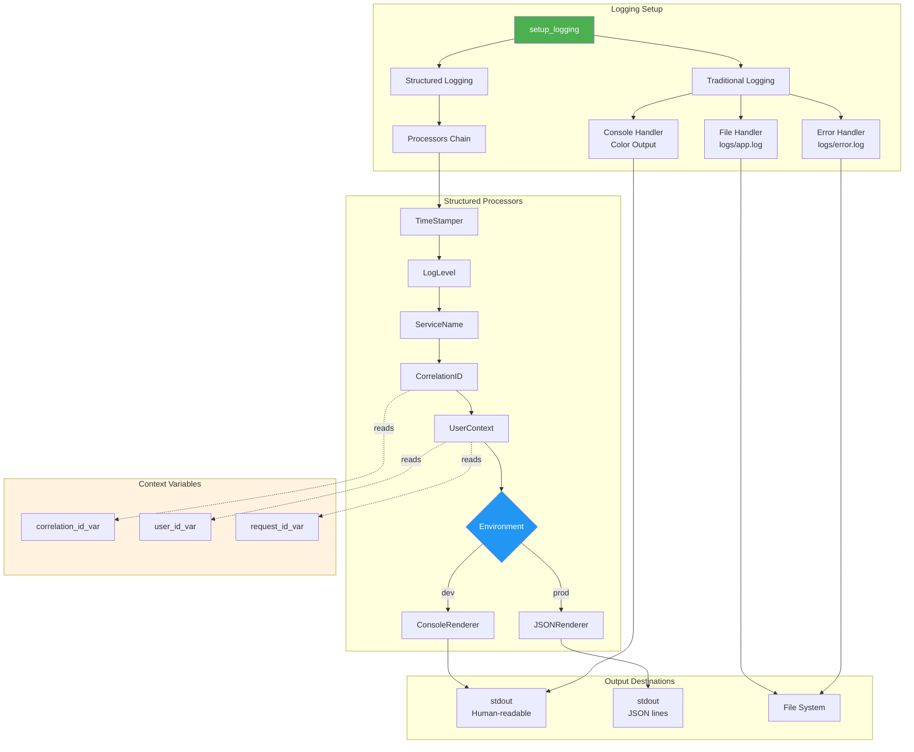
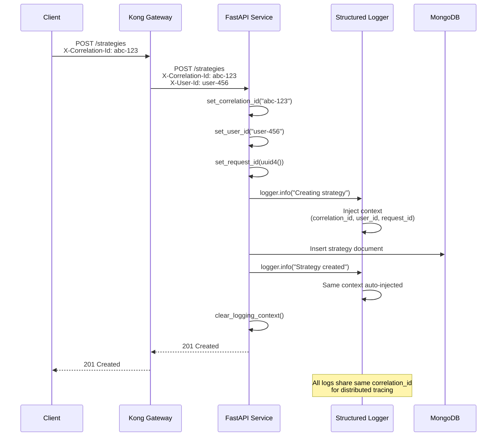

# Structured Logging Guide

**Version:** 2.2.1 | **Module:** `mysingle.core.logging`

> **📖 Core Module Overview:** [mysingle.core README](../../src/mysingle/core/README.md)

Production-ready structured logging with context propagation and JSON output support.

---

## Overview

MySingle provides an integrated logging system combining structlog and Python's logging module for production-grade observability.

**For common patterns and environment configuration, see:** [Core README - Structured Logging](../../src/mysingle/core/README.md#3-structured-logging)

| Feature                 | Technology  | Purpose                                  |
| ----------------------- | ----------- | ---------------------------------------- |
| **Structured Logging**  | structlog   | JSON output, context injection           |
| **Traditional Logging** | logging     | Console color output, file rotation      |
| **Context Variables**   | contextvars | Correlation ID, User ID, Request ID      |
| **Environment Support** | Auto-config | Development (color) vs Production (JSON) |

---

## Quick Start

### Basic Setup

```python
from mysingle.core import setup_logging

# Initialize logging system (call once at application startup)
setup_logging(
    service_name="strategy-service",
    environment="development",  # or "production"
)
```

**Environment Behavior:**

- **development:** Color console output, DEBUG level, human-readable format
- **production:** JSON output, INFO level, structured format

### Get a Logger

```python
from mysingle.core import get_logger

logger = get_logger(__name__)

logger.info("Strategy created", strategy_id="strat-123", user_id="user-456")
logger.error("Database connection failed", error="timeout", duration_ms=5000)
```

**Output (development):**
```
2025-12-02T10:30:45.123Z [info     ] Strategy created    service=strategy-service strategy_id=strat-123 user_id=user-456
```

**Output (production):**
```json
{
  "timestamp": "2025-12-02T10:30:45.123Z",
  "level": "info",
  "event": "Strategy created",
  "service": "strategy-service",
  "strategy_id": "strat-123",
  "user_id": "user-456"
}
```

---

## Architecture



---

## Context Management

### Setting Context

```python
from mysingle.core import (
    set_correlation_id,
    set_user_id,
    set_request_id,
    clear_logging_context,
)

# Set context at request start
set_correlation_id(request.headers.get("X-Correlation-Id", str(uuid.uuid4())))
set_user_id(str(user.id))
set_request_id(str(uuid.uuid4()))

# Log with automatic context injection
logger.info("Processing request")
# Output includes correlation_id, user_id, request_id automatically

# Clear context at request end (important!)
clear_logging_context()
```

### FastAPI Integration

```python
from fastapi import Request
from mysingle.core import get_logger, set_correlation_id, set_user_id, set_request_id
import uuid

logger = get_logger(__name__)

@app.middleware("http")
async def logging_middleware(request: Request, call_next):
    # Set context
    correlation_id = request.headers.get("X-Correlation-Id", str(uuid.uuid4()))
    set_correlation_id(correlation_id)

    if hasattr(request.state, "user"):
        set_user_id(str(request.state.user.id))

    request_id = str(uuid.uuid4())
    set_request_id(request_id)

    logger.info("Request started", method=request.method, path=request.url.path)

    try:
        response = await call_next(request)
        logger.info("Request completed", status_code=response.status_code)
        return response
    finally:
        clear_logging_context()
```

### Context Propagation



---

## Convenience Functions

### User Actions

```python
from mysingle.core import log_user_action

log_user_action(
    action="create_strategy",
    resource_type="strategy",
    resource_id="strat-789",
    details={"name": "My Strategy", "symbols": ["AAPL", "GOOGL"]},
    success=True,
)

# On error
log_user_action(
    action="delete_backtest",
    resource_type="backtest",
    resource_id="bt-456",
    success=False,
    error="Backtest not found",
)
```

**Output:**
```json
{
  "timestamp": "2025-12-02T10:35:12.456Z",
  "level": "info",
  "event": "User action completed",
  "action": "create_strategy",
  "resource_type": "strategy",
  "resource_id": "strat-789",
  "name": "My Strategy",
  "symbols": ["AAPL", "GOOGL"],
  "success": true
}
```

### Service Calls

```python
from mysingle.core import log_service_call
import time

start_time = time.time()
try:
    response = await backtest_client.run_backtest(strategy_id)
    log_service_call(
        service_name="backtest-service",
        method="POST",
        endpoint="/backtests/run",
        duration=time.time() - start_time,
        status_code=201,
    )
except Exception as e:
    log_service_call(
        service_name="backtest-service",
        method="POST",
        endpoint="/backtests/run",
        duration=time.time() - start_time,
        error=str(e),
    )
```

### Database Operations

```python
from mysingle.core import log_database_operation
import time

start_time = time.time()
try:
    result = await Strategy.find({"user_id": user_id}).to_list()
    log_database_operation(
        operation="find",
        collection="strategies",
        duration=time.time() - start_time,
        document_count=len(result),
    )
except Exception as e:
    log_database_operation(
        operation="find",
        collection="strategies",
        duration=time.time() - start_time,
        error=str(e),
    )
```

---

## Configuration

### Full Setup Options

```python
from mysingle.core import setup_logging

setup_logging(
    service_name="strategy-service",  # Required: service identifier
    log_level="INFO",                 # DEBUG, INFO, WARNING, ERROR, CRITICAL
    environment="production",         # development, production
    enable_json=True,                 # Force JSON output (auto-enabled in production)
)
```

### Environment Variables

```bash
# .env
SERVICE_NAME=strategy-service
ENVIRONMENT=production
LOG_LEVEL=INFO
```

```python
import os
from mysingle.core import setup_logging

setup_logging(
    service_name=os.getenv("SERVICE_NAME", "unknown-service"),
    environment=os.getenv("ENVIRONMENT", "development"),
    log_level=os.getenv("LOG_LEVEL", "INFO"),
)
```

### Log Levels

| Level    | Use Case              | Example                              |
| -------- | --------------------- | ------------------------------------ |
| DEBUG    | Development debugging | Variable values, function calls      |
| INFO     | Normal operations     | Request started, Strategy created    |
| WARNING  | Recoverable issues    | Retry attempt, Deprecated API usage  |
| ERROR    | Error conditions      | Database timeout, Validation failed  |
| CRITICAL | System failures       | Service unavailable, Data corruption |

---

## Advanced Usage

### Custom Processors

```python
import structlog

class CustomMetadataProcessor:
    """Add custom metadata to all logs"""

    def __call__(self, logger, method_name, event_dict):
        event_dict["cluster"] = "us-east-1"
        event_dict["version"] = "2.2.1"
        return event_dict

# Apply custom processor
structlog.configure(
    processors=[
        CustomMetadataProcessor(),
        *structlog.get_config()["processors"],
    ]
)
```

### Exception Logging

```python
logger = get_logger(__name__)

try:
    result = dangerous_operation()
except Exception as e:
    logger.exception(
        "Operation failed",
        operation="dangerous_operation",
        params={"param1": value1},
    )
    raise
```

**Output (includes full stack trace):**
```json
{
  "timestamp": "2025-12-02T10:40:15.789Z",
  "level": "error",
  "event": "Operation failed",
  "operation": "dangerous_operation",
  "params": {"param1": "value1"},
  "exception": "Traceback (most recent call last):\n  File ...",
  "exc_info": true
}
```

### Performance Measurement

```python
import time
from mysingle.core import get_logger

logger = get_logger(__name__)

def measure_performance():
    start = time.time()

    # Business logic
    result = expensive_computation()

    duration_ms = (time.time() - start) * 1000
    logger.info(
        "Computation completed",
        duration_ms=round(duration_ms, 2),
        result_size=len(result),
    )
```

---

## File Outputs

### Log File Structure

```
logs/
├── app.log      # All logs (INFO and above)
└── error.log    # Error logs only (ERROR and above)
```

### Log Rotation (Recommended)

```python
from logging.handlers import RotatingFileHandler
import logging

# Add to setup_traditional_logging()
file_handler = RotatingFileHandler(
    "logs/app.log",
    maxBytes=10 * 1024 * 1024,  # 10 MB
    backupCount=5,              # Keep 5 backups
    encoding="utf-8",
)
```

---

## Testing

### Mock Logger

```python
import pytest
from unittest.mock import MagicMock
from mysingle.core import get_logger

@pytest.fixture
def mock_logger():
    return MagicMock()

def test_user_action_logging(mock_logger, monkeypatch):
    monkeypatch.setattr("mysingle.core.logging.get_logger", lambda name: mock_logger)

    from mysingle.core import log_user_action

    log_user_action(
        action="create",
        resource_type="strategy",
        resource_id="strat-123",
        success=True,
    )

    mock_logger.info.assert_called_once()
    call_args = mock_logger.info.call_args
    assert call_args[0][0] == "User action completed"
    assert call_args[1]["action"] == "create"
```

### Capture Logs

```python
import pytest
import logging

@pytest.fixture
def caplog_structured(caplog):
    """Capture structured logs in tests"""
    caplog.set_level(logging.INFO)
    return caplog

def test_logging_output(caplog_structured):
    from mysingle.core import get_logger, set_correlation_id

    logger = get_logger(__name__)
    set_correlation_id("test-correlation-id")

    logger.info("Test message", key="value")

    assert "Test message" in caplog_structured.text
    assert "test-correlation-id" in caplog_structured.text
```

---

## Best Practices

### ✅ DO

```python
# Use structured fields instead of string formatting
logger.info("Strategy created", strategy_id=strategy_id, user_id=user_id)

# Set context at request start
set_correlation_id(correlation_id)
set_user_id(user_id)

# Clear context at request end
clear_logging_context()

# Use appropriate log levels
logger.debug("Variable value", value=x)  # Development only
logger.info("Operation completed", duration_ms=123)  # Normal flow
logger.error("Operation failed", error=str(e))  # Errors

# Log exceptions with stack traces
logger.exception("Failed to process", request_id=request_id)
```

### ❌ DON'T

```python
# Don't use string formatting (loses structure)
logger.info(f"Strategy {strategy_id} created by {user_id}")

# Don't forget to clear context
# Missing clear_logging_context() causes context leak

# Don't log sensitive data
logger.info("User login", password=password)  # BAD!

# Don't use print() statements
print("Debug info")  # Use logger.debug() instead

# Don't log in tight loops without sampling
for item in large_list:
    logger.info("Processing item", item=item)  # Consider sampling
```

### Sampling High-Volume Logs

```python
import random

for i, item in enumerate(large_list):
    # Log every 100th item
    if i % 100 == 0:
        logger.debug("Processing batch", batch_start=i, total=len(large_list))

    # Or random sampling (1%)
    if random.random() < 0.01:
        logger.debug("Sample item", item=item, index=i)
```

---

## Production Deployment

### Container Configuration

```dockerfile
# Dockerfile
FROM python:3.11-slim

# Logging directory
RUN mkdir -p /app/logs

# Application code
COPY . /app
WORKDIR /app

# Environment variables
ENV ENVIRONMENT=production
ENV LOG_LEVEL=INFO
ENV SERVICE_NAME=strategy-service

CMD ["python", "-m", "uvicorn", "app.main:app", "--host", "0.0.0.0", "--port", "8000"]
```

### Kubernetes Logging

```yaml
# deployment.yaml
apiVersion: apps/v1
kind: Deployment
metadata:
  name: strategy-service
spec:
  template:
    spec:
      containers:
      - name: strategy-service
        env:
        - name: ENVIRONMENT
          value: "production"
        - name: LOG_LEVEL
          value: "INFO"
        - name: SERVICE_NAME
          value: "strategy-service"
        volumeMounts:
        - name: logs
          mountPath: /app/logs
      volumes:
      - name: logs
        emptyDir: {}
```

### Log Aggregation

```python
# Send structured logs to external systems
import logging
from pythonjsonlogger import jsonlogger

# Add JSON handler for log forwarding
json_handler = logging.StreamHandler()
json_formatter = jsonlogger.JsonFormatter()
json_handler.setFormatter(json_formatter)
logging.getLogger().addHandler(json_handler)
```

**Integration with:**
- **Datadog:** Use Datadog Agent to collect JSON logs
- **ELK Stack:** Filebeat → Logstash → Elasticsearch
- **CloudWatch:** AWS CloudWatch Logs Agent
- **Grafana Loki:** Promtail collector

---

## Troubleshooting

### Context Not Appearing in Logs

**Problem:** correlation_id not showing in logs

**Solution:**
```python
# Ensure context is set BEFORE logging
set_correlation_id(correlation_id)
logger.info("Message")  # Now includes correlation_id

# Check if context is set
from mysingle.core import get_correlation_id
print(get_correlation_id())  # Should print correlation_id
```

### Duplicate Logs

**Problem:** Logs appearing multiple times

**Solution:**
```python
# Call setup_logging() only once at startup
# Remove duplicate handler registrations
# Check for multiple logger instances
```

### JSON Not Enabled in Production

**Problem:** Production logs are not JSON

**Solution:**
```python
# Ensure environment is set correctly
setup_logging(
    service_name="strategy-service",
    environment="production",  # Must be "production"
)

# Or force JSON explicitly
setup_logging(
    service_name="strategy-service",
    enable_json=True,
)
```

---

## API Reference

### Setup Functions

| Function                         | Description                         |
| -------------------------------- | ----------------------------------- |
| `setup_logging()`                | Initialize logging system (primary) |
| `configure_structured_logging()` | Configure structlog only            |
| `setup_traditional_logging()`    | Configure logging module only       |

### Logger Factories

| Function                      | Description                         |
| ----------------------------- | ----------------------------------- |
| `get_logger(name)`            | Get structured logger (recommended) |
| `get_structured_logger(name)` | Alias for get_logger                |

### Context Management

| Function                  | Description                    |
| ------------------------- | ------------------------------ |
| `set_correlation_id(id)`  | Set correlation ID for tracing |
| `set_user_id(id)`         | Set user ID for audit          |
| `set_request_id(id)`      | Set request ID for debugging   |
| `get_correlation_id()`    | Get current correlation ID     |
| `get_user_id()`           | Get current user ID            |
| `get_request_id()`        | Get current request ID         |
| `clear_logging_context()` | Clear all context variables    |

### Convenience Functions

| Function                   | Description                           |
| -------------------------- | ------------------------------------- |
| `log_user_action()`        | Log user actions with standard format |
| `log_service_call()`       | Log inter-service calls               |
| `log_database_operation()` | Log database operations               |

---

## Migration from v1.x

### Import Changes

```python
# Old (v1.x)
from mysingle.logging_config import setup_logging
from mysingle.structured_logging import get_structured_logger

# New (v2.x)
from mysingle.core import setup_logging, get_logger
```

### Setup Changes

```python
# Old (v1.x)
setup_logging()  # Traditional only
configure_structured_logging(service_name="my-service")  # Separate calls

# New (v2.x)
setup_logging(service_name="my-service")  # Unified setup
```

### Breaking Changes

- **Processors:** Removed `enable_correlation_id` and `enable_user_context` parameters (always enabled)
- **Logger Factory:** `WriteLoggerFactory` → `PrintLoggerFactory` (better performance)
- **Context:** Now uses `structlog.contextvars` for better async support

---

## Related Documentation

- [Auth Module README](../auth/README.md) - Authentication integration
- [Clients README](../../src/mysingle/clients/README.md) - Service communication with logging
- [App Factory Guide](../MYSINGLE_APP_FACTORY_USAGE_GUIDE.md) - FastAPI app factory

---

**Version:** 2.2.1
**Module:** `mysingle.core.logging`
**License:** MIT
