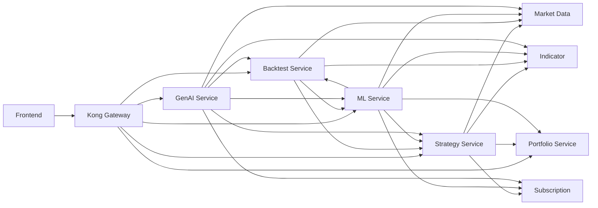
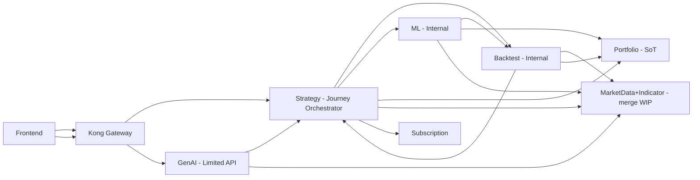
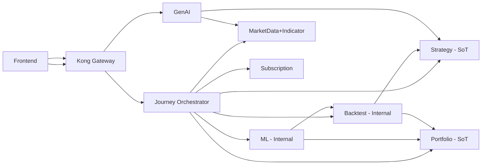

# 마이크로서비스 연동구조 개선 컨설팅 리포트 (AS-IS → TO-BE)

작성일: 2025-12-26
대상: portfolio-service, strategy-service, backtest-service, ml-service, genai-service + `packages/mysingle-pack/protos`

## 1. Executive Summary
현재 작업영역의 서비스 연동은 **(1) 다수 서비스의 개별 HTTP 노출**, **(2) 서비스별 다중 gRPC client 보유**, **(3) 양방향 연동(또는 활성화 가능성이 높은 잠재 양방향)** 으로 인해 성능/유지보수/CI/CD 측면에서 불리한 구조로 관찰된다.

권고 결론은 다음 3가지다.
- **외부(프론트) 노출을 최소화**하고, “저니 오케스트레이터(단기: 전략서비스, 중기: 전용 Orchestrator)”로 사용자 여정 API를 집중한다.
- 내부 gRPC 의존을 **DAG(단방향 그래프)** 로 강제해 **순환 의존(cycle)을 원천 차단**한다.
- gRPC protos를 “서비스 간 계약(내부)” 관점에서 **재설계/단순화**하고, 공용/내부 API를 분리한다.

---

## 2. 입력 문서와 진단 근거
### 2.1 입력 문서(첨부)
- `SERVICE_INTEGRATION_MIGRATION.md`의 문제정의/전략 방향(내부화, 오케스트레이터 도입, proto 재설계)을 본 리포트의 전제로 사용.

### 2.2 코드베이스 관찰(팩트)
#### A) 서비스별 gRPC client 보유(파일 기준)
- strategy-service: MarketData/Indicator/Subscription/Portfolio gRPC client 보유
- backtest-service: Strategy/ML/MarketData/Indicator gRPC client 보유
- ml-service: Backtest/Strategy/Portfolio/MarketData/Indicator/Subscription gRPC client 보유
- genai-service: Backtest/ML/Strategy/MarketData/Indicator/Subscription gRPC client 보유
- portfolio-service: gRPC server만 확인(클라이언트 없음)

#### B) 외부 HTTP 노출(라우터 구성 기준)
- portfolio/strategy/backtest/ml/genai 모두 `/api/v1` 하위에 다수 라우터를 직접 노출
- 특히 ml-service는 다수 라우터/기능군이 직접 노출되어, “내부 서비스 전용 전환” 시 가장 큰 영향 범위를 가짐

#### C) 순환 의존(활성화 가능성 포함)
- ML → Backtest 호출 경로는 실제 구현(예: 평가/벤치마크에서 backtest 결과 조회)
- Backtest 서비스팩토리에 ML gRPC client가 존재하여 Backtest → ML 호출이 활성화되면 **Backtest ↔ ML 양방향(순환)** 이 형성될 가능성이 큼
- genai-service는 다수 서비스를 직접 호출 가능한 형태로 구성되어 있어, 호출 경로가 늘수록 전파/디버깅 비용이 급증

---

## 3. AS-IS 진단
### 3.1 문제 요약
- 프론트엔드가 “여러 서비스의 개별 API”를 직접 연동해야 하는 구조 → 개발 혼잡/변경 파편화
- 서비스 내부 호출이 서비스별로 분산되어 “누가 오케스트레이터인가”가 불분명
- 서비스 간 양방향/다중 경로 통신이 늘어나면
  - 성능: 불필요한 hop 증가, tail latency 악화
  - 운영: 장애 전파/재시도 폭주/관측 어려움
  - CI/CD: 변경 영향 범위 확대(클라이언트/프로토 변경이 여러 서비스에 연쇄 영향)

### 3.2 AS-IS 아키텍처(요약)

**핵심 리스크**: `Backtest ↔ ML`의 순환 가능성 + GenAI의 다중 직접 호출로 인해 “메시(mesh) 확장” 위험이 큼.

---

## 4. TO-BE 목표
### 4.1 설계 원칙
1) **저니 오케스트레이터 단일화**: 사용자 여정(전략 생성/실행/백테스트/평가/리포트)을 1곳에서 오케스트레이션
2) **내부 서비스 전용 전환**: Backtest/ML(및 일부 GenAI 기능)은 외부 노출을 줄이고 내부 호출 중심으로 재배치
3) **DAG 강제(순환 금지)**: 서비스 간 gRPC 의존을 방향성 있는 그래프로 고정
4) **SoT 확정**: 포트폴리오 상태/트랜잭션/포지션은 Portfolio Service가 SoT
5) **proto 재설계**: “내부 계약용” proto를 얇고 안정적으로 유지(고변동/고수명 API 분리)

---

## 5. TO-BE 권고 아키텍처
### 5.1 단기(전략서비스를 Orchestrator로)
- 외부(프론트) 노출은 **Kong → Strategy(Orchestrator)** 중심으로 단순화
- Backtest/ML/GenAI는 가능 범위에서 “내부 서비스”로 전환(직접 노출 최소화)

**포인트**
- Strategy가 “사용자 여정 API”를 제공하고 내부 서비스 호출을 오케스트레이션.
- 단, Portfolio 관련 고빈도/대용량 경로(포지션/스냅샷 등)는 프록시(hop)로 인해 지연/부하가 커질 수 있으므로 **직접 호출을 유지**(Orchestrator는 정책/연결만 관리).

### 5.2 중기(전용 Journey Orchestrator 분리)
- Strategy는 전략 SoT에 집중
- Orchestrator 서비스(신규)가 사용자 여정을 전담

---

## 6. 요구사항별 컨설팅 답변(핵심 포인트)
### 6.1 Backtest ↔ ML 양방향 → 단방향 전환
- 권고: **ML → Backtest** 단방향으로 고정(ML이 최적화/평가 루프 오케스트레이터)
- Backtest → ML 호출은 금지(또는 feature flag로 제한)하여 cycle을 원천 차단

### 6.2 Strategy ↔ Backtest 양방향 → 단방향 전환
- 권고: **Backtest → Strategy** 단방향 고정(전략 버전/DSL 조회)
- 사용자 요청 기반 “백테스트 실행”은 Orchestrator가 Backtest를 호출

### 6.3 ML → Strategy 단방향 → Backtest 프록시 가능성
- 프록시는 hop 증가 + Backtest 부하 증가로 비권고
- 대신 “ML이 Strategy를 호출하는 이유가 성과/결과 조회라면” 그 책임을 Backtest로 모아 **ML → Backtest로 이동**

### 6.4 Strategy/Backtest/ML → Portfolio 단방향 → Strategy 프록시 가능성
- Strategy 프록시는 병목/지연/장애 전파 리스크가 커 비권고
- 각 서비스가 Portfolio를 직접 호출하되, Strategy/Orchestrator는 “policy/연결(예: portfolio_id 생성/연결)”만 담당

---

## 7. Proto 재설계 방향(권고)
1) **Public API vs Internal API 분리**
   - 외부 노출(HTTP)과 내부 gRPC 계약을 분리해 변경 폭을 축소
2) **Orchestrator 전용 proto 추가**
   - 사용자가 실제로 필요로 하는 여정 단위 API(예: RunBacktestAndGetSummary, OptimizeStrategyAndRecommendPortfolio 등)
3) **고빈도/대용량 경로는 SoT에 직접**
   - Portfolio/MarketData/Indicator 등은 프록시 대신 직접 호출을 유지
4) **메시지 표준화**
   - request metadata(user-id, correlation-id) 표준 강제
   - id 타입/시간 표현/페이지네이션 규약 통일

---

## 8. 전환 로드맵(실행안)
### Phase 0 (즉시)
- 순환 가능성 제거: Backtest → ML 호출 금지(정책/테스트/CI rule)
- 서비스별 gRPC client 난립 억제: 사용되지 않는 client 제거 또는 모듈 격리

### Phase 1 (단기)
- Strategy를 Journey Orchestrator로 운영(외부 API 집중)
- Backtest/ML의 외부 노출 축소(내부 전용 전환 범위 정의)

### Phase 2 (중기)
- 전용 Journey Orchestrator 서비스 분리
- protos 재설계/버전업(major/minor 기준 수립)

---

## 9. 결론
- 단기: Strategy 중심 오케스트레이션으로 외부 노출과 의존 방향을 단순화
- 중기: 전용 Orchestrator로 책임 분리
- 상시: gRPC 의존을 DAG로 강제하고, protos를 얇고 안정적인 내부 계약으로 재설계
