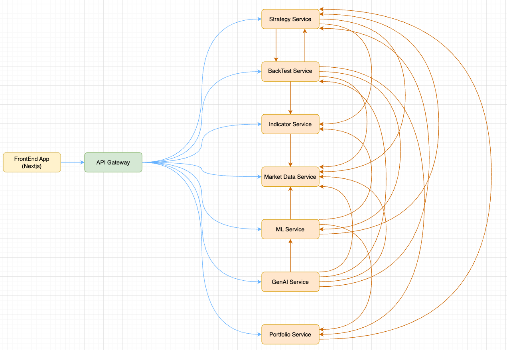
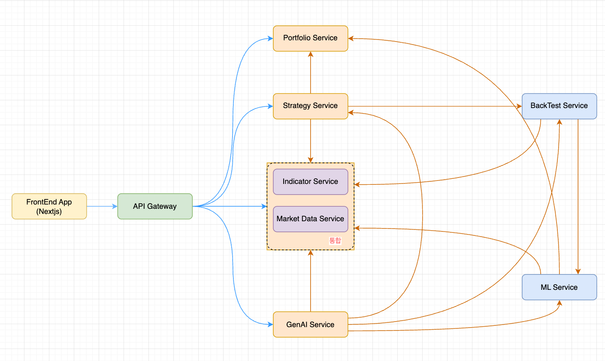

# 마이크로서비스 내부 연동구조 개선

## 현재 문제점
- 모든 마이크로서비스들이 개별적으로 엔드포인트를 프론트엔드에 노출하여, 프론트엔드 연동개발에 혼잡 유발
- 저니 오케스트레이터 서비스가 없음
- 다수의 서비스들이 개별적으로 양방향 연동되어 복잡성 증가 및 유지보수성 열악
- 서비스별로 너무 많은 grpc 클라이언트 들이 구성되어 있으며, 변경시 영향 범위가 넒어 지속적인 개발,통합,배포에 리스크 및 작업지연
- 불필요한 네트워크 자원소모 및 응답지연 증가로 성능저하 위험
- gRPC 구성의 복잡성 증가

## 전략
- 가능한 서비스는 최대한 내부서비스 전용으로 전환 (백테스트, ML 내부용 전환이 가능할지 Copilot agent가 타당성/리스크 분석 후 의사결정 지원 필요)
- Jounery Orchestrator 서비스 도입 검토 (Copilot agent가 분석 후 의사결정 지원 필요)
  - 단기: 전략서비스에서 오케스트레이션 서비스 지원
  - 중기: Jouney Orchestratory 서비스 추가하여 책임분리
- 마켓데이터서비스와 인디케이터서비스는 통합(현재 별도 프로젝트로 통합작업 진행 중)
- grpc protos 재설계 및 단순화 -> 각 서비스의 gRPC 서비서 및 클라이언트 개편

## 현재 구조

## 목표 구조
- NOTE: 아래는 간단 예시이며, 실현 가능성 및 타당성 조사후 최종 아키텍쳐 설계 필요 (Copilot agent가 분석 후 의사결정 지원 필요)

## 리스크
- 현재 ML서비스가 노출하고 있는 API 엔드포인트가 너무 많으며, ML서비스를 내부용으로 전환시 어느 서비스가 proxy 할 것인가? (Copilot agent가 분석 후 의사결정 지원 필요)
-
