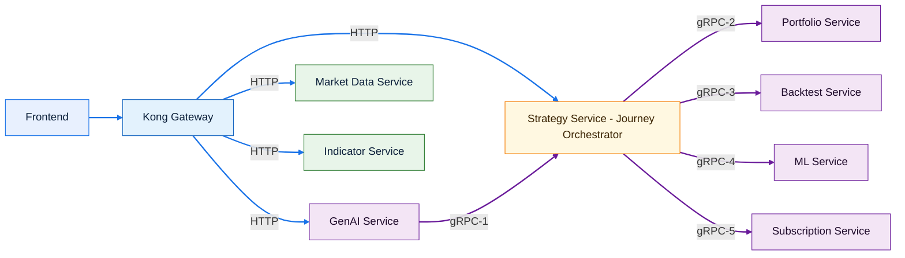

# Target Architecture: Journey Orchestrator (TO-BE)

## 목적
- 서비스 간 호출을 **Journey Orchestrator(단기: Strategy Service)** 로 집중하여, 프론트엔드/GenAI에서 발생하는 “사용자 여정(Strategy 생성→검증→백테스트→리포트/추천)”을 **단일 진입점**으로 표준화합니다.
- 모든 외부 HTTP 트래픽은 **Kong Gateway** 를 통해서만 유입됩니다.
- 서비스 간 통신은 **gRPC** 를 기본으로 합니다.

## 컴포넌트 범주(색상) & 통신선 규칙
- **Client/Edge**: Frontend, Kong
- **Orchestrator**: Strategy Service (Journey Orchestrator 역할)
- **Internal Services**: Portfolio/Backtest/ML/Subscription/GenAI
- **Public Data Services**: Market Data, Indicator (Frontend 직접 사용)

통신선:
- **HTTP**: 파란색
- **gRPC**: 보라색 (구간 번호: `gRPC-1..N`)

## TO-BE 아키텍처 (Mermaid)

## gRPC 연동 구간(번호) 정의
| 구간   | Caller -> Callee                       | 목적                                                                     |
| ------ | -------------------------------------- | ------------------------------------------------------------------------ |
| gRPC-1 | GenAI Service -> StrategyService       | 전략 생성/템플릿/전략 목록/버전 생성·수정 등 GenAI 워크플로우 지원       |
| gRPC-2 | StrategyService -> PortfolioService    | 전략 배포/백테스트 실행을 위한 포트폴리오 생성 및 조회(요약/포지션/거래) |
| gRPC-3 | StrategyService -> BacktestService     | 백테스트 실행/상태 스트리밍/결과 및 메트릭 조회                          |
| gRPC-4 | StrategyService -> MLService           | 파라미터 추천/모델 추천/워크포워드 최적화·분석/예측 호출                 |
| gRPC-5 | StrategyService -> SubscriptionService | 쿼터/기능 접근/구독 정보 확인(여정 단계별 가드)                          |

## 구간별 RPC 메서드 테이블 (proto 기반)
> 원칙: “해당 구간에서 실제로 호출되는” RPC를 중심으로 나열합니다. (서비스 전체 RPC를 무조건 나열하지 않음)

| 구간   | proto (service)                                                             | 대표 RPC 메서드                                                                                                                                       |
| ------ | --------------------------------------------------------------------------- | ----------------------------------------------------------------------------------------------------------------------------------------------------- |
| gRPC-1 | `services/strategy/v1/strategy_service.proto` (StrategyService)             | `GetStrategyTemplate`, `ListStrategyTemplates`, `BatchGetStrategies`, `ListUserStrategies`, `CreateStrategyVersion`, `UpdateStrategyVersion`          |
| gRPC-2 | `services/portfolio/v1/portfolio_service.proto` (PortfolioService)          | `CreatePortfolio`, `GetPortfolioSummary`, `GetPositions`, `GetTransactions`                                                                           |
| gRPC-3 | `services/backtest/v1/backtest_service.proto` (BacktestService)             | `ExecuteBacktest`, `StreamBacktestProgress`, `GetBacktestResult`, `GetBacktestMetrics`, `ListBacktests`, `CancelBacktest`                             |
| gRPC-4 | `services/ml/v1/ml_service.proto` (MLService)                               | `RecommendModel`, `SuggestParameters`, `OptimizeParameters`, `AnalyzeWalkForward`, `PredictSignal`, `PredictSignalsBatch`, `GetMLBacktestPerformance` |
| gRPC-5 | `services/subscription/v1/subscription_service.proto` (SubscriptionService) | `CheckResourceQuota`, `CheckFeatureAccess`, `CheckQuota`, `GetSubscription`, `GetEntitlements`                                                        |

## 참고: GenAI 자체 gRPC API (외부 노출 아님)
- `services/genai/v1/chatops.proto` (ChatOpsService): `CreateSession`, `ChatStream`, `GetSessionHistory`, `CloseSession`
- `services/genai/v1/narrative.proto` (NarrativeService): `GenerateReport`, `GetReportStatus`, `GenerateComparisonReport`
- `services/genai/v1/strategy_builder.proto` (StrategyBuilderService): `GenerateStrategy`, `ValidateProposal`, `CustomizeTemplate`
- `services/genai/v1/dsl_validator.proto` (DSLValidatorService): `ValidateDSL`, `AutocompleteDSL`, `GetSyntaxHelp`, `SuggestRefactoring`, `ExplainError`, `GenerateDocumentation`
- `services/genai/v1/ir_converter.proto` (IRConverterService): `PreviewConversion`, `ExecuteConversion`, `CheckConvertibility`

## 비고(적용 시점)
- 단기: Strategy Service가 Journey Orchestrator 역할 수행(현 proto 기준으로 가장 현실적인 단일 진입점)
- 중기: Orchestrator를 전용 서비스로 분리하는 경우, gRPC-2~5의 Caller만 Orchestrator로 교체(다른 서비스 proto는 대부분 유지 가능)
