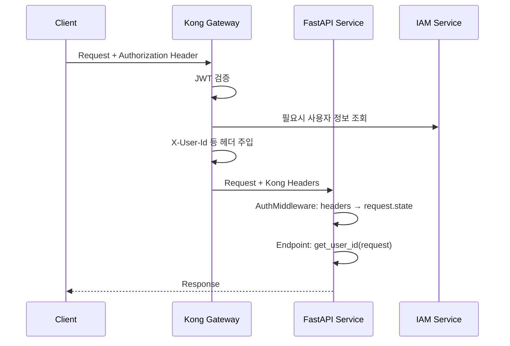

# mysingle.auth

**Version:** 2.2.1 | **Module:** `mysingle.auth`

Kong Gateway 기반 경량 인증 모듈 - Request.state에서 사용자 정보 추출 및 권한 검증

---

## Overview

MySingle 인증 시스템은 **Kong Gateway가 JWT 검증을 완료**한 후, 헤더를 통해 전달된 사용자 정보를 추출하는 경량 아키텍처입니다.

### Key Principles

1. **Kong Gateway가 인증 담당**: JWT 토큰 검증은 Kong API Gateway에서 완료
2. **헤더 기반 사용자 정보**: `X-User-Id`, `X-User-Email` 등 Kong 헤더에서 추출
3. **IAM 로그인 검증**: `is_active=true` + `is_verified=true` 사용자만 JWT 발급
4. **경량 검증**: 불필요한 중복 검증 제거 (이미 IAM에서 완료)

### Architecture Flow



---

## Installation

```bash
# Recommended: Full auth support
pip install mysingle[auth]

# Or minimal
pip install mysingle[core]
```

---

## Quick Start

### 1. Service Setup

```python
from fastapi import FastAPI
from mysingle.core import create_fastapi_app, create_service_config

# Create service config
config = create_service_config(
    service_name="my-service",
    public_paths=["/api/v1/public"],  # 인증 불필요 경로
)

# AuthMiddleware 자동 등록
app = create_fastapi_app(service_config=config)
```

### 2. Endpoint Implementation

```python
from fastapi import APIRouter, Request
from mysingle.auth import get_user_id

router = APIRouter()

@router.get("/items")
async def list_items(request: Request):
    """인증된 사용자의 아이템 조회"""
    user_id = get_user_id(request)  # Kong Gateway가 주입한 user_id
    items = await get_user_items(user_id)
    return {"items": items}

@router.post("/items")
async def create_item(request: Request, name: str):
    """아이템 생성"""
    user_id = get_user_id(request)
    item = await create_user_item(user_id, name)
    return {"item": item}
```

### 3. Optional Authentication

```python
from mysingle.auth import get_user_id_optional

@router.get("/public/items")
async def list_public_items(request: Request):
    """공개 API - 로그인 선택적"""
    user_id = get_user_id_optional(request)  # None if not authenticated

    if user_id:
        # 로그인 사용자: 개인화된 결과
        items = await get_personalized_items(user_id)
    else:
        # 비로그인 사용자: 기본 결과
        items = await get_default_items()

    return {"items": items}
```

---

## Core Functions

### Authentication Functions

#### `get_user_id(request: Request) -> str`

현재 인증된 사용자 ID를 반환합니다. 인증되지 않은 경우 `401 Unauthorized`를 발생시킵니다.

```python
from fastapi import Request
from mysingle.auth import get_user_id

@router.post("/strategies")
async def create_strategy(request: Request, name: str):
    user_id = get_user_id(request)  # Raises 401 if not authenticated
    strategy = await Strategy.create(user_id=user_id, name=name)
    return {"strategy": strategy}
```

**Returns:**
- `str`: User ID (MongoDB ObjectId as string)

**Raises:**
- `HTTPException(401)`: 인증되지 않은 경우

---

#### `get_user_id_optional(request: Request) -> Optional[str]`

선택적으로 사용자 ID를 반환합니다. 인증되지 않은 경우 `None`을 반환합니다.

```python
from mysingle.auth import get_user_id_optional

@router.get("/trending")
async def get_trending(request: Request):
    user_id = get_user_id_optional(request)  # None if not authenticated

    trending = await get_trending_strategies()

    if user_id:
        # Add user-specific metadata
        trending = await enrich_with_user_favorites(trending, user_id)

    return {"trending": trending}
```

**Returns:**
- `Optional[str]`: User ID 또는 `None`

---

#### `get_user_email(request: Request) -> Optional[str]`

사용자 이메일을 반환합니다.

```python
from mysingle.auth import get_user_email

@router.get("/profile")
async def get_profile(request: Request):
    user_id = get_user_id(request)
    email = get_user_email(request)  # May be None

    return {
        "user_id": user_id,
        "email": email,
    }
```

**Returns:**
- `Optional[str]`: Email 또는 `None`

---

### Utility Functions

#### `get_correlation_id(request: Request) -> Optional[str]`

요청 추적을 위한 Correlation ID를 반환합니다.

```python
from mysingle.auth import get_correlation_id

@router.post("/backtest")
async def run_backtest(request: Request, strategy_id: str):
    correlation_id = get_correlation_id(request)

    logger.info(
        "Starting backtest",
        strategy_id=strategy_id,
        correlation_id=correlation_id,
    )

    result = await backtest_service.run(strategy_id, correlation_id)
    return {"result": result}
```

---

#### `get_request_id(request: Request) -> Optional[str]`

Kong Gateway의 Request ID를 반환합니다.

```python
from mysingle.auth import get_request_id

@router.get("/items/{item_id}")
async def get_item(request: Request, item_id: str):
    request_id = get_request_id(request)

    logger.debug(
        "Fetching item",
        item_id=item_id,
        request_id=request_id,
    )

    item = await get_item_by_id(item_id)
    return {"item": item}
```

---

#### `get_request_security_context(request: Request) -> dict`

요청의 보안 컨텍스트를 반환합니다 (로깅/모니터링용).

```python
from mysingle.auth import get_request_security_context

@router.post("/admin/delete-user")
async def delete_user(request: Request, user_id: str):
    context = get_request_security_context(request)

    logger.warning(
        "User deletion requested",
        target_user_id=user_id,
        **context,  # authenticated, user_id, email, is_superuser, etc.
    )

    await delete_user_account(user_id)
    return {"status": "deleted"}
```

**Returns:**
```python
{
    "authenticated": True,
    "user_id": "507f1f77bcf86cd799439011",
    "email": "user@example.com",
    "is_superuser": False,
    "client_ip": "192.168.1.100",
    "user_agent": "Mozilla/5.0...",
    "endpoint": "POST /admin/delete-user",
    "correlation_id": "abc123",
    "request_id": "xyz789",
}
```

---

#### `get_user_display_name(request: Request) -> Optional[str]`

UI 표시용 사용자 이름을 반환합니다.

```python
from mysingle.auth import get_user_display_name

@router.get("/welcome")
async def welcome(request: Request):
    display_name = get_user_display_name(request)  # "john" or "User 507f1f77"

    return {"message": f"Welcome, {display_name}!"}
```

---

## Decorators

### `@authorized`

인증된 사용자만 접근 가능한 엔드포인트를 만듭니다.

```python
from fastapi import Request
from mysingle.auth import authorized

@router.post("/strategies")
@authorized
async def create_strategy(request: Request, name: str):
    """인증 필수 엔드포인트"""
    user_id = get_user_id(request)  # Always succeeds (401 already raised by decorator)
    strategy = await Strategy.create(user_id=user_id, name=name)
    return {"strategy": strategy}
```

**Features:**
- IAM 로그인에서 `is_active=true`, `is_verified=true` 검증 완료
- 인증되지 않은 경우 `401 Unauthorized` 발생

**Note:** `get_user_id()`를 직접 호출하는 것과 동일한 효과이므로, 대부분의 경우 decorator 없이 `get_user_id()`를 사용하는 것을 권장합니다.

---

### `@admin_only`

관리자 권한이 있는 사용자만 접근 가능합니다.

```python
from fastapi import Request
from mysingle.auth import admin_only

@router.delete("/admin/users/{user_id}")
@admin_only
async def delete_user(request: Request, user_id: str):
    """관리자 전용 엔드포인트"""
    await delete_user_account(user_id)
    return {"status": "deleted"}

@router.get("/admin/metrics")
@admin_only
async def get_metrics(request: Request):
    """시스템 메트릭 조회 (관리자 전용)"""
    metrics = await collect_system_metrics()
    return {"metrics": metrics}
```

**Features:**
- 인증 확인 (`is_active=true`, `is_verified=true`)
- `is_superuser=true` 검증
- 관리자가 아닌 경우 `403 Forbidden` 발생

---

### `@resource_owner_required`

리소스 소유자 또는 관리자만 접근 가능합니다.

```python
from mysingle.auth import resource_owner_required

@router.put("/strategies/{strategy_id}")
@resource_owner_required(lambda strategy: strategy.user_id)
async def update_strategy(request: Request, strategy: Strategy, name: str):
    """전략 수정 (소유자 또는 관리자만 가능)"""
    strategy.name = name
    await strategy.save()
    return {"strategy": strategy}

@router.delete("/backtests/{backtest_id}")
@resource_owner_required(lambda backtest: backtest.user_id)
async def delete_backtest(request: Request, backtest: Backtest):
    """백테스트 삭제 (소유자 또는 관리자만 가능)"""
    await backtest.delete()
    return {"status": "deleted"}
```

**Parameters:**
- `resource_user_id_getter`: 리소스에서 `user_id`를 추출하는 함수

**Features:**
- 현재 사용자가 리소스 소유자인지 확인
- 관리자(`is_superuser=true`)는 모든 리소스 접근 가능
- 소유자가 아닌 경우 `403 Forbidden` 발생

**Usage Pattern:**
```python
# 1. Dependency로 리소스 조회
async def get_strategy_by_id(strategy_id: str) -> Strategy:
    strategy = await Strategy.get(strategy_id)
    if not strategy:
        raise HTTPException(404, "Strategy not found")
    return strategy

# 2. resource_owner_required 적용
@router.put("/strategies/{strategy_id}")
@resource_owner_required(lambda s: s.user_id)
async def update_strategy(
    request: Request,
    strategy: Strategy = Depends(get_strategy_by_id),
    name: str = None,
):
    if name:
        strategy.name = name
        await strategy.save()
    return {"strategy": strategy}
```

---

## AuthMiddleware

Kong Gateway 헤더를 추출하여 `Request.state`에 주입하는 미들웨어입니다.

### Automatic Registration

`create_fastapi_app()`을 사용하면 자동으로 등록됩니다.

```python
from mysingle.core import create_fastapi_app, create_service_config

config = create_service_config(
    service_name="my-service",
    public_paths=["/health", "/api/v1/public"],
)

app = create_fastapi_app(service_config=config)  # AuthMiddleware 자동 등록
```

### Manual Registration

```python
from fastapi import FastAPI
from mysingle.auth import AuthMiddleware
from mysingle.core.service_types import ServiceConfig

app = FastAPI()

config = ServiceConfig(
    service_name="my-service",
    public_paths=["/health", "/metrics"],
)

app.add_middleware(AuthMiddleware, service_config=config)
```

### Public Paths

인증이 불필요한 공개 경로를 지정할 수 있습니다.

**Default Public Paths:**
- `/health`
- `/metrics`
- `/docs`
- `/redoc`
- `/openapi.json`
- `/favicon.ico`

**Custom Public Paths:**
```python
config = create_service_config(
    service_name="my-service",
    public_paths=[
        "/api/v1/public",      # 공개 API
        "/webhook",            # 외부 Webhook
        "/static",             # 정적 파일
    ],
)
```

### Extracted Headers

AuthMiddleware가 추출하여 `request.state`에 주입하는 정보:

| Kong Header         | Request.state Attribute | Type   | Description      |
| ------------------- | ----------------------- | ------ | ---------------- |
| `X-User-Id`         | `user_id`               | `str`  | 사용자 ID        |
| `X-User-Email`      | `email`                 | `str`  | 사용자 이메일    |
| `X-User-Verified`   | `is_verified`           | `bool` | 이메일 인증 여부 |
| `X-User-Active`     | `is_active`             | `bool` | 계정 활성화 여부 |
| `X-User-Superuser`  | `is_superuser`          | `bool` | 관리자 권한 여부 |
| `X-Correlation-Id`  | -                       | -      | (직접 조회 필요) |
| `X-Kong-Request-Id` | -                       | -      | (직접 조회 필요) |

---

## Testing

### Auth Bypass Mode

테스트 환경에서 인증을 우회할 수 있습니다.

**.env.test:**
```bash
MYSINGLE_AUTH_BYPASS=true
ENVIRONMENT=development

# Optional: 관리자 권한 테스트
MYSINGLE_AUTH_BYPASS_ADMIN=true
```

**Test Code:**
```python
import pytest
from fastapi.testclient import TestClient

@pytest.fixture
def client():
    app = create_fastapi_app(service_config=config)
    return TestClient(app)

def test_create_strategy(client):
    """인증 우회 모드로 테스트"""
    response = client.post("/strategies", json={"name": "Test Strategy"})
    assert response.status_code == 200

    # Auth bypass가 활성화되면 자동으로 테스트 사용자 주입
    # user_id: "000000000000000000000001"
    # email: "test@bypass.local"
    # is_active: true
    # is_verified: true
    # is_superuser: false (or true if MYSINGLE_AUTH_BYPASS_ADMIN=true)
```

### Mock Kong Headers

Auth bypass 없이 Kong 헤더를 직접 주입하여 테스트:

```python
def test_with_mock_kong_headers(client):
    """Kong 헤더 직접 주입 테스트"""
    headers = {
        "X-User-Id": "507f1f77bcf86cd799439011",
        "X-User-Email": "test@example.com",
        "X-User-Active": "true",
        "X-User-Verified": "true",
        "X-User-Superuser": "false",
    }

    response = client.post(
        "/strategies",
        json={"name": "Test Strategy"},
        headers=headers,
    )

    assert response.status_code == 200
```

### Admin User Testing

```bash
# .env.test
MYSINGLE_AUTH_BYPASS=true
MYSINGLE_AUTH_BYPASS_ADMIN=true  # 관리자 권한 부여
```

```python
def test_admin_endpoint(client):
    """관리자 엔드포인트 테스트"""
    response = client.delete("/admin/users/507f1f77bcf86cd799439011")
    assert response.status_code == 200  # Auth bypass admin=true
```

---

## Common Patterns

### Pattern 1: User-Scoped Resource Query

```python
from fastapi import Request
from mysingle.auth import get_user_id

@router.get("/strategies")
async def list_strategies(request: Request):
    """사용자의 전략 목록 조회"""
    user_id = get_user_id(request)

    strategies = await Strategy.find(
        Strategy.user_id == user_id
    ).to_list()

    return {"strategies": strategies}
```

### Pattern 2: Optional User Context

```python
from mysingle.auth import get_user_id_optional

@router.get("/marketplace")
async def browse_marketplace(request: Request):
    """마켓플레이스 (로그인 선택적)"""
    user_id = get_user_id_optional(request)

    strategies = await get_public_strategies()

    if user_id:
        # 사용자별 추천/즐겨찾기 추가
        strategies = await add_user_recommendations(strategies, user_id)

    return {"strategies": strategies}
```

### Pattern 3: Admin-Only Operations

```python
from mysingle.auth import admin_only

@router.post("/admin/reindex")
@admin_only
async def reindex_database(request: Request):
    """데이터베이스 재색인 (관리자 전용)"""
    await run_reindex_task()
    return {"status": "reindexing started"}
```

### Pattern 4: Resource Ownership Check

```python
from mysingle.auth import resource_owner_required

@router.put("/strategies/{strategy_id}")
@resource_owner_required(lambda s: s.user_id)
async def update_strategy(
    request: Request,
    strategy: Strategy = Depends(get_strategy),
    payload: StrategyUpdate = Body(...),
):
    """전략 수정 (소유자 또는 관리자만)"""
    strategy.update_from_payload(payload)
    await strategy.save()
    return {"strategy": strategy}
```

### Pattern 5: Audit Logging

```python
from mysingle.auth import get_request_security_context

@router.delete("/strategies/{strategy_id}")
async def delete_strategy(request: Request, strategy_id: str):
    """전략 삭제 (감사 로깅)"""
    context = get_request_security_context(request)

    logger.warning(
        "Strategy deletion",
        strategy_id=strategy_id,
        **context,  # user_id, email, ip, user_agent, etc.
    )

    await Strategy.delete(strategy_id)
    return {"status": "deleted"}
```

---

## Error Handling

### 401 Unauthorized

인증되지 않은 경우 `get_user_id()`가 발생시킵니다.

```python
@router.get("/items")
async def list_items(request: Request):
    try:
        user_id = get_user_id(request)
        items = await get_user_items(user_id)
        return {"items": items}
    except HTTPException as e:
        if e.status_code == 401:
            logger.info("Unauthenticated access attempt")
            raise
        raise
```

**Response:**
```json
{
  "detail": "Authentication required"
}
```

### 403 Forbidden

권한이 없는 경우 발생합니다.

```python
@router.delete("/admin/users/{user_id}")
@admin_only
async def delete_user(request: Request, user_id: str):
    # Non-admin user → 403 Forbidden
    await delete_user_account(user_id)
    return {"status": "deleted"}
```

**Response:**
```json
{
  "detail": "Admin access required"
}
```

### Resource Ownership Violation

```python
@router.put("/strategies/{strategy_id}")
@resource_owner_required(lambda s: s.user_id)
async def update_strategy(request: Request, strategy: Strategy):
    # User tries to modify another user's strategy → 403 Forbidden
    strategy.name = "New Name"
    await strategy.save()
    return {"strategy": strategy}
```

**Response:**
```json
{
  "detail": "You do not have access to this resource"
}
```

---

## Anti-Patterns (DO NOT)

❌ **Manual JWT verification**
```python
# BAD: Kong Gateway already verified JWT
import jwt
token = request.headers.get("Authorization").split(" ")[1]
payload = jwt.decode(token, SECRET_KEY)  # Unnecessary!

# GOOD: Use Kong headers
user_id = get_user_id(request)
```

❌ **Redundant is_active/is_verified checks**
```python
# BAD: Already verified at IAM login
user_id = get_user_id(request)
user = await User.get(user_id)
if not user.is_active or not user.is_verified:
    raise HTTPException(403)  # Never happens!

# GOOD: Trust Kong Gateway
user_id = get_user_id(request)
```

❌ **Hardcoding public paths in routes**
```python
# BAD: Inconsistent with middleware
@router.get("/health")
async def health():
    pass  # No auth check, but not in public_paths

# GOOD: Use service_config.public_paths
config = create_service_config(
    service_name="my-service",
    public_paths=["/health", "/metrics"],
)
```

❌ **Direct request.state access**
```python
# BAD: Direct state access
user_id = request.state.user_id  # May raise AttributeError

# GOOD: Use helper functions
user_id = get_user_id(request)  # Proper error handling
```

---

## Migration from v1.x

### Removed Functions

- `get_current_user()` → Use `get_user_id(request)`
- `get_current_active_user()` → Use `get_user_id(request)` (active check removed)
- `get_current_verified_user()` → Use `get_user_id(request)` (verified check removed)
- `get_current_active_verified_user()` → Use `get_user_id(request)`
- `get_current_superuser()` → Use `get_user_id(request)` + `request.state.is_superuser`

### Import Changes

```python
# Old (v1.x)
from mysingle.auth import get_current_active_verified_user

# New (v2.x)
from mysingle.auth import get_user_id
```

### Code Migration

**Before (v1.x):**
```python
from mysingle.auth import get_current_active_verified_user

@router.get("/items")
async def list_items(
    current_user: User = Depends(get_current_active_verified_user)
):
    items = await get_user_items(current_user.id)
    return {"items": items}
```

**After (v2.x):**
```python
from fastapi import Request
from mysingle.auth import get_user_id

@router.get("/items")
async def list_items(request: Request):
    user_id = get_user_id(request)
    items = await get_user_items(user_id)
    return {"items": items}
```

---

## Related Documentation

- [Core Module README](../core/README.md) - FastAPI app factory
- [gRPC Module README](../grpc/README.md) - gRPC client/server utilities

---

**Version:** 2.2.1
**Module:** `mysingle.auth`
**License:** MIT
