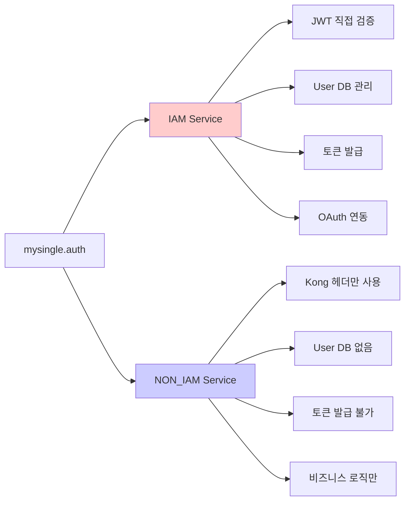
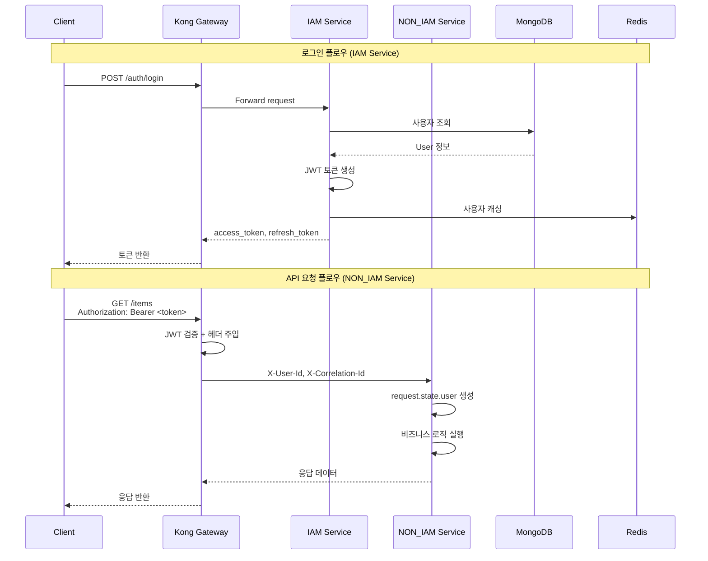
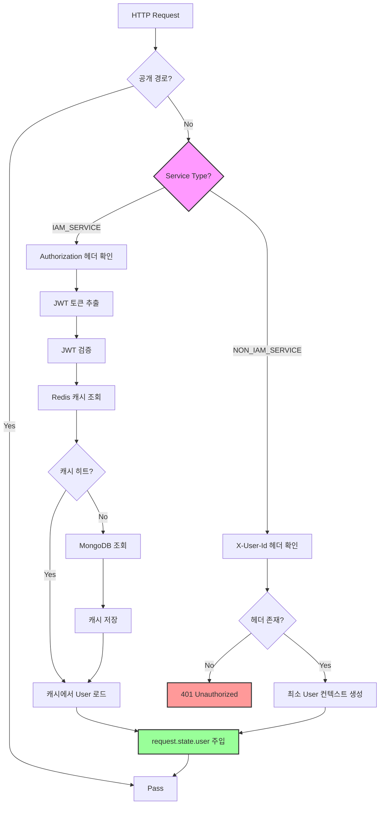

# mysingle.auth - 인증/인가 모듈

**Version:** 2.2.1 | **Last Updated:** 2025-12-02

MySingle 플랫폼의 인증 및 인가를 담당하는 핵심 모듈입니다. Kong Gateway 기반 JWT 인증, OAuth 2.0 연동, 사용자 관리 기능을 제공합니다.

---

## 📋 목차

1. [개요](#개요)
2. [설치](#설치)
3. [서비스 타입별 가이드](#서비스-타입별-가이드)
4. [주요 기능](#주요-기능)
5. [아키텍처](#아키텍처)
6. [API 참조](#api-참조)
7. [향후 개선 로드맵](#향후-개선-로드맵)

---

## 개요

### 핵심 개념

mysingle.auth는 **서비스 타입에 따라 동작이 달라지는** 인증 모듈입니다:



### 지원 기능

| 기능              | IAM Service | NON_IAM Service |
| ----------------- | ----------- | --------------- |
| JWT 토큰 검증     | ✅ 직접 검증 | ❌ Kong만 검증   |
| 토큰 발급         | ✅           | ❌               |
| User 컬렉션 관리  | ✅           | ❌               |
| OAuth 2.0 연동    | ✅           | ❌               |
| Kong 헤더 인증    | ✅           | ✅               |
| Request 기반 인증 | ✅           | ✅               |

---

## 설치

### 기본 설치

```bash
# Auth 모듈만 설치
pip install mysingle[auth]

# 또는 전체 설치
pip install mysingle[full]
```

### 의존성

- **PyJWT**: JWT 토큰 생성/검증
- **pwdlib[argon2,bcrypt]**: 비밀번호 해싱
- **httpx-oauth**: OAuth 2.0 클라이언트

---

## 서비스 타입별 가이드

### 상세 문서

각 서비스 타입에 맞는 상세 가이드를 참조하세요:

1. **[IAM Service 가이드](../../docs/auth/IAM_SERVICE_GUIDE.md)**
   - 사용자 등록, 로그인, OAuth 연동
   - JWT 토큰 발급 및 검증
   - User/OAuthAccount 컬렉션 관리
   - 이메일 인증, 비밀번호 재설정

2. **[NON_IAM Service 가이드](../../docs/auth/NON_IAM_SERVICE_GUIDE.md)**
   - Kong Gateway 헤더 기반 인증
   - Request 기반 사용자 정보 접근
   - gRPC 서비스 간 통신
   - 실전 CRUD API 예제

3. **[API Gateway 설정 가이드](../../docs/auth/API_GATEWAY_CONFIG_GUIDE.md)**
   - Kong Gateway 설치 및 설정
   - JWT 플러그인 구성
   - 헤더 전파 및 CORS 설정
   - Rate Limiting

---

## 주요 기능

### 1. Request 기반 인증 (권장)

Kong Gateway와 완벽하게 통합된 Request 기반 인증:

```python
from mysingle.auth import get_current_active_verified_user
from fastapi import Request, APIRouter

router = APIRouter()

@router.get("/items")
async def list_items(request: Request):
    """인증된 사용자의 아이템 목록"""
    user = get_current_active_verified_user(request)

    items = await Item.find(
        Item.user_id == str(user.id)
    ).to_list()

    return items
```

**핵심 함수**:

```python
from mysingle.auth import (
    get_current_user,                    # 기본 인증
    get_current_active_user,             # 활성 사용자
    get_current_active_verified_user,    # 검증된 사용자 (권장)
    get_current_user_optional,           # 선택적 인증
    get_current_active_superuser,        # 관리자 전용
)
```

### 2. Kong Gateway 헤더 통합

Kong Gateway가 주입한 헤더에서 정보 추출:

```python
from mysingle.auth import (
    get_kong_user_id,
    get_kong_correlation_id,
    get_kong_request_id,
    is_kong_authenticated,
)
from fastapi import Request

@router.get("/items/{item_id}")
async def get_item(item_id: str, request: Request):
    # 사용자 ID 추출
    user_id = get_kong_user_id(request)

    # Correlation ID (요청 추적)
    correlation_id = get_kong_correlation_id(request)

    logger.info(
        "Get item",
        extra={
            "user_id": user_id,
            "item_id": item_id,
            "correlation_id": correlation_id,
        },
    )

    return await Item.get(item_id)
```

### 3. JWT 토큰 관리 (IAM Service 전용)

```python
from mysingle.auth.security.jwt import get_jwt_manager

jwt_manager = get_jwt_manager()

# Access Token 생성 (30분)
access_token = jwt_manager.create_user_token(
    user_id=str(user.id),
    email=user.email,
    token_type="access",
    is_verified=user.is_verified,
)

# Refresh Token 생성 (7일)
refresh_token = jwt_manager.create_user_token(
    user_id=str(user.id),
    email=user.email,
    token_type="refresh",
)

# 토큰 검증
decoded = jwt_manager.decode_token(access_token)
user_id = decoded.get("sub")
```

### 4. 비밀번호 보안

Argon2 + Bcrypt 이중 해싱:

```python
from mysingle.auth.security.password import password_helper

# 비밀번호 해싱
hashed = password_helper.hash("user_password")

# 비밀번호 검증 및 자동 재해싱
is_valid, new_hash = password_helper.verify_and_update(
    plain_password="user_input",
    hashed_password=hashed,
)

# 안전한 임시 비밀번호 생성
temp_password = password_helper.generate_secure_password(length=12)
```

### 5. OAuth 2.0 통합 (IAM Service 전용)

Google, Kakao, Naver 계정 연동:

```python
from mysingle.auth.oauth_manager import OAuthManager

oauth_manager = OAuthManager()

# 인증 URL 생성
auth_url = await oauth_manager.get_authorization_url(
    provider="google",
    redirect_uri="https://your-domain.com/callback",
)

# 액세스 토큰 발급
access_token = await oauth_manager.get_access_token(
    provider="google",
    code="authorization_code",
    redirect_uri="https://your-domain.com/callback",
)

# 사용자 프로필 조회
profile = await oauth_manager.get_user_profile(
    provider="google",
    access_token=access_token,
)
```

---

## 아키텍처

### 전체 인증 흐름



### AuthMiddleware 동작



---

## API 참조

### 공개 함수

```python
from mysingle.auth import (
    # 핵심 인증 함수 (Request 기반)
    get_current_user,
    get_current_active_user,
    get_current_active_verified_user,
    get_current_user_optional,
    get_current_active_superuser,

    # Kong Gateway 헤더
    get_kong_user_id,
    is_kong_authenticated,
    get_kong_correlation_id,
    get_kong_request_id,

    # 모델 및 미들웨어
    User,
    AuthMiddleware,
)
```

### 모듈 구조

```
mysingle/auth/
├── __init__.py              # 공개 API
├── models.py                # User, OAuthAccount
├── authenticate.py          # 인증 로직
├── user_manager.py          # 사용자 관리
├── oauth_manager.py         # OAuth 2.0
├── middleware.py            # AuthMiddleware
├── cache.py                 # Redis 캐시
├── deps/                    # 의존성 함수
│   ├── core.py              # Request 기반 인증
│   ├── kong.py              # Kong 헤더 추출
│   └── decorators.py        # 데코레이터
├── router/                  # IAM Service API 라우터
│   ├── auth.py              # 로그인/로그아웃
│   ├── register.py          # 회원가입
│   ├── verify.py            # 이메일 인증
│   ├── reset.py             # 비밀번호 재설정
│   ├── users.py             # 사용자 관리
│   ├── oauth2.py            # OAuth 인증
│   └── oauth_management.py # OAuth 계정 관리
├── security/                # 보안
│   ├── jwt.py               # JWT 관리
│   ├── password.py          # 비밀번호 해싱
│   └── cookie.py            # 쿠키 관리
└── schemas/                 # Pydantic 스키마
```

---

## 향후 개선 로드맵

### Phase 1: 보안 강화 (Q1 2026)

- [ ] **MFA (Multi-Factor Authentication)**: TOTP, SMS 인증 추가
- [ ] **Refresh Token Rotation**: 토큰 재사용 방지
- [ ] **JWT Blacklist**: 로그아웃된 토큰 블랙리스트 관리 (Redis)
- [ ] **IP Whitelist**: 관리자 계정 IP 제한
- [ ] **비밀번호 정책 강화**: 복잡도, 재사용 방지, 만료 주기

### Phase 2: 성능 최적화 (Q2 2026)

- [ ] **Redis Cluster**: 캐시 고가용성
- [ ] **Connection Pooling**: MongoDB 연결 풀 최적화
- [ ] **Token Caching**: JWT 검증 결과 캐싱 (단기)
- [ ] **Lazy Loading**: OAuth 프로필 정보 지연 로딩
- [ ] **Batch Operations**: 사용자 조회 배치 처리

### Phase 3: 기능 확장 (Q3 2026)

- [ ] **SSO (Single Sign-On)**: SAML 2.0 지원
- [ ] **RBAC (Role-Based Access Control)**: 역할 기반 권한 관리
- [ ] **API Key 인증**: 서드파티 API 연동용
- [ ] **WebAuthn/FIDO2**: 비밀번호 없는 인증
- [ ] **Session Management**: 활성 세션 관리 및 강제 로그아웃

### Phase 4: 모니터링 및 감사 (Q4 2026)

- [ ] **로그인 이력**: 로그인/로그아웃 이벤트 추적
- [ ] **보안 이벤트 알림**: 의심스러운 활동 감지 및 알림
- [ ] **Audit Log**: 사용자 활동 감사 로그
- [ ] **Metrics Dashboard**: 인증 성공률, 실패율 모니터링
- [ ] **Compliance Reports**: GDPR, HIPAA 준수 리포트

### Phase 5: 개발자 경험 (Ongoing)

- [ ] **CLI 도구**: 사용자 생성, 권한 부여 CLI
- [ ] **Admin UI**: 사용자 관리 웹 인터페이스
- [ ] **테스트 유틸리티**: 인증 테스트 헬퍼 함수
- [ ] **문서 자동화**: API 문서 자동 생성
- [ ] **Migration Scripts**: 사용자 데이터 마이그레이션 스크립트

### 기술 부채 해결

- [ ] **타입 힌트 개선**: 모든 함수에 완전한 타입 힌트
- [ ] **에러 처리 표준화**: 일관된 에러 응답 형식
- [ ] **테스트 커버리지**: 90% 이상 유지
- [ ] **의존성 업데이트**: 정기적인 보안 패치
- [ ] **코드 품질**: Ruff, MyPy 엄격 모드 적용

---

## 참고 자료

### 내부 문서
- [IAM Service 가이드](../../docs/auth/IAM_SERVICE_GUIDE.md)
- [NON_IAM Service 가이드](../../docs/auth/NON_IAM_SERVICE_GUIDE.md)
- [API Gateway 설정 가이드](../../docs/auth/API_GATEWAY_CONFIG_GUIDE.md)

### 관련 모듈
- [mysingle.core](../core/README.md) - 핵심 유틸리티
- [mysingle.database](../database/README.md) - MongoDB, Redis
- [mysingle.clients](../clients/README.md) - gRPC 클라이언트

### 외부 문서
- [PyJWT Documentation](https://pyjwt.readthedocs.io/)
- [Kong Gateway](https://docs.konghq.com/)
- [OAuth 2.0 RFC](https://oauth.net/2/)
- [OWASP Authentication Cheat Sheet](https://cheatsheetseries.owasp.org/cheatsheets/Authentication_Cheat_Sheet.html)

---

**Version:** 2.2.1
**Maintainers:** MySingle Platform Team
**License:** MIT
