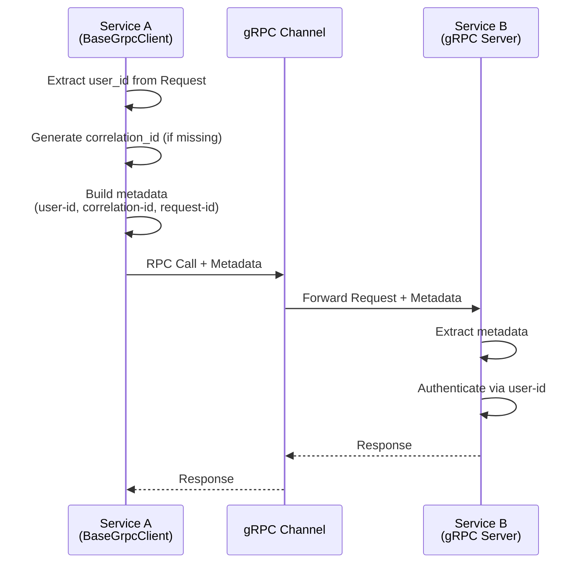
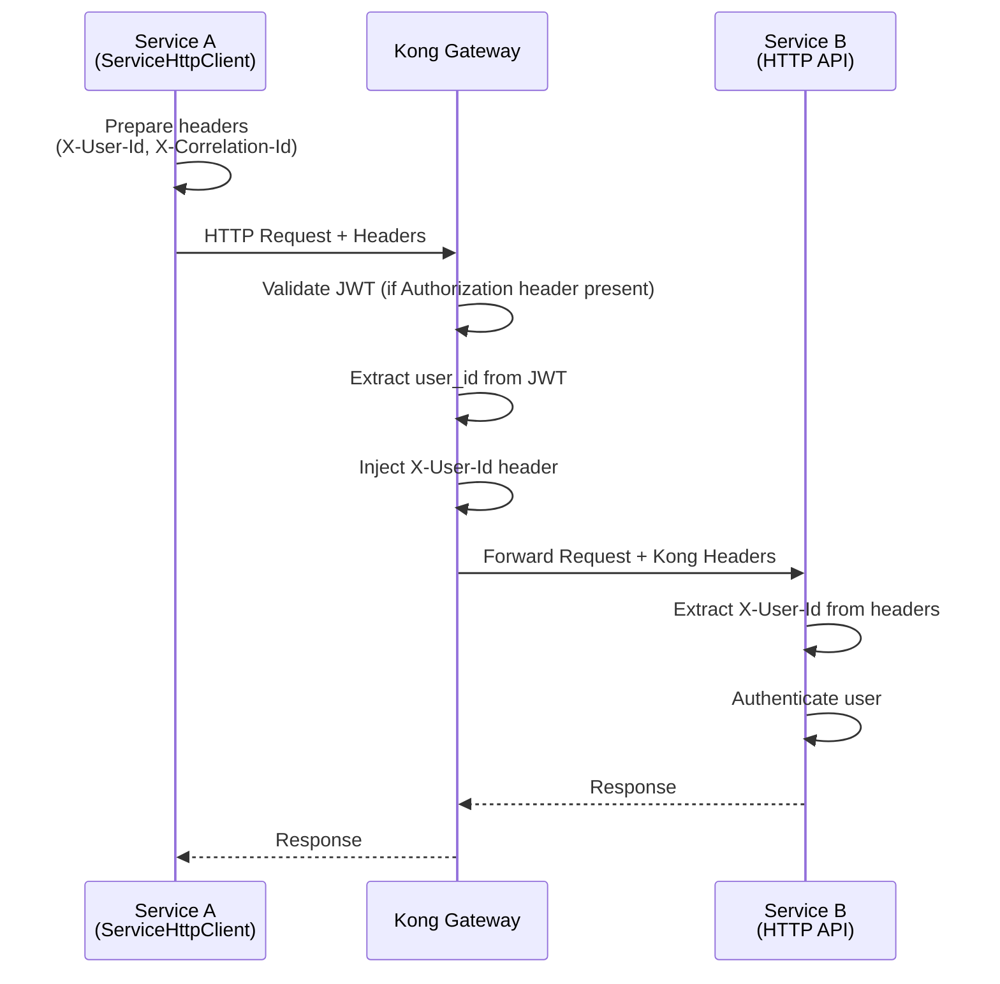

# mysingle.clients

**Version:** 2.2.1 | **Module:** `mysingle.clients`

Service-to-service communication clients with Kong Gateway authentication integration.

---

## Overview

MySingle provides two standardized client types for inter-service communication:

| Client Type           | Protocol | Use Case                              | Auth Headers  |
| --------------------- | -------- | ------------------------------------- | ------------- |
| **BaseGrpcClient**    | gRPC     | Primary inter-service communication   | gRPC metadata |
| **ServiceHttpClient** | HTTP     | External APIs or Kong Gateway routing | HTTP headers  |

### Key Features

- **Kong Gateway Integration:** Auto-propagation of `X-User-Id`, `X-Correlation-Id`, `Authorization`
- **Connection Pooling:** Efficient resource usage with configurable limits
- **Metadata Injection:** Automatic user/correlation/request ID propagation
- **Health Checks:** gRPC Health Checking Protocol support
- **Error Handling:** Comprehensive logging and retry logic

---

## Installation

```bash
# Recommended: Full client support
pip install mysingle[common-grpc]

# Or individual components
pip install mysingle[clients]
```

**Dependencies:** `grpcio`, `httpx`

---

## BaseGrpcClient

### Architecture



### Basic Usage

```python
from mysingle.clients import BaseGrpcClient
from mysingle.protos.services.backtest.v1 import backtest_service_pb2_grpc

class BacktestClient(BaseGrpcClient):
    def __init__(self, user_id=None, correlation_id=None, request=None):
        super().__init__(
            service_name="backtest-service",
            default_port=50051,
            user_id=user_id,
            correlation_id=correlation_id,
            request=request,  # FastAPI Request for auto-extraction
        )
        self.stub = backtest_service_pb2_grpc.BacktestServiceStub(self.channel)

    async def run_backtest(self, strategy_id: str):
        request = backtest_service_pb2.RunBacktestRequest(strategy_id=strategy_id)
        # metadata is auto-injected
        return await self.stub.RunBacktest(request, metadata=self.metadata)
```

### Kong Gateway Integration

```python
from fastapi import Request
from mysingle.clients import BaseGrpcClient

@router.post("/strategies/{strategy_id}/backtest")
async def trigger_backtest(strategy_id: str, request: Request):
    # Option 1: Pass Request object (recommended)
    async with BacktestClient(request=request) as client:
        result = await client.run_backtest(strategy_id)

    # Option 2: Manual extraction
    from mysingle.auth import get_current_active_verified_user
    user = get_current_active_verified_user(request)

    async with BacktestClient(user_id=str(user.id)) as client:
        result = await client.run_backtest(strategy_id)

    return result
```

### Header Extraction Priority

When using `request=request`, headers are extracted in this order:

1. **`X-User-Id`** (service-to-service standard)
2. **`X-Consumer-Custom-ID`** (Kong JWT plugin original)
3. **`request.state.user.id`** (AuthMiddleware injection)

```python
# Automatic extraction from Kong Gateway headers
client = BacktestClient(request=request)

# Extracted metadata:
# - user-id: from X-User-Id header
# - correlation-id: from X-Correlation-Id header (or auto-generated)
# - request-id: UUID4 (generated per RPC call)
```

### Health Check

```python
from mysingle.clients import BaseGrpcClient

async def check_service_health():
    async with BacktestClient() as client:
        is_healthy = await client.check_health()
        if not is_healthy:
            raise ServiceUnavailableError("Backtest service unhealthy")
```

**Note:** Server must implement [gRPC Health Checking Protocol](https://github.com/grpc/grpc/blob/master/doc/health-checking.md).

### Error Handling

```python
import grpc
from mysingle.clients import BaseGrpcClient

async def safe_rpc_call():
    try:
        async with BacktestClient(user_id=user_id) as client:
            result = await client.run_backtest(strategy_id)
    except grpc.RpcError as e:
        if e.code() == grpc.StatusCode.UNAUTHENTICATED:
            # user_id missing or invalid
            logger.error("Authentication failed")
        elif e.code() == grpc.StatusCode.NOT_FOUND:
            logger.error("Strategy not found")
        else:
            client._handle_grpc_error(e, "run_backtest")
```

### Advanced Configuration

```python
class CustomBacktestClient(BaseGrpcClient):
    def __init__(self, user_id=None, **kwargs):
        super().__init__(
            service_name="backtest-service",
            default_port=50051,
            user_id=user_id,
            use_tls=True,  # Enable TLS
            tls_options={
                "root_certificates": open("/path/to/ca.crt", "rb").read(),
                "private_key": open("/path/to/client.key", "rb").read(),
                "certificate_chain": open("/path/to/client.crt", "rb").read(),
            },
            grpc_options=[
                ("grpc.keepalive_time_ms", 10000),
                ("grpc.keepalive_timeout_ms", 5000),
                ("grpc.keepalive_permit_without_calls", True),
                ("grpc.http2.max_pings_without_data", 0),
            ],
            **kwargs,
        )
```

---

## ServiceHttpClient

### Architecture



### Basic Usage

```python
from mysingle.clients import ServiceHttpClient

# Initialize with connection pooling
client = ServiceHttpClient(
    base_url="https://api.mysingle.io",
    service_name="external-api",
    timeout=30.0,
    max_connections=100,
    max_keepalive_connections=20,
    headers={"X-API-Key": "your-api-key"},
    propagate_auth_headers=True,  # Enable Kong header propagation
)

# Basic request
response = await client.get("/strategies")
data = response.json()

# With custom headers
response = await client.post(
    "/strategies",
    json={"name": "My Strategy"},
    headers={"X-Custom-Header": "value"},
)

await client.close()
```

### Kong Gateway Header Propagation

```python
from fastapi import Request
from mysingle.clients import ServiceHttpClient

@router.post("/strategies/{strategy_id}/analyze")
async def analyze_strategy(strategy_id: str, request: Request):
    client = ServiceHttpClient(
        base_url="https://ml-service.mysingle.io",
        propagate_auth_headers=True,  # Auto-propagate Kong headers
    )

    try:
        # Headers auto-propagated: Authorization, X-User-Id, X-Correlation-Id
        response = await client.request_with_auth_propagation(
            method="POST",
            url=f"/analyze/{strategy_id}",
            request=request,  # FastAPI Request for header extraction
            json={"model": "lstm"},
        )
        return response.json()
    finally:
        await client.close()
```

**Propagated Headers:**

- **`Authorization`**: Bearer token from original request
- **`X-User-Id`**: Kong Gateway user ID
- **`X-Correlation-Id`**: Request tracing ID

### Connection Pooling

```python
from mysingle.clients import ServiceHttpClientManager

# Singleton manager (recommended for production)
manager = ServiceHttpClientManager()

# Get or create client with automatic pooling
async with manager.get_client(
    base_url="https://backtest-service.mysingle.io",
    service_name="backtest-service",
) as client:
    response = await client.get("/health")

# Cleanup all clients
await manager.close_all()
```

### Custom Headers

```python
# Static headers (set during initialization)
client = ServiceHttpClient(
    base_url="https://api.mysingle.io",
    headers={
        "X-API-Version": "v1",
        "X-Client-Type": "strategy-service",
    },
)

# Dynamic headers (per request)
response = await client.request_with_auth_propagation(
    method="GET",
    url="/strategies",
    request=request,
    headers={
        "X-Custom-Filter": "active",
    },
)
```

---

## Authentication Best Practices

### 1. Always Propagate user_id

```python
# ✅ CORRECT: Use Request object
async with BacktestClient(request=request) as client:
    result = await client.run_backtest(strategy_id)

# ❌ WRONG: Missing user_id
async with BacktestClient() as client:
    result = await client.run_backtest(strategy_id)  # Server returns UNAUTHENTICATED
```

### 2. Use Kong Gateway Headers

```python
# ✅ CORRECT: Kong Gateway extracts user_id from JWT
from mysingle.auth import get_current_active_verified_user

@router.get("/items")
async def list_items(request: Request):
    user = get_current_active_verified_user(request)
    # user.id is already validated by Kong Gateway
    async with ItemClient(request=request) as client:
        return await client.list_user_items()
```

### 3. Correlation ID for Tracing

```python
# ✅ CORRECT: Auto-propagate correlation_id
async with BacktestClient(request=request) as client:
    # correlation_id extracted from X-Correlation-Id or auto-generated
    result = await client.run_backtest(strategy_id)

# Manual correlation_id (if needed)
async with BacktestClient(correlation_id="custom-trace-id") as client:
    result = await client.run_backtest(strategy_id)
```

---

## Testing

### Mock gRPC Client

```python
import pytest
from unittest.mock import AsyncMock, MagicMock
from mysingle.clients import BaseGrpcClient

@pytest.fixture
def mock_backtest_client():
    client = MagicMock(spec=BacktestClient)
    client.run_backtest = AsyncMock(
        return_value=backtest_pb2.RunBacktestResponse(
            backtest_id="test-123",
            status="running",
        )
    )
    return client

async def test_trigger_backtest(mock_backtest_client):
    result = await mock_backtest_client.run_backtest("strategy-456")
    assert result.backtest_id == "test-123"
```

### Mock HTTP Client

```python
import pytest
import respx
from mysingle.clients import ServiceHttpClient

@pytest.mark.asyncio
@respx.mock
async def test_http_client():
    respx.post("https://api.mysingle.io/strategies").mock(
        return_value=httpx.Response(
            200,
            json={"id": "strategy-789", "name": "Test Strategy"},
        )
    )

    client = ServiceHttpClient(base_url="https://api.mysingle.io")
    response = await client.post("/strategies", json={"name": "Test Strategy"})

    assert response.status_code == 200
    assert response.json()["id"] == "strategy-789"

    await client.close()
```

### Test with Auth Bypass

```python
# .env.test
MYSINGLE_AUTH_BYPASS=true
ENVIRONMENT=development

# Test code
@pytest.mark.asyncio
async def test_backtest_client_no_auth():
    # Auth bypass enabled, no user_id required
    async with BacktestClient() as client:
        result = await client.run_backtest("strategy-456")
        assert result.status == "running"
```

---

## Service Discovery

### Environment Variables

```bash
# .env
BACKTEST_SERVICE_GRPC_HOST=backtest-service.mysingle.svc.cluster.local
BACKTEST_SERVICE_GRPC_PORT=50051

ML_SERVICE_HTTP_URL=https://ml-service.mysingle.io
```

### Client Implementation

```python
import os
from mysingle.clients import BaseGrpcClient

class BacktestClient(BaseGrpcClient):
    def __init__(self, **kwargs):
        host = os.getenv("BACKTEST_SERVICE_GRPC_HOST", "localhost")
        port = int(os.getenv("BACKTEST_SERVICE_GRPC_PORT", "50051"))

        super().__init__(
            service_name="backtest-service",
            host=host,
            default_port=port,
            **kwargs,
        )
```

---

## Common Patterns

### Pattern 1: FastAPI Dependency

```python
from fastapi import Depends, Request
from mysingle.clients import BaseGrpcClient

async def get_backtest_client(request: Request) -> BaseGrpcClient:
    client = BacktestClient(request=request)
    try:
        yield client
    finally:
        await client.close()

@router.post("/strategies/{strategy_id}/backtest")
async def trigger_backtest(
    strategy_id: str,
    backtest_client: BaseGrpcClient = Depends(get_backtest_client),
):
    result = await backtest_client.run_backtest(strategy_id)
    return result
```

### Pattern 2: Context Manager

```python
async def analyze_strategy(strategy_id: str, request: Request):
    async with BacktestClient(request=request) as backtest_client:
        async with MLClient(request=request) as ml_client:
            # Multiple clients with auto-cleanup
            backtest_result = await backtest_client.run_backtest(strategy_id)
            analysis = await ml_client.analyze(backtest_result.id)
            return analysis
```

### Pattern 3: Client Manager

```python
from mysingle.clients import ServiceHttpClientManager

manager = ServiceHttpClientManager()

async def call_multiple_services(request: Request):
    async with manager.get_client(
        "https://backtest.mysingle.io",
        "backtest-service",
    ) as backtest_client:
        async with manager.get_client(
            "https://ml.mysingle.io",
            "ml-service",
        ) as ml_client:
            # Reuse connections across requests
            backtest_response = await backtest_client.get("/status")
            ml_response = await ml_client.get("/models")
            return {
                "backtest": backtest_response.json(),
                "ml": ml_response.json(),
            }
```

---

## Anti-Patterns (DO NOT)

❌ **Hard-coded URLs**
```python
# BAD
client = BacktestClient(host="10.0.1.15", default_port=50051)

# GOOD
host = os.getenv("BACKTEST_SERVICE_GRPC_HOST", "localhost")
client = BacktestClient(host=host)
```

❌ **Missing user_id**
```python
# BAD
async with BacktestClient() as client:
    result = await client.run_backtest(strategy_id)  # UNAUTHENTICATED error

# GOOD
async with BacktestClient(request=request) as client:
    result = await client.run_backtest(strategy_id)
```

❌ **Forgetting to close**
```python
# BAD
client = ServiceHttpClient(base_url="https://api.mysingle.io")
response = await client.get("/strategies")
# Connection leak!

# GOOD
async with ServiceHttpClient(base_url="https://api.mysingle.io") as client:
    response = await client.get("/strategies")
```

❌ **Direct HTTP between services (use Kong Gateway or gRPC)**
```python
# BAD
response = await httpx.get("http://backtest-service:8000/api/run")

# GOOD (gRPC)
async with BacktestClient(request=request) as client:
    result = await client.run_backtest(strategy_id)

# GOOD (HTTP via Kong Gateway)
client = ServiceHttpClient(base_url=os.getenv("KONG_GATEWAY_URL"))
response = await client.request_with_auth_propagation(
    "POST",
    "/backtest-service/api/run",
    request=request,
)
```

---

## API Reference

### BaseGrpcClient

| Method / Property                         | Description                                                   |
| ----------------------------------------- | ------------------------------------------------------------- |
| `__init__(service_name, host, port, ...)` | Initialize gRPC client                                        |
| `metadata` (property)                     | Auto-generated metadata (user-id, correlation-id, request-id) |
| `check_health() -> bool`                  | gRPC health check                                             |
| `close()`                                 | Close gRPC channel                                            |
| `_extract_user_id_from_request(request)`  | Extract user_id from Kong headers                             |
| `_handle_grpc_error(error, operation)`    | Error handling and logging                                    |

### ServiceHttpClient

| Method / Property                                          | Description                          |
| ---------------------------------------------------------- | ------------------------------------ |
| `__init__(base_url, timeout, headers, ...)`                | Initialize HTTP client               |
| `get(url, **kwargs)`                                       | HTTP GET request                     |
| `post(url, json, **kwargs)`                                | HTTP POST request                    |
| `request(method, url, **kwargs)`                           | Generic HTTP request                 |
| `request_with_auth_propagation(method, url, request, ...)` | Request with Kong header propagation |
| `close()`                                                  | Close connection pool                |

### ServiceHttpClientManager

| Method                                    | Description                 |
| ----------------------------------------- | --------------------------- |
| `get_client(base_url, service_name, ...)` | Get or create pooled client |
| `close_all()`                             | Close all managed clients   |

---

## Migration from v1.x

### Removed Components

- **`BaseServiceClient`** (HTTP client) → Use **Kong Gateway** or **BaseGrpcClient**
- Legacy auth patterns → Use **Kong Gateway headers** (`X-User-Id`)

### Import Path Changes

```python
# Old (v1.x)
from mysingle.base import BaseGrpcClient

# New (v2.x)
from mysingle.clients import BaseGrpcClient
```

### Breaking Changes

- **`user_id` required:** All gRPC calls now require `user_id` (no bypass in production)
- **Kong Gateway mandatory:** HTTP authentication via Kong headers only
- **Metadata format:** Changed from `user_id` to `user-id` (lowercase with hyphens)

---

## Troubleshooting

### gRPC: UNAUTHENTICATED Error

**Cause:** Missing or invalid `user_id` in metadata

**Solution:**
```python
# Check user_id extraction
async with BacktestClient(request=request) as client:
    print(f"User ID: {client.user_id}")  # Should not be empty
    result = await client.run_backtest(strategy_id)
```

### HTTP: Connection Pool Exhausted

**Cause:** Too many concurrent requests without connection limits

**Solution:**
```python
# Increase pool size
client = ServiceHttpClient(
    base_url="https://api.mysingle.io",
    max_connections=200,  # Default: 100
    max_keepalive_connections=40,  # Default: 20
)
```

### gRPC: Health Check Fails

**Cause:** Server doesn't implement gRPC Health Checking Protocol

**Solution:**
```python
# Install grpcio-health-checking on server
pip install grpcio-health-checking

# Server implementation
from grpc_health.v1 import health_pb2_grpc

health_servicer = health.HealthServicer()
health_pb2_grpc.add_HealthServicer_to_server(health_servicer, server)
```

---

## Related Documentation

- [Auth Module README](../auth/README.md) - Authentication architecture
- [IAM Service Guide](../../docs/auth/IAM_SERVICE_GUIDE.md) - Central auth service
- [NON_IAM Service Guide](../../docs/auth/NON_IAM_SERVICE_GUIDE.md) - Kong Gateway auth
- [API Gateway Config](../../docs/auth/API_GATEWAY_CONFIG_GUIDE.md) - Kong setup

---

**Version:** 2.2.1
**Module:** `mysingle.clients`
**License:** MIT
