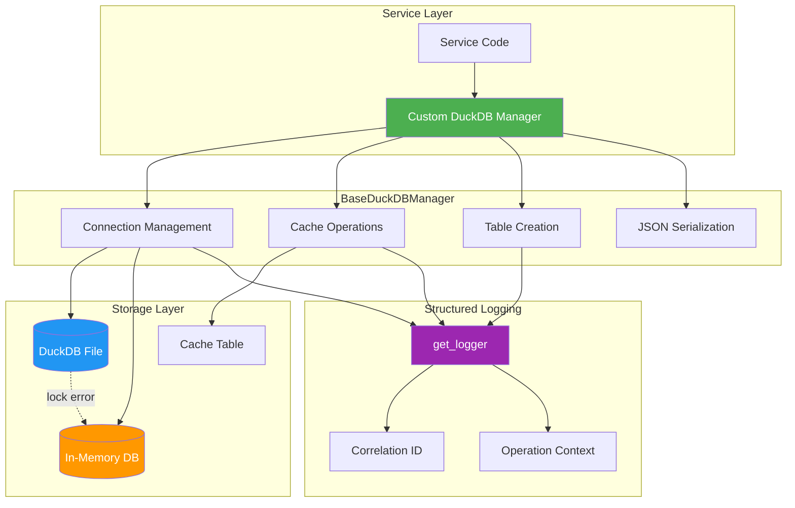

# MySingle Database Module

**Version:** 2.2.1 | **Module:** `mysingle.database`

High-performance database utilities for DuckDB with caching and structured logging.

---

## Overview

The `mysingle.database` module provides standardized database management for MySingle Quant services, focusing on DuckDB for analytical workloads and caching.

### Key Features

| Feature                | Description                                      |
| ---------------------- | ------------------------------------------------ |
| **DuckDB Management**  | Base class for DuckDB connections and operations |
| **Built-in Caching**   | TTL-based caching with automatic expiration      |
| **Context Management** | Safe resource handling with context managers     |
| **Fallback Support**   | Automatic fallback to in-memory DB on lock       |
| **Structured Logging** | Production-ready logging with correlation IDs    |
| **JSON Serialization** | Automatic serialization for Pydantic models      |

---

## Installation

```bash
# Install with database extras
pip install mysingle[database]

# Or with common dependencies
pip install mysingle[common-grpc]
```

---

## Quick Start

### Basic Usage

```python
from mysingle.database import BaseDuckDBManager

class MyDataManager(BaseDuckDBManager):
    """Custom DuckDB manager for your service"""

    def _create_tables(self) -> None:
        """Create service-specific tables"""
        self.duckdb_conn.execute("""
            CREATE TABLE IF NOT EXISTS analytics (
                id VARCHAR PRIMARY KEY,
                user_id VARCHAR NOT NULL,
                event_type VARCHAR NOT NULL,
                event_data JSON,
                created_at TIMESTAMP NOT NULL
            )
        """)

        # Create indexes
        self.duckdb_conn.execute("""
            CREATE INDEX IF NOT EXISTS idx_analytics_user_id
            ON analytics(user_id)
        """)

# Usage with context manager (recommended)
with MyDataManager(db_path="data/analytics.duckdb") as db:
    db.duckdb_conn.execute("""
        INSERT INTO analytics (id, user_id, event_type, event_data, created_at)
        VALUES (?, ?, ?, ?, ?)
    """, [record_id, user_id, "strategy_created", json.dumps(data), now])

    results = db.duckdb_conn.execute("SELECT * FROM analytics").fetchall()

# Or manual connection management
db = MyDataManager(db_path="data/analytics.duckdb")
db.connect()
try:
    # Your database operations
    pass
finally:
    db.close()
```

---

## Architecture



---

## Core Components

### BaseDuckDBManager

Base class for all DuckDB operations with built-in caching and connection management.

#### Key Methods

| Method                      | Description                             |
| --------------------------- | --------------------------------------- |
| `connect()`                 | Establish database connection           |
| `close()`                   | Close connection and cleanup resources  |
| `store_cache_data()`        | Store data in cache with TTL            |
| `get_cache_data()`          | Retrieve cached data                    |
| `_create_tables()`          | Override to create service tables       |
| `_make_json_serializable()` | Convert objects to JSON-compatible form |

#### Properties

| Property      | Type                       | Description                |
| ------------- | -------------------------- | -------------------------- |
| `duckdb_conn` | `DuckDBPyConnection`       | Active database connection |
| `db_path`     | `str`                      | Path to database file      |
| `connection`  | `DuckDBPyConnection\|None` | Raw connection object      |

---

## Usage Patterns

### 1. Custom Manager Implementation

```python
from datetime import UTC, datetime
import uuid
from mysingle.database import BaseDuckDBManager

class BacktestDataManager(BaseDuckDBManager):
    """DuckDB manager for backtest results"""

    def _create_tables(self) -> None:
        """Create backtest-specific tables"""
        self.duckdb_conn.execute("""
            CREATE TABLE IF NOT EXISTS backtest_results (
                id VARCHAR PRIMARY KEY,
                strategy_id VARCHAR NOT NULL,
                user_id VARCHAR NOT NULL,
                start_date DATE NOT NULL,
                end_date DATE NOT NULL,
                total_return DOUBLE,
                sharpe_ratio DOUBLE,
                max_drawdown DOUBLE,
                trades JSON,
                created_at TIMESTAMP NOT NULL
            )
        """)

        # Indexes for common queries
        self.duckdb_conn.execute("""
            CREATE INDEX IF NOT EXISTS idx_backtest_strategy
            ON backtest_results(strategy_id)
        """)

        self.duckdb_conn.execute("""
            CREATE INDEX IF NOT EXISTS idx_backtest_user
            ON backtest_results(user_id)
        """)

    def store_backtest_result(self, result_data: dict) -> bool:
        """Store backtest result with automatic serialization"""
        try:
            # Convert Pydantic models to JSON-serializable format
            serializable_data = self._make_json_serializable(result_data)

            self.duckdb_conn.execute("""
                INSERT INTO backtest_results
                (id, strategy_id, user_id, start_date, end_date,
                 total_return, sharpe_ratio, max_drawdown, trades, created_at)
                VALUES (?, ?, ?, ?, ?, ?, ?, ?, ?, ?)
            """, [
                str(uuid.uuid4()),
                serializable_data["strategy_id"],
                serializable_data["user_id"],
                serializable_data["start_date"],
                serializable_data["end_date"],
                serializable_data["total_return"],
                serializable_data["sharpe_ratio"],
                serializable_data["max_drawdown"],
                json.dumps(serializable_data["trades"]),
                datetime.now(UTC),
            ])
            return True
        except Exception as e:
            logger.error(f"Failed to store backtest result: {e}")
            return False

    def get_user_backtests(self, user_id: str) -> list[dict]:
        """Get all backtest results for a user"""
        result = self.duckdb_conn.execute("""
            SELECT * FROM backtest_results
            WHERE user_id = ?
            ORDER BY created_at DESC
        """, [user_id]).fetchall()

        return [dict(row) for row in result]
```

### 2. Context Manager Pattern

```python
# Recommended: Automatic connection cleanup
with BacktestDataManager(db_path="data/backtests.duckdb") as db:
    # Connection is automatically established
    success = db.store_backtest_result(result_data)

    if success:
        results = db.get_user_backtests(user_id)
# Connection is automatically closed

# Manual management (if needed)
db = BacktestDataManager(db_path="data/backtests.duckdb")
db.connect()
try:
    # Your operations
    pass
finally:
    db.close()  # Always close to free resources
```

### 3. Built-in Caching

```python
# Store data in cache
data = [
    {"symbol": "AAPL", "price": 150.25, "volume": 1000000},
    {"symbol": "GOOGL", "price": 2800.50, "volume": 500000},
]

db.store_cache_data(
    cache_key="market_data:2024-12-02",
    data=data,
    table_name="market_cache"  # Optional: custom table name
)

# Retrieve cached data with TTL
cached_data = db.get_cache_data(
    cache_key="market_data:2024-12-02",
    table_name="market_cache",
    ttl_hours=24  # Data expires after 24 hours
)

if cached_data:
    print(f"Found {len(cached_data)} cached records")
else:
    print("Cache miss - fetch fresh data")
```

### 4. JSON Serialization

```python
from pydantic import BaseModel
from datetime import datetime
from decimal import Decimal

class TradeResult(BaseModel):
    symbol: str
    quantity: int
    price: Decimal
    executed_at: datetime

# Automatic serialization of complex types
trade = TradeResult(
    symbol="AAPL",
    quantity=100,
    price=Decimal("150.25"),
    executed_at=datetime.now(UTC)
)

# Convert to JSON-serializable format
serializable = db._make_json_serializable(trade)
# Result: {"symbol": "AAPL", "quantity": 100, "price": 150.25, "executed_at": "2024-12-02T10:30:45.123Z"}
```

---

## Configuration

### Database Path

```python
# Production: File-based
db = MyDataManager(db_path="/data/analytics/prod.duckdb")

# Development: Local file
db = MyDataManager(db_path="./dev_data/analytics.duckdb")

# Testing: In-memory (explicit)
db = MyDataManager(db_path=":memory:")

# Auto-fallback: File with in-memory fallback on lock
db = MyDataManager(db_path="/data/locked.duckdb")  # Falls back to :memory: if locked
```

### Environment Variables

```bash
# Service-specific database paths
export BACKTEST_DB_PATH="/data/backtests/prod.duckdb"
export ANALYTICS_DB_PATH="/data/analytics/prod.duckdb"

# Cache TTL configuration
export CACHE_TTL_HOURS=24
```

```python
import os

db_path = os.getenv("BACKTEST_DB_PATH", "./data/backtests.duckdb")
cache_ttl = int(os.getenv("CACHE_TTL_HOURS", "24"))

db = BacktestDataManager(db_path=db_path)
cached_data = db.get_cache_data(cache_key, ttl_hours=cache_ttl)
```

---

## Advanced Usage

### Custom Cache Tables

```python
class MultiCacheManager(BaseDuckDBManager):
    """Manager with multiple cache tables"""

    def _create_tables(self) -> None:
        """Create multiple cache tables"""
        # Market data cache
        self._create_cache_table("market_data_cache")

        # Strategy cache
        self._create_cache_table("strategy_cache")

        # User preferences cache
        self._create_cache_table("user_prefs_cache")

    def cache_market_data(self, symbol: str, data: list[dict]) -> bool:
        """Cache market data by symbol"""
        return self.store_cache_data(
            cache_key=f"market:{symbol}",
            data=data,
            table_name="market_data_cache"
        )

    def get_market_data(self, symbol: str, ttl_hours: int = 1) -> list[dict] | None:
        """Get cached market data (short TTL for real-time data)"""
        return self.get_cache_data(
            cache_key=f"market:{symbol}",
            table_name="market_data_cache",
            ttl_hours=ttl_hours
        )
```

### Complex Queries

```python
class AnalyticsManager(BaseDuckDBManager):
    """Advanced analytics queries"""

    def get_top_strategies(self, limit: int = 10) -> list[dict]:
        """Get top performing strategies"""
        result = self.duckdb_conn.execute("""
            SELECT
                strategy_id,
                COUNT(*) as backtest_count,
                AVG(total_return) as avg_return,
                AVG(sharpe_ratio) as avg_sharpe,
                MAX(created_at) as last_backtest
            FROM backtest_results
            GROUP BY strategy_id
            HAVING avg_sharpe > 1.0
            ORDER BY avg_return DESC
            LIMIT ?
        """, [limit]).fetchall()

        return [
            {
                "strategy_id": row[0],
                "backtest_count": row[1],
                "avg_return": row[2],
                "avg_sharpe": row[3],
                "last_backtest": row[4],
            }
            for row in result
        ]

    def get_user_statistics(self, user_id: str) -> dict:
        """Get aggregated user statistics"""
        result = self.duckdb_conn.execute("""
            SELECT
                COUNT(*) as total_backtests,
                AVG(total_return) as avg_return,
                MAX(total_return) as best_return,
                MIN(total_return) as worst_return,
                AVG(sharpe_ratio) as avg_sharpe
            FROM backtest_results
            WHERE user_id = ?
        """, [user_id]).fetchone()

        if result:
            return {
                "total_backtests": result[0],
                "avg_return": result[1],
                "best_return": result[2],
                "worst_return": result[3],
                "avg_sharpe": result[4],
            }
        return {}
```

### Batch Operations

```python
def batch_insert_trades(self, trades: list[dict]) -> int:
    """Insert multiple trades efficiently"""
    try:
        # Prepare data
        serialized_trades = [
            self._make_json_serializable(trade) for trade in trades
        ]

        # Batch insert
        self.duckdb_conn.executemany("""
            INSERT INTO trades (id, strategy_id, symbol, quantity, price, executed_at)
            VALUES (?, ?, ?, ?, ?, ?)
        """, [
            (
                str(uuid.uuid4()),
                trade["strategy_id"],
                trade["symbol"],
                trade["quantity"],
                trade["price"],
                trade["executed_at"],
            )
            for trade in serialized_trades
        ])

        return len(trades)
    except Exception as e:
        logger.error(f"Batch insert failed: {e}")
        return 0
```

---

## Error Handling

### Connection Failures

```python
try:
    db = MyDataManager(db_path="/locked/database.duckdb")
    db.connect()
except Exception as e:
    logger.error(f"Failed to connect: {e}")
    # Fallback to in-memory database
    db = MyDataManager(db_path=":memory:")
    db.connect()
```

### Automatic Fallback

```python
# BaseDuckDBManager automatically falls back to in-memory on lock errors
db = MyDataManager(db_path="/data/database.duckdb")
db.connect()
# If file is locked, automatically uses `:memory:` instead
```

### Cache Errors

```python
# store_cache_data returns bool for success/failure
success = db.store_cache_data(cache_key, data)
if not success:
    logger.warning("Cache write failed - continuing without cache")

# get_cache_data returns None on error or cache miss
cached_data = db.get_cache_data(cache_key)
if cached_data is None:
    # Fetch fresh data
    fresh_data = fetch_from_api()
    db.store_cache_data(cache_key, fresh_data)
    cached_data = fresh_data
```

---

## Structured Logging

All database operations emit structured logs following the MySingle logging guide.

### Log Examples

```json
// Connection success
{
  "timestamp": "2024-12-02T10:30:45.123Z",
  "level": "info",
  "event": "DuckDB connected successfully",
  "db_path": "/data/analytics.duckdb",
  "status": "success",
  "operation": "connect"
}

// Cache hit
{
  "timestamp": "2024-12-02T10:31:12.456Z",
  "level": "debug",
  "event": "Cache data retrieved successfully",
  "cache_key": "market_data:2024-12-02",
  "table_name": "market_cache",
  "data_count": 150,
  "ttl_hours": 24,
  "operation": "get_cache"
}

// Lock error with fallback
{
  "timestamp": "2024-12-02T10:32:00.789Z",
  "level": "warning",
  "event": "Falling back to in-memory database",
  "reason": "file_locked",
  "original_db_path": "/data/locked.duckdb"
}

// Cache write failure
{
  "timestamp": "2024-12-02T10:33:15.321Z",
  "level": "error",
  "event": "Failed to store cache data",
  "cache_key": "strategy_results:123",
  "table_name": "cache_data",
  "error": "Database is locked",
  "error_type": "OperationalError"
}
```

---

## Best Practices

### ✅ DO

```python
# Use context managers for automatic cleanup
with MyDataManager(db_path="data.duckdb") as db:
    db.store_cache_data(cache_key, data)

# Check return values
success = db.store_cache_data(cache_key, data)
if not success:
    logger.warning("Cache write failed")

# Use structured caching with TTL
cached = db.get_cache_data(cache_key, ttl_hours=24)
if cached is None:
    cached = fetch_fresh_data()
    db.store_cache_data(cache_key, cached)

# Serialize complex objects before storage
serializable = db._make_json_serializable(pydantic_model)

# Create indexes for frequently queried columns
self.duckdb_conn.execute("""
    CREATE INDEX IF NOT EXISTS idx_user_id ON table(user_id)
""")
```

### ❌ DON'T

```python
# Don't forget to close connections
db = MyDataManager(db_path="data.duckdb")
db.connect()
# ... operations ...
# Missing db.close() - resource leak!

# Don't ignore cache failures
db.store_cache_data(cache_key, data)  # Ignoring return value

# Don't store non-serializable objects directly
db.duckdb_conn.execute("INSERT ...", [datetime_object])  # May fail

# Don't create tables in every method
def my_method(self):
    self.duckdb_conn.execute("CREATE TABLE ...")  # Should be in _create_tables()

# Don't use hardcoded paths
db = MyDataManager(db_path="/hardcoded/path.duckdb")  # Use config/env vars
```

### Connection Management

```python
# Pattern 1: Context manager (recommended)
with MyDataManager(db_path=db_path) as db:
    results = db.query_data()
    # Automatically closed

# Pattern 2: Manual with try-finally
db = MyDataManager(db_path=db_path)
db.connect()
try:
    results = db.query_data()
finally:
    db.close()  # Always executed

# Pattern 3: Long-lived connection (service startup)
class MyService:
    def __init__(self):
        self.db = MyDataManager(db_path=db_path)
        self.db.connect()

    def shutdown(self):
        self.db.close()
```

---

## Testing

### Mock DuckDB Manager

```python
import pytest
from unittest.mock import MagicMock, patch

@pytest.fixture
def mock_duckdb_manager():
    """Mock DuckDB manager for testing"""
    manager = MagicMock(spec=BaseDuckDBManager)
    manager.store_cache_data.return_value = True
    manager.get_cache_data.return_value = [{"symbol": "AAPL", "price": 150.0}]
    return manager

def test_cache_operations(mock_duckdb_manager):
    """Test cache operations with mock"""
    # Store data
    success = mock_duckdb_manager.store_cache_data("test_key", [{"data": "value"}])
    assert success is True

    # Retrieve data
    cached = mock_duckdb_manager.get_cache_data("test_key")
    assert cached is not None
    assert len(cached) == 1
```

### In-Memory Testing

```python
def test_with_real_duckdb():
    """Test with real in-memory DuckDB"""
    with MyDataManager(db_path=":memory:") as db:
        # Test actual database operations
        db.store_cache_data("test", [{"value": 1}])
        result = db.get_cache_data("test")
        assert result == [{"value": 1}]
```

### Fixture for Tests

```python
import pytest
from pathlib import Path
import tempfile

@pytest.fixture
def temp_duckdb():
    """Temporary DuckDB file for testing"""
    with tempfile.TemporaryDirectory() as tmpdir:
        db_path = Path(tmpdir) / "test.duckdb"
        yield str(db_path)
        # Cleanup is automatic

def test_with_temp_db(temp_duckdb):
    """Test with temporary database file"""
    with MyDataManager(db_path=temp_duckdb) as db:
        # Test operations
        pass
```

---

## Performance Tips

### 1. Use Batch Operations

```python
# Bad: Multiple individual inserts
for trade in trades:
    db.duckdb_conn.execute("INSERT ...", [trade])

# Good: Batch insert
db.duckdb_conn.executemany("INSERT ...", trades)
```

### 2. Create Appropriate Indexes

```python
# Index frequently queried columns
self.duckdb_conn.execute("""
    CREATE INDEX IF NOT EXISTS idx_user_date
    ON analytics(user_id, created_at)
""")
```

### 3. Use Cache Effectively

```python
# Short TTL for real-time data
market_data = db.get_cache_data(f"market:{symbol}", ttl_hours=1)

# Long TTL for static data
strategy_config = db.get_cache_data(f"config:{id}", ttl_hours=168)  # 1 week
```

### 4. Connection Pooling

```python
# Reuse connections in long-lived services
class AnalyticsService:
    def __init__(self):
        self.db = AnalyticsManager(db_path=config.DB_PATH)
        self.db.connect()

    async def on_shutdown(self):
        self.db.close()
```

---

## Troubleshooting

### Issue: Database Locked

**Symptom:** `database is locked` error

**Solution:** BaseDuckDBManager automatically falls back to in-memory database
```python
# Automatic fallback is logged
# WARNING: Falling back to in-memory database (reason: file_locked)
```

### Issue: Cache Not Working

**Symptom:** `get_cache_data()` always returns None

**Possible Causes:**
1. TTL expired - increase `ttl_hours`
2. Table not created - check `_create_cache_table()` is called
3. Connection issue - check structured logs

**Debug:**
```python
# Enable debug logging
import logging
logging.getLogger("mysingle.database").setLevel(logging.DEBUG)

# Check cache table exists
result = db.duckdb_conn.execute("""
    SELECT name FROM sqlite_master WHERE type='table'
""").fetchall()
print("Tables:", result)
```

### Issue: JSON Serialization Error

**Symptom:** `TypeError: Object of type X is not JSON serializable`

**Solution:** Use `_make_json_serializable()`
```python
# Before
data = {"datetime": datetime.now(), "decimal": Decimal("10.5")}

# After
serializable = db._make_json_serializable(data)
# Result: {"datetime": "2024-12-02T10:30:45.123Z", "decimal": 10.5}
```

---

## API Reference

### BaseDuckDBManager

```python
class BaseDuckDBManager:
    def __init__(self, db_path: str) -> None: ...

    def connect(self) -> None: ...
    def close(self) -> None: ...

    def store_cache_data(
        self,
        cache_key: str,
        data: list[dict],
        table_name: str = "cache_data"
    ) -> bool: ...

    def get_cache_data(
        self,
        cache_key: str,
        table_name: str = "cache_data",
        ttl_hours: int = 24
    ) -> list[dict] | None: ...

    def _create_tables(self) -> None: ...  # Abstract - must override
    def _create_cache_table(self, table_name: str) -> None: ...
    def _make_json_serializable(self, obj: Any) -> Any: ...
    def _ensure_connected(self) -> None: ...

    @property
    def duckdb_conn(self) -> duckdb.DuckDBPyConnection: ...
```

---

## Migration Guide

### From Custom DuckDB Implementation

```python
# Old: Custom implementation
import duckdb
conn = duckdb.connect("data.duckdb")
try:
    conn.execute("CREATE TABLE ...")
finally:
    conn.close()

# New: BaseDuckDBManager
class MyManager(BaseDuckDBManager):
    def _create_tables(self):
        self.duckdb_conn.execute("CREATE TABLE ...")

with MyManager("data.duckdb") as db:
    # Automatic connection management
    pass
```

### Adding Caching

```python
# Before: No caching
data = fetch_expensive_data()

# After: With caching
cached = db.get_cache_data("expensive_data", ttl_hours=24)
if cached is None:
    cached = fetch_expensive_data()
    db.store_cache_data("expensive_data", cached)
data = cached
```

---

## Related Documentation

- [Structured Logging Guide](../../docs/core/STRUCTURED_LOGGING_GUIDE.md) - Logging integration
- [Core Module README](../core/README.md) - Core utilities
- [DuckDB Documentation](https://duckdb.org/docs/) - DuckDB reference

---

**Version:** 2.2.1
**Module:** `mysingle.database`
**License:** MIT
