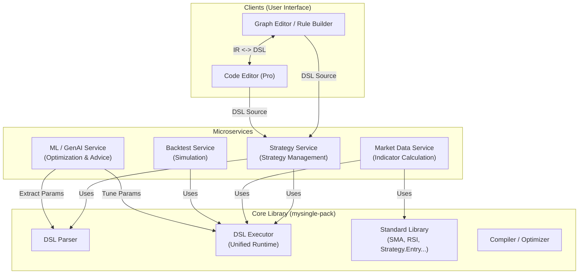

# 통합 DSL 아키텍처 전략 보고서: The Unified Quant Platform

**작성일**: 2026-01-07
**작성자**: Antigravity (Google Deepmind AI Agent)
**대상 리포지토리**: `mysingle-pack`

---

## 1. Executive Summary (개요)

MySingle Quant 플랫폼의 궁극적인 목표는 **"초보자부터 전문가까지, 인디케이터에서 전략까지, 하나의 언어로 연결되는 생태계"**를 구축하는 것입니다.
이를 위해 **MySingle DSL**은 단순한 스크립트 언어를 넘어, 플랫폼 내 모든 마이크로서비스(시장 데이터, 전략, 백테스트, ML, GenAI)가 공유하는 **공통 프로토콜(Common Protocol)**이자 **핵심 연산 엔진(Core Calculation Engine)**으로 자리 잡아야 합니다.

본 문서는 현재 분절되어 있는 DSL 처리 로직을 `mysingle-pack` 패키지의 **Unified DSL Engine**으로 통합하고, 이를 기반으로 노코드(No-Code) 툴과 ML/GenAI 서비스가 유기적으로 결합되는 아키텍처 청사진을 제시합니다.

---

## 2. Current Challenges (현황 및 문제점)

### 2.1. 계산 로직의 파편화 (Fragmentation)
- **Market Data Service**: Pandas/Numpy 기반의 하드코딩된 Python 엔진(`.py`)과 DSL이 혼재됨. DSL은 메타데이터 정의용으로만 주로 사용됨.
- **Strategy Service**: 자체적인 파서와 실행기를 보유하거나, `mysingle-pack`을 일부 참고하지만 완전히 의존하지 않음.
- **결과**: 동일한 로직(예: RSI)이라도 서비스마다 계산 결과가 미세하게 다를 수 있으며, 새로운 기능을 추가하려면 여러 곳을 수정해야 함.

### 2.2. ML/GenAI 연동의 어려움
- ML 모델이 최적화해야 할 파라미터가 DSL 코드 내에 존재하지만, 이를 추출하고 주입하는 표준화된 인터페이스가 부재함.
- GenAI가 전략을 제안할 때, 실행 가능한 코드로 즉시 변환되지 않고 텍스트 형태의 제안에 그칠 위험이 있음.

### 2.3. No-Code 도구와의 연결성 부족
- 그래프 에디터나 룰 빌더가 생성하는 데이터 구조(JSON/IR)와 DSL 간의 양방향 변환(Bi-directional Conversion) 체계가 미흡함.
- 사용자가 GUI로 만든 전략이 실제 백테스트 엔진에서 정확히 동일하게 동작한다는 보장이 부족함.

---

## 3. Strategic Architecture (전략적 아키텍처)

핵심 전략은 **"Single Source of Truth (SSOT)"**로서의 `mysingle-pack` 강화입니다. 모든 서비스는 자체적인 계산 로직을 갖지 않고, 오직 `mysingle-pack`의 라이브러리와 실행기를 호출하여 결과를 얻습니다.

### 3.1. Architecture Diagram

### 3.2. 핵심 원칙 (Core Principles)

1.  **Unified Execution Context**: 인디케이터 계산과 전략 실행은 본질적으로 다를 것이 없습니다. 모두 "시계열 데이터(Input) -> 연산(Process) -> 시계열/시그널(Output)"의 구조를 가집니다. `DSLExecutor` 하나가 이 두 가지 모드를 모두 처리할 수 있어야 합니다.
2.  **Explicit Parameterization**: ML 최적화를 위해 DSL 내의 모든 상수는 `params.get()` 또는 `var()` 등을 통해 명시적인 파라미터로 추출 가능해야 합니다.
3.  **Sandboxed Safety**: `RestrictedPython`을 기반으로 한 현재의 안전한 실행 환경을 유지하며, 외부 오염을 원천 차단합니다.

---

## 4. Component Strategy (컴포넌트별 전략)

### 4.1. Standard Library (`mysingle.dsl.stdlib`)
- **역할**: 플랫폼의 "표준 언어" 정의.
- **전략**:
    - 기술적 지표(TA-Lib 수준 이상)와 트레이딩 함수(Entry, Exit, StopLoss 등)를 모두 포함.
    - 함수 시그니처 표준화: `func(data: DataFrame, params: dict) -> Result`.
    - Docstring을 통한 GenAI 학습 데이터 제공.

### 4.2. Universal Executor (`mysingle.dsl.executor`)
- **역할**: 컴파일된 바이트코드를 안전하고 빠르게 실행.
- **전략**:
    - **Context Injection**: 실행 시점에 `context`를 주입하여, 인디케이터 모드(순수 연산)와 전략 모드(주문 생성, 포지션 추적)를 구분.
    - **Caching & JIT**: 빈번하게 사용되는 코드는 바이트코드로 캐싱하고, 가능하다면 Numba/Cython 등을 통한 JIT 컴파일 경로를 열어둠.

### 4.3. No-Code Bridge (Intermediate Representation)
- **역할**: GUI와 코드의 가교.
- **전략**:
    - **DSL as Storage**: 지표/전략의 저장 포맷은 항상 DSL 텍스트입니다.
    - **IR to Graph**: DSL 파서가 코드를 AST(Abstract Syntax Tree)로 파싱한 후, 이를 프론트엔드가 이해할 수 있는 JSON IR로 변환하여 GUI에 표시합니다.
    - **Graph to DSL**: GUI 변경 사항은 다시 DSL 코드로 regenerate 됩니다. (Code generation).

---

## 5. Implementation Roadmap (구현 로드맵)

### Phase 1: Foundation (기반 마련) - [진행 중]
- [x] `market-data-service`: Universal DSL Engine 도입 (완료).
- [ ] `mysingle-pack`: Standard Library 확충 (지표 + 기본 전략 함수).
- [ ] `strategy-service`: 자체 파서 로직 제거 및 `mysingle.dsl` 의존성 통합.

### Phase 2: Unification (통합)
- [ ] **Unified Interface**: 모든 서비스가 `mysingle.dsl.runtime`을 통해 코드를 실행하도록 리팩토링.
- [ ] **IR(Intermediate Representation) 표준화**: 노코드 툴과 DSL 컴파일러가 공유할 IR 스키마(Schema) 정의.

### Phase 3: Intelligence (지능화)
- [ ] **ML Pipeline Integration**: `mysingle-pack`에 `Optimizer` 모듈 추가. (DSL 파라미터 범위 추출 -> 반복 실행 -> 최적 파라미터 제안).
- [ ] **GenAI Assistant**: 사용자의 자연어 요청 -> DSL 코드 생성 -> 백테스트 검증 파이프라인 구축.

---

## 6. 결론

"코드는 어렵지만, 로직은 자유로워야 한다."
이 딜레마를 해결하는 열쇠는 **강력하고 유연한 통합 DSL 엔진**에 있습니다. `mysingle-pack`이 단순한 유틸리티 모음이 아니라, 플랫폼의 **두뇌(Brain)** 역할을 수행하도록 아키텍처를 진화시켜야 합니다. 이를 통해 사용자는 노코드 툴로 쉽게 진입하고, ML의 도움을 받아 정교한 전략가로 성장할 수 있을 것입니다.
